[TOC]

------


# STM32 简介

- 系列：主流系列STM32F1
- 内核：ARM Cortex-M3
- 主频：72MHz
- RAM：20K（SRAM）
- ROM：64K（Flash）
- 供电：2.0~3.6V（标准3.3V）
- 封装：LQFP48


## 片上资源/外设

|       **英文缩写**       |         **名称**         |                           **备注**                           |
| :----------------------: | :----------------------: | :----------------------------------------------------------: |
|  ***NVIC<br />内核内***  | ***嵌套向量中断控制器*** |                     ***管理中断的设备***                     |
| ***SysTick<br/>内核内*** |   ***系统滴答定时器***   |  ***内核定时器，主要给操作系统提供定时服务，进行任务切换***  |
|           RCC            |      复位和时钟控制      | 对系统时钟进行配置 ，使能各模块的时钟，默认是没有配置时钟的，外设也不会工作，目的是为了降低功耗 |
|           GPIO           |         通用IO口         |                                                              |
|           AFIO           |         复用IO口         |                                                              |
|           EXTI           |         外部中断         |                                                              |
|           TIM            |          定时器          |      分为高级（最复杂），通用（最常用），基本三种定时器      |
|           ADC            |        模数转换器        |                                                              |
|           DMA            |       直接内存访问       |            用于帮助CPU完成类似大量数据繁杂的任务             |
|          USART           |    同步/异步串口通信     |                                                              |
|           I2C            |         I2C通信          |                                                              |
|           SPI            |         SPI通信          |                                                              |
|           CAN            |         CAN通信          |                        多用于汽车领域                        |
|           USB            |         USB通信          |                                                              |
|           RTC            |         实时时钟         |            可以接外部时钟，即使掉电也可以正常运行            |
|           CRC            |         CRC校验          |                                                              |
|           PWR            |         电源控制         |                                                              |
|           BKP            |        备份寄存器        |         可以让芯片进入睡眠模式等状态，达到省电的目的         |
|           IWDG           |        独立看门狗        |                                                              |
|           WWDG           |        窗口看门狗        |                                                              |
|         ~~DAC~~          |      ~~数模转换器~~      |                                                              |
|         ~~SDIO~~         |       ~~SD卡接口~~       |                                                              |
|         ~~FSMC~~         |  ~~可变静态存储控制器~~  |                     ~~可以用于扩展内存~~                     |
|       ~~USB OTG~~        |     ~~USB主机接口~~      |                                                              |

**后面四种外设在此芯片上没有**

## 命名规则


## 系统结构


```tex
ICode	指令总线
DCode	数据总线
System	系统总线
AHB	（Advance High Performance Bus）	先进高性能总线
APBx（Advanced Peripheral Bus）		 先进外设总线
```

***ICode（Instruction Code）：*** 

该总线将Cortex™-M3内核的指令总线与闪存指令接口相连接。指令预取在此总线上完成 

***DCode (Data Code)：*** 

该总线将Cortex™-M3内核的DCode总线与闪存存储器的数据接口相连接(常量加载和 调试访问) 

***系统总线*** 

此总线连接Cortex™-M3内核的系统总线(外设总线)到总线矩阵，总线矩阵协调着内核 和DMA间的访问 

***DMA总线*** 

此总线将DMA的AHB主控接口与总线矩阵相联，总线矩阵协调着CPU的DCode和 DMA到SRAM、闪存和外设的访问 

***总线矩阵*** 

总线矩阵协调内核系统总线和DMA主控总线之间的访问仲裁，仲裁利用轮换算法。在互联型产品中，总线矩阵包含5个驱动部件(CPU的DCode、系统总线、以太网DMA、 DMA1总线和DMA2总线)和3个从部件(闪存存储器接口(FLITF)、SRAM和AHB2APB桥)。在其它产品中总线矩阵包含4个驱动部件(CPU的DCode、系统总线、DMA1总线和DMA2总线)和4个被动部件(闪存存储器接 口(FLITF)、SRAM、FSMC和AHB2APB桥)。AHB外设通过总线矩阵与系统总线相连，允许 DMA访问 

***AHB/APB桥(APB)*** 

两个AHB/APB桥在AHB和2个APB总线间提供同步连接。APB1操作速度限于36MHz， APB2操作于全速(最高72MHz)。有关连接到每个桥的不同外设的地址映射请参考表1。在每一次复位以后，所有除SRAM和FLITF以外的外设都被关闭，在使用一个外设之前，必须 设置寄存器RCC_AHBENR来打开该外设的时钟  

因为 AHB 和 APB **总线协议，总线速度，还有数据传输格式存在差异**，所以中间要加两个桥接来完成数据的转化和缓存。

- ​	性能：APB2 > APB1
- ​	时钟：APB2 72MHz       APB1 36MHz 

## 引脚定义


## RCC时钟树


# GPIO

## GPIO简介

GPIO（General Purpose Input Output）通用输入输出口

- ​	可配置为8种输入输出模式

  ```c
  typedef enum
  { GPIO_Mode_AIN = 0x0, 			//模拟输入模式
    GPIO_Mode_IN_FLOATING = 0x04,	//浮点输入模式
    GPIO_Mode_IPD = 0x28,			//下拉输入模式
    GPIO_Mode_IPU = 0x48,			//上拉输入模式
    GPIO_Mode_Out_OD = 0x14,		//开漏输出模式
    GPIO_Mode_Out_PP = 0x10,		//推拉输出模式
    GPIO_Mode_AF_OD = 0x1C,		//开漏替代功能模式
    GPIO_Mode_AF_PP = 0x18		//推拉替代功能模式
  }GPIOMode_TypeDef;
  ```

- ​	引脚电平：0V~3.3V，部分引脚可容忍5V

- ​	输出模式下可控制端口输出高低电平，用以驱动LED、控制蜂鸣器、模拟通信协议输出时序等

- ​	输入模式下可读取端口的高低电平或电压，用于读取按键输入、外接模块电平信号输入、ADC电压采集、模拟通信协议接收数据等

## 基本结构


## GPIO模式

通过配置GPIO的端口配置寄存器，端口可以配置成以下8种模式

| **模式名称** | **性质** | **特征**                                           |
| ------------ | -------- | -------------------------------------------------- |
| 浮空输入     | 数字输入 | 可读取引脚电平，若引脚悬空，则电平不确定           |
| 上拉输入     | 数字输入 | 可读取引脚电平，内部连接上拉电阻，悬空时默认高电平 |
| 下拉输入     | 数字输入 | 可读取引脚电平，内部连接下拉电阻，悬空时默认低电平 |
| 模拟输入     | 模拟输入 | GPIO无效，引脚直接接入内部ADC                      |
| 开漏输出     | 数字输出 | 可输出引脚电平，高电平为高阻态，低电平接VSS        |
| 推挽输出     | 数字输出 | 可输出引脚电平，高电平接VDD，低电平接VSS           |
| 复用开漏输出 | 数字输出 | 由片上外设控制，高电平为高阻态，低电平接VSS        |
| 复用推挽输出 | 数字输出 | 由片上外设控制，高电平接VDD，低电平接VSS           |

### 输入浮空：GPIO_Mode_IN_FLOATING 

​	电平进入后，不经过上下拉，在触发施密特触发器后，进入输入数据寄存器，最后由CPU读取。 浮空输入状态下，IO的电平状态是不确定的，完全由外部输入决定（输入达到条件就触发），如果在该引脚悬空的情况下，读取该端口的电平是不确定的。


### 模拟输入：GPIO_Mode_AIN 

​	输入没有上拉下拉电阻，且输入的是电压而非电平（电平只有高低之分，电压则是一个连续值）；该输入方式可用于AD转换接受模拟信号


### 输入上拉：GPIO_Mode_IPU 

​	**原本需要低电平触发，有上拉电阻存在，使得端口为高电平，达到抗干扰作用，只接受低电平！**


 ### 输入下拉： GPIO_Mode_IPD 

​	**原本需要高电平触发，有下拉电阻存在，使得端口为低电平，达到抗干扰作用，只接受高电平！** 


### 推挽输出：GPIO_Mode_Out_PP 

​	与开漏输出不同，在于其在经过输出控制电路后面的MOS管不同！ 

​	**优点**：推挽电路是两个参数相同的三极管或MOSFET,以推挽方式存在于电路中,各负责正负半周的波形放大任务,电路工作时，两只对称的功率开关管每次只有一个导通，所以导通损耗小、效率高。输出既可以向负载灌电流，也可以从负载抽取电流。推拉式输出级既提高电路的负载能力，又提高开关速度。


### 开漏输出 GPIO_Mode_Out_OD

实际是没有驱动能力的，想要驱动设备，需要外部有驱动电路支持   

​	可用于通信写的驱动方式  I^2^C驱动就是开漏输出

​	在 IO 外接上5V的上拉电阻可以用于输出5V电压


### 开漏复用输出功能：GPIO_Mode_AF_OD 

​	复用与不是复用的区别在于---非复用输出是CPU控制，复用功能则是从复用功能输出口上接受输出信号，可以是从外设接受输入信号输出。


## 案例 光敏传感器控制蜂鸣器

### 光敏传感器介绍


- 光敏电阻模块对环境光线最敏感，一般用来检测周围环境的光线的亮度，触发单片机或继电器模块等；  
- **模块在环境光线亮度达不到设定阈值时，DO 端输出高电平，当外 界环境光线亮度超过设定阈值时，DO 端输出低电平**； 
- DO 输出端可以与单片机直接相连，通过单片机来检测高低电平， 由此来检测环境的光线亮度改变；  
- DO 输出端可以直接驱动本店继电器模块，由此可以组成一个光控开关。 

### 接线图

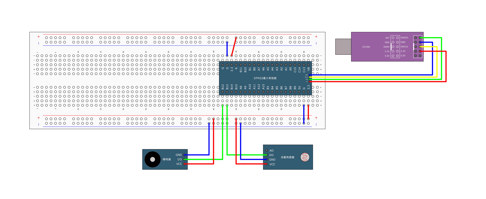

### 程序源码

main.c

```c
#include "stm32f10x.h" // Device header
#include "Buzzer.h"
#include "Delay.h"
#include "LightSensor.h"
int main()
{
	// 初始化光照传感器
	LightSensor_Init();
	// 初始化蜂鸣器
	Buzzer_Init();
	while (1)
	{
		// 检测到光照传感器返回值为1  蜂鸣器工作
		if (LightSensor_Get() == 1)
		{
			Buzzer_ON();
		}
		else
		{
			// 检测到光照传感器返回值为0  蜂鸣器不工作
			Buzzer_OFF();
		}
	}
}
```

Buzzer.c

​	蜂鸣器的 I/O 接在 PB12 ，初始化 PB12 端口，设置为推挽输出（`GPIO_Mode_Out_PP`）

```c
#include "stm32f10x.h"                  // Device header

void Buzzer_Init(void)
{
	RCC_APB2PeriphClockCmd(RCC_APB2Periph_GPIOB,ENABLE);
	
	GPIO_InitTypeDef GPIO_InitStruct;
	GPIO_InitStruct.GPIO_Mode = GPIO_Mode_Out_PP;
	GPIO_InitStruct.GPIO_Pin = GPIO_Pin_12;
	GPIO_InitStruct.GPIO_Speed = GPIO_Speed_50MHz;
	GPIO_Init(GPIOA,&GPIO_InitStruct);
	
	GPIO_ResetBits(GPIOB, GPIO_Pin_12);
}

void Buzzer_ON(void)
{
	GPIO_ResetBits(GPIOB,GPIO_Pin_12);
}

void Buzzer_OFF(void)
{
	GPIO_SetBits(GPIOB,GPIO_Pin_12);
}

void Buzzer_Turn(void)
{
	if(GPIO_ReadOutputDataBit(GPIOB,GPIO_Pin_12) == 1)
	{
		GPIO_ResetBits(GPIOB,GPIO_Pin_12);
	}else
	{
		GPIO_SetBits(GPIOB,GPIO_Pin_12);
	}
}
```

Light_Sensor.c

​	光敏传感器的 D0 接在PB13，初始化PB13，默认状态下（高亮度）D0口输出状态为低电平，所以将 PB13 口设置为上拉输入模式（`GPIO_Mode_IPU`）

```c
#include "stm32f10x.h"                  // Device header

void LightSensor_Init(void)
{
	RCC_APB2PeriphClockCmd(RCC_APB2Periph_GPIOA,ENABLE);
	
	GPIO_InitTypeDef GPIO_InitStruct;
	GPIO_InitStruct.GPIO_Mode = GPIO_Mode_IPU;
	GPIO_InitStruct.GPIO_Pin = GPIO_Pin_13;
	GPIO_InitStruct.GPIO_Speed = GPIO_Speed_50MHz;
	GPIO_Init(GPIOA,&GPIO_InitStruct);
}
uint8_t LightSensor_Get(void)
{
	return GPIO_ReadInputDataBit(GPIOB, GPIO_Pin_13);
}
```

<u>程序文件路径</u>


# OLED屏幕调试工具

## 简介

- OLED（Organic Light Emitting Diode）：有机发光二极管
- OLED显示屏：性能优异的新型显示屏，具有功耗低、相应速度快、宽视角、轻薄柔韧等特点
- 0.96寸OLED模块：小巧玲珑、占用接口少、简单易用，是电子设计中非常常见的显示屏模块
- 供电：3~5.5V，通信协议：I2C/SPI，分辨率：128*64


## 驱动函数

显示4行 16列

|       | 1    | 2    | 3    | 4    | 5    | 6    | 7    | 8    | 9    | 10   | 11   | 12   | 13   | 14   | 15   | 16   |
| :---- | ---- | ---- | ---- | :--- | :--- | :--- | :--- | :--- | :--- | :--- | :--- | :--- | :--- | :--- | :--- | :--- |
| **1** | A    |      | H    | e    | l    | l    | o    | W    | o    | r    | l    | d    | !    |      |      |      |
| **2** | 1    | 2    | 3    | 4    | 5    |      | -    | 6    | 6    |      |      |      |      |      |      |      |
| **3** | A    | A    | 5    | 5    |      |      |      |      |      |      |      |      |      |      |      |      |
| **4** | 1    | 0    | 1    | 0    | 1    | 0    | 1    | 0    | 0    | 1    | 0    | 1    | 0    | 1    | 0    | 1    |


| **函数**                               | **作用**             |
| -------------------------------------- | -------------------- |
| OLED_Init();                           | 初始化               |
| OLED_Clear();                          | 清屏                 |
| OLED_ShowChar(1,  1, 'A');             | 显示一个字符         |
| OLED_ShowString(1, 3,  "HelloWorld!"); | 显示字符串           |
| OLED_ShowNum(2, 1, 12345, 5);          | 显示十进制数字       |
| OLED_ShowSignedNum(2, 7, -66, 2);      | 显示有符号十进制数字 |
| OLED_ShowHexNum(3, 1, 0xAA55, 4);      | 显示十六进制数字     |
| OLED_ShowBinNum(4, 1, 0xAA55, 16);     | 显示二进制数字       |


## 代码测试

### 接线图


### 测试代码

main.c 文件

```c
#include "stm32f10x.h"                  // Device header
#include "Delay.h"
#include "OLED.h"
int main()
{
	OLED_Init();
	
	OLED_ShowChar(1,1,'A');
	
	OLED_ShowString(1,2,"HelloWorld!");
	
	/*
	 * 输入数字位数小于数字长度，自动在前面补0，否则最高位被删除
	 */
	OLED_ShowNum(2,1,12345,5);
	
	OLED_ShowSignedNum(2,7,-66,2);
	
	OLED_ShowHexNum(3,1,0xAA55,4);
	
	OLED_ShowBinNum(4,1,0xAA55,16);
	
	OLED_Clear();
	
	while(1); 
}
```

目录结构


# 中断

## 中断系统概述

​	在主程序运行过程中，出现了特定的中断触发条件（中断源），使得CPU暂停当前正在运行的程序，转而去处理中断程序，处理完成后又返回原来被暂停的位置继续运行


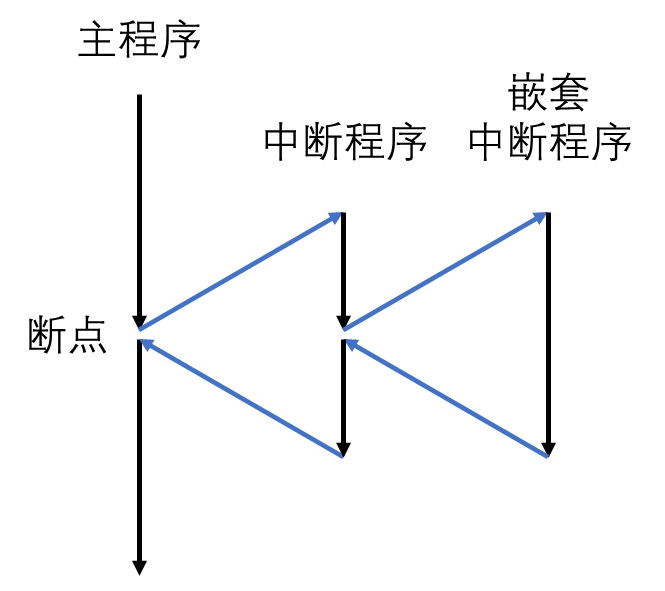


## NVIC 嵌套中断向量控制器

### 抢占优先级和响应优先级

使用NVIC统一管理中断，每个中断通道都拥有16个可编程的优先等级，可对优先级进行分组，进一步设置抢占优先级和响应优先级

 NVIC给每个中断赋予**<u>抢占优先级</u>**和**<u>响应优先级</u>**。  

- 拥有较高抢占优先级的中断可以打断抢占优先级较低的中断 
- 若两个抢占优先级的中断同时挂起，则优先执行响应优先级较高的中断 
- 若两个挂起的中断优先级都一致，则优先执行位于中断向量表中位置较高的中断 
- 响应优先级不会造成中断嵌套，也就是说中断嵌套是由抢占优先级决定的 

STM32 的中断向量具有两个属性，一个为抢占属性，另一个为响应属性，其属性编号越小，表明它的优先级别越高。

抢占，是指打断其他中断的属性，即因为具有这个属性会出现嵌套中断（在执行中断服务函数A 的过程中被中断B 打断，执行完中断服务函数B 再继续执行中断服务函数A），抢占属性由 `NVIC_IRQChannelPreemptionPriority` 的参数配置。

而响应属性则应用在抢占属性相同的情况下，当两个中断向量的抢占优先级相同时，如果两个中断同时到达， 则先处理响应优先级高的中断， 响应属性由 `NVIC_IRQChannelSubPriority` 参数配置。

| **分组方式** | **抢占优先级**  | **响应优先级**  |
| ------------ | --------------- | --------------- |
| 分组0        | 0位，取值为0    | 4位，取值为0~15 |
| 分组1        | 1位，取值为0~1  | 3位，取值为0~7  |
| 分组2        | 2位，取值为0~3  | 2位，取值为0~3  |
| 分组3        | 3位，取值为0~7  | 1位，取值为0~1  |
| 分组4        | 4位，取值为0~15 | 0位，取值为0    |

​	

​	若内核正在执行C 的中断服务函数，则它能被抢占优先级更高的中断A 打断，由于B和C 的抢占优先级相同，所以C 不能被B 打断。但如果B 和C 中断是同时到达的，内核就会首先响应响应优先级别更高的B 中断。

### NVIC基本结构


## 中断具体行为

CM3开始响应一个中断时，会做如下动作：  

- 入栈： 把8个寄存器的值压入栈 
- 取向量：从向量表中找出对应的服务程序入口地址 
- 选择堆栈指针MSP(主堆栈)/PSP(进程堆栈)，更新堆栈指针SP，更新链接寄存器 LR，更新程序计数器PC  

### 入栈

响应异常的第一个动作，就是自动保存现场，依次把xPSR、PC, LR, R12以及R3-R0由 硬件寄存器自动压入适当的堆栈中。  

### 取向量

数据总线（系统总线）在执行入栈的时候，指令总线从向量表中找出正确的异常向量， 然后在服务程序的入口处预取指。 

（由此可以看到各自都有专用总线的好处：入栈与取指这两个工作能同时进行）  

###  更新寄存器  

在入栈和取向量操作完成之后，执行服务例程之前，还要更新一系列的寄存器.  

- SP：在入栈后会把堆栈指针更新到新的位置。在执行服务例程时，将由MSP负 责对堆栈的 访问。 
- PSR：更新IPSR位段的值为新响应的异常编号。 
- PC：在取向量完成后，PC将指向服务例程的入口地址， 
- LR：在出入ISR（Interrupt Service Routines）中断服务程序的时候，LR的值 将得到更新  

 （在异常进入时由系统计算并赋给LR，并在异常返回时使用它）  

### 异常/中断返回  

当异常服务例程执行完毕后，需要恢复先前的系统状态，才能使被中断的程序得以继续执行。 

异常/中断处理完成后，执行如下处理： 

- 出栈：恢复先前压入栈中的寄存器，堆栈指针的值也改回先前的值 
- 更新NVIC寄存器：伴随着异常的返回，它的活动位也被硬件清除  

# EXTI外部中断

## 概述

- EXTI（Extern Interrupt）外部中断
- EXTI可以监测指定GPIO口的电平信号，当其指定的GPIO口产生电平变化时，EXTI将立即向NVIC发出中断申请，经过NVIC裁决后即可中断CPU主程序，使CPU执行EXTI对应的中断程序
- 支持的触发方式：上升沿/下降沿/双边沿/软件触发
- 支持的GPIO口：<u>**所有GPIO口，但相同的Pin不能同时触发中断**</u>
- 通道数：16个GPIO_Pin，外加PVD输出、RTC闹钟、USB唤醒、以太网唤醒
- 触发响应方式：<u>**中断响应/事件响应**</u>

***<u>事件和中断的区别：</u>*** 

产生中断线路目的是把输入信号输入到 NVIC，进一步会运行中断服务函数，实现功能，这样是软件级的。而产生事件线路目的就是传输一个脉冲信号给其他外设使用，并且是电路级 别的信号传输，属于硬件级的。  

- 中断：要进入NVIC，有相应的中断服务函数，需要CPU处理；
- 事件：不进入NVIC，仅用内部硬件自动控制，TIM，DMA，ADC等

**<u>主要特征</u>**

- 每个中断/事件都有独立的触发和屏蔽 
- 每个中断线都有专用的状态位 
- 支持多达20个软件的中断/事件请求 
- 检测脉冲宽度低于APB2时钟宽度的外部信号。

## 基本结构


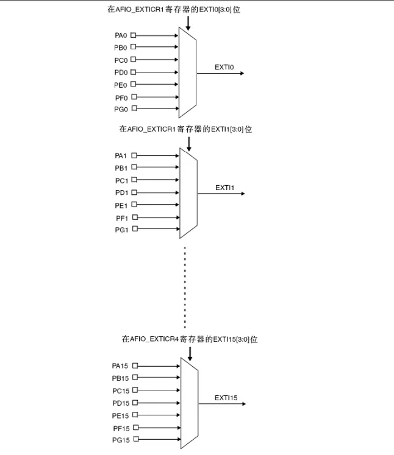

另外四个EXTI线的连接方式如下：  

- EXTI线16连接到PVD输出 
- EXTI线17连接到RTC闹钟事件 
- EXTI线18连接到USB唤醒事件 
- EXTI线19连接到以太网唤醒事件(只适用于互联型产品)  

**<u>AFIO复用IO</u>**

- AFIO主要用于引脚复用功能的选择和重定义
- 在STM32中，AFIO主要完成两个任务：复用功能引脚重映射、中断引脚选择

## 案例1 红外传感器

### 模块使用说明 


- 模块槽中无遮挡时，接收管导通，模块 OUT 输出低电平，遮挡时， OUT 输出高电平

### 接线图


### 程序源码

main.c

```c
#include "stm32f10x.h" // Device header
#include "Delay.h"
#include "OLED.h"
#include "CountSensor.h"
int main()
{
    OLED_Init();

    OLED_Clear();

    CountSensor_Init();

    while (1) {
        OLED_ShowNum(1, 1, CountNum(),3);
    }
}
```

CountSensor.c

```c
#include "stm32f10x.h" // Device header
#include "OLED.h"
#include "CountSensor.h"
#include"Delay.h"
/*
 *
 * 无遮挡输出低电平
 */
uint32_t num = 0; // Number
void CountSensor_Init(void)
{
    // 配置GPIO口
    RCC_APB2PeriphClockCmd(RCC_APB2Periph_AFIO, ENABLE);
    RCC_APB2PeriphClockCmd(RCC_APB2Periph_GPIOB, ENABLE);
    GPIO_InitTypeDef GPIO_InitStruct;
    GPIO_InitStruct.GPIO_Mode  = GPIO_Mode_IPU;
    GPIO_InitStruct.GPIO_Pin   = GPIO_Pin_14;
    GPIO_InitStruct.GPIO_Speed = GPIO_Speed_50MHz;
    GPIO_Init(GPIOB, &GPIO_InitStruct);

    GPIO_EXTILineConfig(GPIO_PortSourceGPIOB, GPIO_PinSource14);

    // 配置外部中断的
    EXTI_InitTypeDef EXTI_InitStruct;
    EXTI_InitStruct.EXTI_Line    = EXTI_Line14;
    EXTI_InitStruct.EXTI_LineCmd = ENABLE;
    EXTI_InitStruct.EXTI_Mode    = EXTI_Mode_Interrupt;
    EXTI_InitStruct.EXTI_Trigger = EXTI_Trigger_Falling;
    EXTI_Init(&EXTI_InitStruct);

    NVIC_PriorityGroupConfig(NVIC_PriorityGroup_2);
    // 配置NVIC
    NVIC_InitTypeDef NVIC_InitStruct;
    NVIC_InitStruct.NVIC_IRQChannel                   = EXTI15_10_IRQn;
    NVIC_InitStruct.NVIC_IRQChannelCmd                = ENABLE;
    NVIC_InitStruct.NVIC_IRQChannelPreemptionPriority = 1;
    NVIC_InitStruct.NVIC_IRQChannelSubPriority        = 1;
    NVIC_Init(&NVIC_InitStruct);
}
uint32_t CountNum(void)
{
    return num;
}

void EXTI15_10_IRQHandler(void)
{
    if (EXTI_GetITStatus(EXTI_Line14) == SET) {
        Delay_ms(500);
        num++;
        EXTI_ClearITPendingBit(EXTI_Line14);
    }
}
```

<u>程序路径</u>


### 实物图


## 案例2 旋转编码器计次

### 模块使用说明

- 旋转编码器：用来测量位置、速度或旋转方向的装置，当其旋转轴旋转时，其输出端可以输出与旋转速度和方向对应的方波信号，读取方波信号的频率和相位信息即可得知旋转轴的速度和方向
- 类型：机械触点式/霍尔传感器式/光栅式

### 接线图

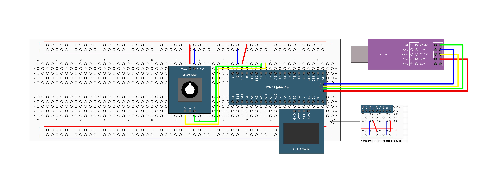

### 程序源码

main.c

```c
#include "stm32f10x.h" // Device header
#include "Delay.h"
#include "OLED.h"
#include "Encoder.h"

int16_t Num;
int main()
{
    OLED_Init();
    OLED_ShowString(1, 1, "Num:");

    Encoder_Init();
    while (1) {
        Num = Num + getCountNum();
        OLED_ShowSignedNum(1, 5, Num, 5);
    }
}
```

Encoder.c

```c
#include "stm32f10x.h"
#include "Encoder.h"
#include "OLED.h"
uint16_t CountNum;
void Encoder_Init()
{
    RCC_APB2PeriphClockCmd(RCC_APB2Periph_GPIOB, ENABLE);
    RCC_APB2PeriphClockCmd(RCC_APB2Periph_AFIO, ENABLE);
    GPIO_InitTypeDef GPIO_InitStruct;
    GPIO_InitStruct.GPIO_Mode  = GPIO_Mode_IPU;
    GPIO_InitStruct.GPIO_Pin   = GPIO_Pin_0 | GPIO_Pin_1;
    GPIO_InitStruct.GPIO_Speed = GPIO_Speed_50MHz;
    // 配置GPIO
    GPIO_Init(GPIOB, &GPIO_InitStruct);
    // 选择GPIO口作为外部中断线
    GPIO_EXTILineConfig(GPIO_PortSourceGPIOB, GPIO_PinSource0 | GPIO_PinSource1);
    EXTI_InitTypeDef EXTI_InitStruct;
    EXTI_InitStruct.EXTI_Line    = EXTI_Line0 | EXTI_Line1;
    EXTI_InitStruct.EXTI_LineCmd = ENABLE;
    EXTI_InitStruct.EXTI_Mode    = EXTI_Mode_Interrupt;
    EXTI_InitStruct.EXTI_Trigger = EXTI_Trigger_Falling;
    EXTI_Init(&EXTI_InitStruct);

    NVIC_InitTypeDef NVIC_InitStruct;
    NVIC_InitStruct.NVIC_IRQChannel                   = EXTI0_IRQn;
    NVIC_InitStruct.NVIC_IRQChannelCmd                = ENABLE;
    NVIC_InitStruct.NVIC_IRQChannelPreemptionPriority = 1;
    NVIC_InitStruct.NVIC_IRQChannelSubPriority        = 1;
    NVIC_Init(&NVIC_InitStruct);
    // 需要对两个中断分别配置中断优先级
    NVIC_InitStruct.NVIC_IRQChannel            = EXTI1_IRQn;
    NVIC_InitStruct.NVIC_IRQChannelSubPriority = 2;
    NVIC_Init(&NVIC_InitStruct);
}

void EXTI0_IRQHandler()
{
    if (EXTI_GetITStatus(EXTI_Line0) == SET) {
        if (GPIO_ReadInputDataBit(GPIOB, GPIO_Pin_1) == 0)
            CountNum++;
        EXTI_ClearITPendingBit(EXTI_Line0);
    }
}
void EXTI1_IRQHandler()
{
    if (EXTI_GetITStatus(EXTI_Line1) == SET) {
        if (GPIO_ReadInputDataBit(GPIOB, GPIO_Pin_0) == 0)
            CountNum--;
        EXTI_ClearITPendingBit(EXTI_Line1);
    }
}

int16_t getCountNum()
{
    uint16_t Tmp;
    Tmp      = CountNum;
    CountNum = 0;
    return Tmp;
}
```

<u>程序路径</u>


### 实物图


## 总结

配置外部中断需要调用的函数

- `RCC_APB2PeriphClockCmd` 需要配置GPIO口的时钟，需要配置AFIO中断引脚选择
- `GPIO_Init`  在调用函数时，需要将GPIO口设置为输入  下拉输入`GPIO_Mode_IPD`   上拉输出`GPIO_Mode_IPU`
- `GPIO_EXTILineConfig`  选择GPIO口作为外部中断线
- `EXTI_init` 配置外部中断
- `NVIC_Init` 配置NVIC中断优先级
- `EXTI_ClearITPendingBit` ，清除中断标志


最后，调用中断回调函数，在中断函数中尽量保持函数的简短


# 定时器

## 简介

- TIM（Timer）定时器
- 定时器可以对输入的时钟进行计数，并在计数值达到设定值时触发中断
- 16位计数器、预分频器、自动重装寄存器的时基单元，在72MHz计数时钟下可以实现最大59.65s的定时
- 不仅具备基本的定时中断功能，而且还包含内外时钟源选择、输入捕获、输出比较、编码器接口、主从触发模式等多种功能
- 根据复杂度和应用场景分为了高级定时器、通用定时器、基本定时器三种类型

| **类型**   | **编号**               | **总线** | **功能**                                                     |
| ---------- | ---------------------- | -------- | ------------------------------------------------------------ |
| 高级定时器 | TIM1、TIM8             | APB2     | 拥有通用定时器全部功能，并额外具有重复计数器、死区生成、互补输出、刹车输入等功能 |
| 通用定时器 | TIM2、TIM3、TIM4、TIM5 | APB1     | 拥有基本定时器全部功能，并额外具有内外时钟源选择、输入捕获、输出比较、编码器接口、主从触发模式等功能 |
| 基本定时器 | TIM6、TIM7             | APB1     | 拥有定时中断、主模式触发DAC的功能                            |

STM32F103C8T6定时器资源：TIM1、TIM2、TIM3、TIM4

## 定时中断基本结构


## 时序和时钟

### 预分频器时序


`预分频缓冲器`也叫做`影子寄存器`，在本期计数周期没有结束内，在`预分频控制寄存器`中更改了预分频系数，为了保证STM32运行的严谨，`预分频缓冲寄存器`会在执行完本次计数周期，即在触发本次中断回调函数后，将`预分频缓冲器`的值更改为当前`预分器`的值。

​	**<u>真正控制分频系数的值是在`预分频缓冲器`中</u>**

### 计数器时序


```tex
计数器溢出频率：CK_CNT_OV = CK_CNT / (ARR + 1) = CK_PSC / (PSC + 1) / (ARR + 1)
```

### 计数器无预装时序


### 计数器有预装时序


### RCC时钟树


## 案例1 定时器TIM2定时中断

### 接线图


### 程序源码

main.c

```c
#include "stm32f10x.h" // Device header
#include "Delay.h"
#include "OLED.h"
#include "Timer.h"

uint16_t num = 0;

int main()
{
    OLED_Init();
    Timer_Init();

    OLED_ShowString(1, 1, "NUM:");

    while (1) {
		OLED_ShowNum(2, 1, TIM_GetCounter(TIM2),5);
        OLED_ShowNum(1, 5, num, 3);
    }
}

void TIM2_IRQHandler(void)
{
    if (TIM_GetITStatus(TIM2, TIM_IT_Update) == SET) {
        num++;
        TIM_ClearITPendingBit(TIM2, TIM_IT_Update);
    }
}
```

Timer.c

```c
#include "stm32f10x.h" // Device header
#include "Timer.h"

void Timer_Init(void)
{
    RCC_APB1PeriphClockCmd(RCC_APB1Periph_TIM2, ENABLE);

    TIM_InternalClockConfig(TIM2);
    // 配置时基单元
    TIM_TimeBaseInitTypeDef TIM_TimeBaseInitStruct;
    TIM_TimeBaseInitStruct.TIM_ClockDivision     = TIM_CKD_DIV1;
    TIM_TimeBaseInitStruct.TIM_CounterMode       = TIM_CounterMode_Up;
    TIM_TimeBaseInitStruct.TIM_Period            = 10000 - 1;
    TIM_TimeBaseInitStruct.TIM_Prescaler         = 7200 - 1;
    TIM_TimeBaseInitStruct.TIM_RepetitionCounter = 0;
    TIM_TimeBaseInit(TIM2, &TIM_TimeBaseInitStruct);

    TIM_ITConfig(TIM2, TIM_IT_Update, ENABLE);
    TIM_ClearITPendingBit(TIM2, TIM_IT_Update);

    NVIC_PriorityGroupConfig(NVIC_PriorityGroup_2);

    NVIC_InitTypeDef NVIC_InitStruct;
    NVIC_InitStruct.NVIC_IRQChannel                   = TIM2_IRQn;
    NVIC_InitStruct.NVIC_IRQChannelCmd                = ENABLE;
    NVIC_InitStruct.NVIC_IRQChannelPreemptionPriority = 2;
    NVIC_InitStruct.NVIC_IRQChannelSubPriority        = 1;
    NVIC_Init(&NVIC_InitStruct);
    TIM_Cmd(TIM2, ENABLE);
}
```

> 在19行调用了`TIM_ClearITPendingBit(TIM2, TIM_IT_Update);` 是因为调用了 `TIM_TimeBaseInit(TIM2, &TIM_TimeBaseInitStruct);` 后会立刻产生一个中断事件来将立刻更新预分频和重复计数器的值
>
> `TIM_TimeBaseInitStruct.TIM_RepetitionCounter = 0;` TIM_RepetitionCounter 重复计数器（RCR）只用高级计时器才有，所以值0
>
> `TIM_ClearITPendingBit(TIM2, TIM_IT_Update);` TIM_IT_Update 更新事件：是指计数器的值达到ARR寄存器设定的值或从0递增达到最大值发送的事件

<u>程序路径</u>


### 实物图


## 案例2 使用外部时钟（红外传感器）

### 接线图


### 程序源码

main.c

```c
#include "stm32f10x.h" // Device header
#include "Delay.h"
#include "OLED.h"
#include "Timer.h"

uint16_t num = 0;

int main()
{
    OLED_Init();
    Timer_Init();

    OLED_ShowString(2, 1, "NUM:");

    while (1) {
		OLED_ShowNum(2, 1, TIM_GetCounter(TIM2),5);
        OLED_ShowNum(1, 5, num, 3);
    }
}

void TIM2_IRQHandler(void)
{
    if (TIM_GetITStatus(TIM2, TIM_IT_Update) == SET) {
        num++;
        TIM_ClearITPendingBit(TIM2, TIM_IT_Update);
    }
}
```

Timer.c

```c
#include "stm32f10x.h" // Device header
#include "Timer.h"

void Timer_Init(void)
{
    RCC_APB2PeriphClockCmd(RCC_APB2Periph_GPIOA, ENABLE);
    RCC_APB1PeriphClockCmd(RCC_APB1Periph_TIM2, ENABLE);
    GPIO_InitTypeDef GPIO_InitStruct;
    GPIO_InitStruct.GPIO_Mode  = GPIO_Mode_IN_FLOATING;
    GPIO_InitStruct.GPIO_Pin   = GPIO_Pin_0;
    GPIO_InitStruct.GPIO_Speed = GPIO_Speed_50MHz;
    GPIO_Init(GPIOA, &GPIO_InitStruct);
    // 使用外部时钟
    // 外部触发预分频器
    // TIM_ExtTRGPolarity_NonInverted 高电平或上升沿有效
    // 外部触发滤波器
    TIM_ETRClockMode2Config(TIM2, TIM_ExtTRGPSC_OFF, TIM_ExtTRGPolarity_NonInverted, 0x03);
    // 配置时基单元
    TIM_TimeBaseInitTypeDef TIM_TimeBaseInitStruct;
    TIM_TimeBaseInitStruct.TIM_ClockDivision     = TIM_CKD_DIV1;
    TIM_TimeBaseInitStruct.TIM_CounterMode       = TIM_CounterMode_Up;
    TIM_TimeBaseInitStruct.TIM_Period            = 10 - 1; // 自动重装值
    TIM_TimeBaseInitStruct.TIM_Prescaler         = 1 - 1;      // 预分频0次
    TIM_TimeBaseInitStruct.TIM_RepetitionCounter = 0;
    TIM_TimeBaseInit(TIM2, &TIM_TimeBaseInitStruct);
	TIM_ClearITPendingBit(TIM2, TIM_IT_Update);

    TIM_ITConfig(TIM2, TIM_IT_Update, ENABLE);

    NVIC_PriorityGroupConfig(NVIC_PriorityGroup_2);

    NVIC_InitTypeDef NVIC_InitStruct;
    NVIC_InitStruct.NVIC_IRQChannel                   = TIM2_IRQn;
    NVIC_InitStruct.NVIC_IRQChannelCmd                = ENABLE;
    NVIC_InitStruct.NVIC_IRQChannelPreemptionPriority = 2;
    NVIC_InitStruct.NVIC_IRQChannelSubPriority        = 1;
    NVIC_Init(&NVIC_InitStruct);
    TIM_Cmd(TIM2, ENABLE);
}
```

> `TIM_ETRClockMode2Config(TIM2, TIM_ExtTRGPSC_OFF, TIM_ExtTRGPolarity_NonInverted, 0x03);`  
>
> `void TIM_ETRClockMode2Config(TIM_TypeDef* TIMx, uint16_t TIM_ExtTRGPrescaler, uint16_t TIM_ExtTRGPolarity, uint16_t ExtTRGFilter)`
>
> ​	在STM32F103C8T6 中，PA0 口的映射到TIM2，第一个参数选择TIM2，
>
> ​	`TIM_ExtTRGPrescaler`外部触发时钟预分频器，选择外部触发时钟不进行预分频
>
> ​	`TIM_ExtTRGPolarity`：外部触发信号极性，上升沿或下降沿触发，选择TIM_ExtTRGPolarity_NonInverted
>
> ​	`ExtTRGFilter`：外部触发信号滤波器，用于滤除外部触发信号的抖动，提高信号的稳定性。

#### `ExtTRGFilter` 滤波器的具体工作步骤

`ExtTRGFilter` 滤波器是一种用于滤除外部触发信号抖动的硬件电路。它通常集成在定时器芯片中，由一组采样器和逻辑门组成。

**工作原理：**

1. **采样**：`ExtTRGFilter` 滤波器会定期对外部触发信号进行采样。采样频率通常与定时器的时钟频率相关。
2. **比较**：将每个采样值与前一个采样值进行比较。
3. **判定**：如果两个采样值之间满足特定的判定条件，则认为外部触发信号发生了有效的变化。
4. **输出**：如果判定结果为有效，则将外部触发信号输出到定时器逻辑。

**判定条件：**

不同的 `ExtTRGFilter` 滤波器可能使用不同的判定条件。常见判定条件包括：

- **上升沿触发**：如果当前采样值比前一个采样值高，则判定为有效。
- **下降沿触发**：如果当前采样值比前一个采样值低，则判定为有效。
- **任何沿触发**：如果当前采样值与前一个采样值不同，则判定为有效。

<u>程序路径</u>


### 实物图


## 代码总结

在配置TIM2时，需要调用的函数

- `RCC_APB1PeriphClockCmd`  使能RCC内部时钟  RCC内部时钟
- `TIM_InternalClockConfig` 选择内部时钟模式  内部时钟模式
- `TIM_TimeBaseInit` 初始化时基单元
- `NVIC_Init` 初始化NVIC	
- `TIM_Cmd` 允许TIM3工作，使能TIM3   运行控制
- `TIM_ITConfig`  设置允许TIM2更新终端  终端输出控制

在配置外部时钟时，需要调用的函数

- `RCC_APB2PeriphClockCmd` 使能GPIO口的时钟
- `GPIO_Init` 初始化GPIO口
- `TIM_ETRClockMode2Config` 使用外部时钟 外部时钟模式2
- 其他步骤与配置TIM2相同


# 定时器的输出捕获和输入比较

## 输出比较 OC（Output Compare）

- 输出比较可以通过比较CNT与CCR寄存器值的关系，来对输出电平进行置1、置0或翻转的操作，用于输出一定频率和占空比的PWM波形
- 每个高级定时器和通用定时器都拥有4个输出比较通道
- 高级定时器的前3个通道额外拥有死区生成和互补输出的功能

## PWM（Pulse Width Modulation）脉冲宽度调制

- 在具有惯性的系统中，可以通过对一系列脉冲的宽度进行调制，来等效地获得所需要的模拟参量，常应用于电机控速等领域
- PWM参数：
       

频率 = 1 / TS            占空比 = TON / TS           分辨率 = 占空比变化步距

- PWM频率：	    Freq = CK_PSC / (PSC + 1) / (ARR + 1)
- PWM占空比：	  Duty = CCR / (ARR + 1)
- PWM分辨率：	  Reso = 1 / (ARR + 1)


## 输出比较

|     **模式**     |                           **描述**                           |
| :--------------: | :----------------------------------------------------------: |
|       冻结       |                  CNT=CCR时，REF保持为原状态                  |
| 匹配时置有效电平 |                   CNT=CCR时，REF置有效电平                   |
| 匹配时置无效电平 |                   CNT=CCR时，REF置无效电平                   |
|  匹配时电平翻转  |                    CNT=CCR时，REF电平翻转                    |
|  强制为无效电平  |               CNT与CCR无效，REF强制为无效电平                |
|  强制为有效电平  |               CNT与CCR无效，REF强制为有效电平                |
|     PWM模式1     | 向上计数：CNT<CCR时，REF置有效电平，CNT≥CCR时，REF置无效电平  向下计数：CNT>CCR时，REF置无效电平，CNT≤CCR时，REF置有效电平 |
|     PWM模式2     | 向上计数：CNT<CCR时，REF置无效电平，CNT≥CCR时，REF置有效电平  向下计数：CNT>CCR时，REF置有效电平，CNT≤CCR时，REF置无效电平 |

## PWM基本结构


## 案例1 输出PWM实现呼吸灯效果

 ### 接线图


### 程序源码

main.c

```c
#include "stm32f10x.h"                  // Device header
#include "Delay.h"
#include "OLED.h"
#include "PWM.h"

uint8_t i;

int main(void)
{
	OLED_Init();
	PWM_Init();
	
	while (1)
	{
		for (i = 0; i <= 100; i++)
		{
			PWM_SetCompare1(i);
			Delay_ms(10);
		}
		for (i = 0; i <= 100; i++)
		{
			PWM_SetCompare1(100 - i);
			Delay_ms(10);
		}
	}
}
```

PWM.c  如果需要使用重映像功能，PA15引脚输出PWM波，需要使用被注释了的代码

```c
#include "stm32f10x.h" // Device header

void PWM_Init(void)
{
	RCC_APB1PeriphClockCmd(RCC_APB1Periph_TIM2, ENABLE);
	RCC_APB2PeriphClockCmd(RCC_APB2Periph_GPIOA, ENABLE);
    // 使用PA15的复用功能，输出TIM2_CH1
    // 当使用GPIO的复用功能时，需要配置AFIO时钟
    // RCC_APB2PeriphClockCmd(RCC_APB2Periph_AFIO, ENABLE);

	GPIO_InitTypeDef GPIO_InitStructure;
	GPIO_InitStructure.GPIO_Mode = GPIO_Mode_AF_PP;
	GPIO_InitStructure.GPIO_Pin = GPIO_Pin_0;		//GPIO_Pin_15;
	GPIO_InitStructure.GPIO_Speed = GPIO_Speed_50MHz;
	GPIO_Init(GPIOA, &GPIO_InitStructure);
    // 配置重新映射
    // GPIO_PinRemapConfig(GPIO_PartialRemap1_TIM2, ENABLE);
    // 关闭GPIO口原来的功能
    // GPIO_PinRemapConfig(GPIO_Remap_SWJ_JTAGDisable, ENABLE);

    TIM_TimeBaseInitTypeDef TIM_TimeBaseInitStructure;
	TIM_TimeBaseInitStructure.TIM_ClockDivision = TIM_CKD_DIV1;
	TIM_TimeBaseInitStructure.TIM_CounterMode = TIM_CounterMode_Up;
	TIM_TimeBaseInitStructure.TIM_Period = 100 - 1;		//ARR
	TIM_TimeBaseInitStructure.TIM_Prescaler = 720 - 1;		//PSC
	TIM_TimeBaseInitStructure.TIM_RepetitionCounter = 0;
	TIM_TimeBaseInit(TIM2, &TIM_TimeBaseInitStructure);

    TIM_OCInitTypeDef TIM_OCInitStructure;
	TIM_OCStructInit(&TIM_OCInitStructure);
	TIM_OCInitStructure.TIM_OCMode = TIM_OCMode_PWM1;
	TIM_OCInitStructure.TIM_OCPolarity = TIM_OCPolarity_High;
	TIM_OCInitStructure.TIM_OutputState = TIM_OutputState_Enable;
	TIM_OCInitStructure.TIM_Pulse = 0;		//CCR
	TIM_OC1Init(TIM2, &TIM_OCInitStructure);

    TIM_Cmd(TIM2, ENABLE);
}
void PWM_SetCompare1(uint16_t Compare)
{
	TIM_SetCompare1(TIM2, Compare);
}
```

<u>程序路径</u>


### 代码总结

在配置PWM时

- `RCC_APB1PeriphClockCmd(RCC_APB1Periph_TIM2, ENABLE);`
- `RCC_APB2PeriphClockCmd(RCC_APB2Periph_GPIOA, ENABLE);` 分别开启GPIO口和TIM2的是时钟
- `GPIO_Init` 初始化GPIO口
- `TIM_TimeBaseInit` 初始化时基单元
- `TIM_OC1Init` 初始化OC1比较器
- `TIM_Cmd` 允许TIM2工作，使能TIM2   运行控制

在main.c文件中

- 调用 `TIM_SetCompare1` 函数更改通道1的比较值，CCR


## 案例2 PWM控制舵机

### 模块使用说明


### 接线图


### 程序源码

main.c

```c
#include "stm32f10x.h"                  // Device header
#include "Delay.h"
#include "OLED.h"
#include "Servo.h"
#include "Key.h"
#include "Servo.h"

uint16_t Angle = 0;

int main()
{
	OLED_Init();
	Servo_Init();
	Key_Init();
	Servo_SetAngle(Angle);
	OLED_ShowString(1,1,"Angle:");
	
    while(1)
	{
		if(Angle > 180)
			Angle = 0;
		OLED_ShowNum(1,7,Angle,3);
		Servo_SetAngle(Angle);
	} 
}

void EXTI1_IRQHandler()
{
	if(EXTI_GetITStatus(EXTI_Line1) == SET)
	{	
		Angle = Angle+30;
		EXTI_ClearITPendingBit(EXTI_Line1);
	}
}
```

Servo.c

```c
#include "stm32f10x.h" // Device header
#include "PWM.h"

void Servo_Init(void)
{
    PWM_Init();
}

void Servo_SetAngle(float angle)
{
    TIM_SetCompare2(TIM2, angle / 180 * 2000 + 500);
}
```

PWM.c

```c
#include "stm32f10x.h" // Device header
#include "PWM.h"
#include "OLED.h"
void PWM_Init(void)
{
    RCC_APB2PeriphClockCmd(RCC_APB2Periph_GPIOA, ENABLE);
	RCC_APB1PeriphClockCmd(RCC_APB1Periph_TIM2, ENABLE);

    GPIO_InitTypeDef GPIO_InitStructure;
    GPIO_InitStructure.GPIO_Pin   = GPIO_Pin_1;
    GPIO_InitStructure.GPIO_Mode  = GPIO_Mode_AF_PP;
    GPIO_InitStructure.GPIO_Speed = GPIO_Speed_50MHz;
    GPIO_Init(GPIOA, &GPIO_InitStructure);

    TIM_TimeBaseInitTypeDef TIM_TimeBaseStructure;
    TIM_TimeBaseStructure.TIM_Period        = 20000 - 1;  // ARR
    TIM_TimeBaseStructure.TIM_Prescaler     = 72 - 1; // PSC
    TIM_TimeBaseStructure.TIM_ClockDivision = TIM_CKD_DIV1;
    TIM_TimeBaseStructure.TIM_CounterMode   = TIM_CounterMode_Up;
    TIM_TimeBaseInit(TIM2, &TIM_TimeBaseStructure);

    TIM_OCInitTypeDef TIM_OCInitStructure;
    TIM_OCInitStructure.TIM_OCMode      = TIM_OCMode_PWM1;
    TIM_OCInitStructure.TIM_OutputState = TIM_OutputState_Enable;
    TIM_OCInitStructure.TIM_Pulse       = 0; // CCR
    TIM_OCInitStructure.TIM_OCPolarity  = TIM_OCPolarity_High;
    TIM_OC2Init(TIM2, &TIM_OCInitStructure);

    TIM_Cmd(TIM2, ENABLE);
}
```

key.c

```c
#include "stm32f10x.h" // Device header

void Key_Init(void)
{
    RCC_APB2PeriphClockCmd(RCC_APB2Periph_GPIOB, ENABLE);
    RCC_APB2PeriphClockCmd(RCC_APB2Periph_AFIO, ENABLE);
    GPIO_InitTypeDef GPIO_InitStructure;
    GPIO_InitStructure.GPIO_Mode  = GPIO_Mode_IPU;
    GPIO_InitStructure.GPIO_Pin   = GPIO_Pin_1;
    GPIO_InitStructure.GPIO_Speed = GPIO_Speed_50MHz;
    GPIO_Init(GPIOB, &GPIO_InitStructure);

    GPIO_EXTILineConfig(GPIO_PortSourceGPIOB, GPIO_PinSource1);

    EXTI_InitTypeDef EXTI_InitStruct;
    EXTI_InitStruct.EXTI_Line    = EXTI_Line1;
    EXTI_InitStruct.EXTI_LineCmd = ENABLE;
    EXTI_InitStruct.EXTI_Mode    = EXTI_Mode_Interrupt;
    EXTI_InitStruct.EXTI_Trigger = EXTI_Trigger_Rising;
    EXTI_Init(&EXTI_InitStruct);

    NVIC_PriorityGroupConfig(NVIC_PriorityGroup_2);

    NVIC_InitTypeDef NVIC_InitStruct;
    NVIC_InitStruct.NVIC_IRQChannel                   = EXTI1_IRQn;
    NVIC_InitStruct.NVIC_IRQChannelCmd                = ENABLE;
    NVIC_InitStruct.NVIC_IRQChannelPreemptionPriority = 1;
    NVIC_InitStruct.NVIC_IRQChannelSubPriority        = 2;
    NVIC_Init(&NVIC_InitStruct);
}
```

<u>程序路径</u>


### 实物图


## 案例3 PWM控制直流电机

### 模块说明

- 直流电机是一种将电能转换为机械能的装置，有两个电极，当电极正接时，电机正转，当电极反接时，电机反转

- 直流电机属于大功率器件，GPIO口无法直接驱动，需要配合电机驱动电路来操作

- TB6612是一款双路H桥型的直流电机驱动芯片，可以驱动两个直流电机并且控制其转速和方向

  

### 接线图


### 程序源码

main.c

```c
#include "stm32f10x.h"                  // Device header
#include "Delay.h"
#include "OLED.h"
#include "Motor.h"
#include "Key.h"

volatile int16_t Speed = 0;
volatile int32_t Step = 30;

int main(void)
{
	OLED_Init();
	OLED_ShowString(1,1,"SPEED:");
	OLED_ShowNum(2,1,Speed,4);
	Motor_Init();
	Key_Init();
	Motor_SetSpeed(Speed);
	
	while (1)
	{
		OLED_ShowSignedNum(2,1,Speed,4);
		if( Speed >= 100)
		{
			Step = Step * (-1);
		}
		if(Speed <= -100)
		{
			Step = Step * (-1);
		}
		Motor_SetSpeed(Speed);
	}
}

void EXTI1_IRQHandler()
{
	if(EXTI_GetITStatus(EXTI_Line1) == SET)
	{	
		Speed = Speed+Step;
		EXTI_ClearITPendingBit(EXTI_Line1);
	}
}
```

PWM.c

```c
#include "stm32f10x.h" // Device header

void PWM_Init(void)
{
	RCC_APB1PeriphClockCmd(RCC_APB1Periph_TIM2, ENABLE);
	RCC_APB2PeriphClockCmd(RCC_APB2Periph_GPIOA, ENABLE);

	GPIO_InitTypeDef GPIO_InitStructure;
	GPIO_InitStructure.GPIO_Mode = GPIO_Mode_AF_PP;
	GPIO_InitStructure.GPIO_Pin = GPIO_Pin_2;		//GPIO_Pin_15;
	GPIO_InitStructure.GPIO_Speed = GPIO_Speed_50MHz;
	GPIO_Init(GPIOA, &GPIO_InitStructure);
    

    TIM_TimeBaseInitTypeDef TIM_TimeBaseInitStructure;
	TIM_TimeBaseInitStructure.TIM_ClockDivision = TIM_CKD_DIV1;
	TIM_TimeBaseInitStructure.TIM_CounterMode = TIM_CounterMode_Up;
	TIM_TimeBaseInitStructure.TIM_Period = 100 - 1;		//ARR
	TIM_TimeBaseInitStructure.TIM_Prescaler = 3 - 1;		//PSC
	TIM_TimeBaseInitStructure.TIM_RepetitionCounter = 0;
	TIM_TimeBaseInit(TIM2, &TIM_TimeBaseInitStructure);

    TIM_OCInitTypeDef TIM_OCInitStructure;
	TIM_OCStructInit(&TIM_OCInitStructure);
	TIM_OCInitStructure.TIM_OCMode = TIM_OCMode_PWM1;
	TIM_OCInitStructure.TIM_OCPolarity = TIM_OCPolarity_High;
	TIM_OCInitStructure.TIM_OutputState = TIM_OutputState_Enable;
	TIM_OCInitStructure.TIM_Pulse = 0;		//CCR
	TIM_OC3Init(TIM2, &TIM_OCInitStructure);

    TIM_Cmd(TIM2, ENABLE);
}
void PWM_SetCompare3(uint16_t Compare)
{
	TIM_SetCompare3(TIM2, Compare);
}
```

Motor.c

```c
#include "stm32f10x.h" // Device header
#include "PWM.h"

void Motor_Init(void)
{
	RCC_APB2PeriphClockCmd(RCC_APB2Periph_GPIOA, ENABLE);
	
	GPIO_InitTypeDef GPIO_InitStruct;
	GPIO_InitStruct.GPIO_Mode = GPIO_Mode_Out_PP;
	GPIO_InitStruct.GPIO_Pin = GPIO_Pin_4 | GPIO_Pin_5;
	GPIO_InitStruct.GPIO_Speed = GPIO_Speed_50MHz;
	GPIO_Init(GPIOA, &GPIO_InitStruct);
	
	PWM_Init();
}

void Motor_SetSpeed(int8_t Speed)
{
	if(Speed >= 0)
	{
		GPIO_SetBits(GPIOA, GPIO_Pin_4);
		GPIO_ResetBits(GPIOA, GPIO_Pin_5);
		PWM_SetCompare3(Speed);
	} else
	{
		GPIO_SetBits(GPIOA, GPIO_Pin_5);
		GPIO_ResetBits(GPIOA, GPIO_Pin_4);
		PWM_SetCompare3(-Speed);
	}
}
```

Key.c

```c
#include "stm32f10x.h" // Device header

void Key_Init(void)
{
    RCC_APB2PeriphClockCmd(RCC_APB2Periph_GPIOA, ENABLE);
    RCC_APB2PeriphClockCmd(RCC_APB2Periph_AFIO, ENABLE);
    GPIO_InitTypeDef GPIO_InitStructure;
    GPIO_InitStructure.GPIO_Mode  = GPIO_Mode_IPU;
    GPIO_InitStructure.GPIO_Pin   = GPIO_Pin_1;
    GPIO_InitStructure.GPIO_Speed = GPIO_Speed_50MHz;
    GPIO_Init(GPIOA, &GPIO_InitStructure);

    GPIO_EXTILineConfig(GPIO_PortSourceGPIOA, GPIO_PinSource1);

    EXTI_InitTypeDef EXTI_InitStruct;
    EXTI_InitStruct.EXTI_Line    = EXTI_Line1;
    EXTI_InitStruct.EXTI_LineCmd = ENABLE;
    EXTI_InitStruct.EXTI_Mode    = EXTI_Mode_Interrupt;
    EXTI_InitStruct.EXTI_Trigger = EXTI_Trigger_Rising;
    EXTI_Init(&EXTI_InitStruct);

    NVIC_PriorityGroupConfig(NVIC_PriorityGroup_2);

    NVIC_InitTypeDef NVIC_InitStruct;
    NVIC_InitStruct.NVIC_IRQChannel                   = EXTI1_IRQn;
    NVIC_InitStruct.NVIC_IRQChannelCmd                = ENABLE;
    NVIC_InitStruct.NVIC_IRQChannelPreemptionPriority = 1;
    NVIC_InitStruct.NVIC_IRQChannelSubPriority        = 2;
    NVIC_Init(&NVIC_InitStruct);
}
```

<u>程序路径</u>


### 实物图


## 输入比较 IC（Input Capture）

- 输入捕获模式下，当通道输入引脚出现指定电平跳变时，当前CNT的值将被锁存到CCR中，可用于测量PWM波形的频率、占空比、脉冲间隔、电平持续时间等参数
- 每个高级定时器和通用定时器都拥有4个输入捕获通道
- 可配置为PWMI模式，同时测量频率和占空比
- 可配合主从触发模式，实现硬件全自动测量

### 输入捕获通道过程


**工作流程**

输入信号进过**输入滤波器和边沿检测器**和**预分频器**产生一个触发信号，由于CNT的值是由内部时钟驱动的，产生一个触发信号，CNT的值存入比较寄存器（CCR）。计算出频率。

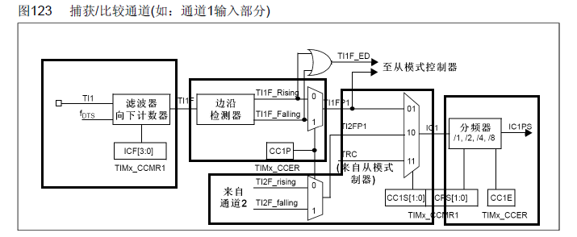

**设置输入捕获滤波器**

输入捕获滤波器IC1F[3:0]，这个用于设置采样频率和数字滤波器长度。其中：f~CK~INT是定时器的输入频率，f~DTS~是根据TIM~x~_CCMR1的CKD[1:0]的设置来确定的。

数字滤波器由一个事件计数器组成，它记录到N个事件后会产生一个输出的跳变。也就是说连续N次采样，如果都是高电平，则说明这是一个有效的触发，就会进入输入捕捉中断（如果设置了的话）。这样就可以滤除那些高电平脉宽低于8个采样周期的脉冲信号，从而达到滤波的作用。

**设置输入捕捉极性**

这里是设置捕捉事件是发生在上升沿还是下降沿。

**设置输入捕获映射关系**

由于我们只显示了一路通道的通道图，如果在几条通路的情况下：


在TIM~x~_CH1和TIM~x~ _CH2两条通道的情况下，我们可以看出除了TIM~x~ _CH1捕捉到的信号可以连接到IC1，TIM~x~ _CH2捕捉到的信号可以连接到IC2之外，TIM~x~ _CH1捕捉到的信号也可以连接到IC2，TIM~x~ _CH2捕捉到的信号也可以连接到IC1。

一般情况下，我们设置成TIM~x~ _CH1捕捉到的信号可以连接到IC1，TIM~x~ _CH2捕捉到的信号可以连接到IC2。

**设置输入捕获分频器**

这里设置的是**每N个事件触发一次捕捉**。也就是说，我们可以设置成，每2次上升沿事件触发一次捕捉。

- f~DTS~ 滤波器的采样时钟    滤波器 用于消除输入信号的噪声
- TIM~X~_CCMR1 中的`ICF`位用于控制滤波器的参数
- TIM~X~_CCER 中的`CC1P`位用于选择输入的极性 `TI1F_Rising` `TI1F_Falling` 最终得到 `TI1FP1` 信号
- TIM~X~_CCMR1 中的`CC1S`位用于数据选择器选择
- TIM~X~_CCMR1 中的`ICPS`位用于控制分配器参数
- TIM~X~_CCER 控制输出使能或失能

## 定时器主从模式详解

- 主模式：可以将定时器内部的信号，映射到TRGO引脚，用于出发别的外设
- 从模式：接收其他外设或自身外设的一些信号，用于控制定时器的运行，也就是被别的信号控制
- 触发源选择：选择从模式的触发信号源，指定一个信号，得到TRGI去触发从模式，从模式自动执行
- 主从模式优点是硬件自动触发一些功能，不需要通过软件判断触发源，减少软件使用资源。

***例如***

​	想要时TI1FP1信号自动触发CNT的值赋0，在**<u>触发源选择</u>**选择`TI1FP1`，在<u>**从模式**</u>选择`Reset`。这样TI1FP1信号触出硬件会自动执行CNT赋0操作


## 输入捕获基本结构


## PWMI基本结构


## 案例1 IPWM模式测占空比

### 接线图


### 程序源码

main.c

```c
#include "stm32f10x.h"                  // Device header
#include "Delay.h"
#include "OLED.h"
#include "PWM.h"
#include "IC.h"

uint32_t i;

int main(void)
{
	OLED_Init();
	PWM_Init();
	TIM_IC();
	OLED_ShowString(1, 1, "Freq:00000Hz");
	OLED_ShowString(2, 1, "Freq:00%");
	PWM_SetPrescaler(720 - 1);		//Freq = 72M / (PSC + 1) / 100
	PWM_SetCompare1(50);			//Duty = CCR / 100
	
	while (1)
	{
		OLED_ShowNum(1,6,IC_GetFreq(), 5);
		OLED_ShowNum(2,6,IC_GetDuty(), 2);
	}
}
```

PWM.c

```c
#include "stm32f10x.h" // Device header

void PWM_Init(void)
{
	RCC_APB1PeriphClockCmd(RCC_APB1Periph_TIM2,ENABLE);
	RCC_APB2PeriphClockCmd(RCC_APB2Periph_GPIOA,ENABLE);
	
	GPIO_InitTypeDef GPIO_InitStruct;
	GPIO_InitStruct.GPIO_Mode = GPIO_Mode_AF_PP;
	GPIO_InitStruct.GPIO_Pin = GPIO_Pin_0;
	GPIO_InitStruct.GPIO_Speed = GPIO_Speed_50MHz;
	GPIO_Init(GPIOA, &GPIO_InitStruct);
	
	TIM_TimeBaseInitTypeDef TIM_TimeBaseInitStruct;
	TIM_TimeBaseInitStruct.TIM_ClockDivision = TIM_CKD_DIV1;
	TIM_TimeBaseInitStruct.TIM_CounterMode = TIM_CounterMode_Up;
	TIM_TimeBaseInitStruct.TIM_Period = 100 - 1;
	TIM_TimeBaseInitStruct.TIM_Prescaler = 720 - 1;
	TIM_TimeBaseInitStruct.TIM_RepetitionCounter = 0;
	TIM_TimeBaseInit(TIM2, &TIM_TimeBaseInitStruct);
	
	TIM_OCInitTypeDef TIM_OCInitStruct;
	TIM_OCInitStruct.TIM_OCMode = TIM_OCMode_PWM1;
	TIM_OCInitStruct.TIM_OCPolarity = TIM_OCPolarity_High;
	TIM_OCInitStruct.TIM_Pulse = 0;		//CCR
	TIM_OCInitStruct.TIM_OutputState = TIM_OutputState_Enable;
	TIM_OC1Init(TIM2, &TIM_OCInitStruct);
	
	TIM_Cmd(TIM2,ENABLE);
}
void PWM_SetCompare1(uint16_t Compare)
{
	TIM_SetCompare1(TIM2, Compare);
}

void PWM_SetPrescaler(uint16_t Prescaler)
{
	TIM_PrescalerConfig(TIM2, Prescaler, TIM_PSCReloadMode_Immediate);
}
```

IC.c

```c
#include "stm32f10x.h"                  // Device header

void TIM_IC(void)
{
	
	RCC_APB1PeriphClockCmd(RCC_APB1Periph_TIM3,ENABLE);
	RCC_APB2PeriphClockCmd(RCC_APB2Periph_GPIOA,ENABLE);
	
	GPIO_InitTypeDef GPIO_InitStruct;
	GPIO_InitStruct.GPIO_Mode = GPIO_Mode_IPU;
	GPIO_InitStruct.GPIO_Pin = GPIO_Pin_6;
	GPIO_InitStruct.GPIO_Speed = GPIO_Speed_50MHz;
	GPIO_Init(GPIOA, &GPIO_InitStruct);
	
	TIM_TimeBaseInitTypeDef TIM_TimeBaseInitStruct;
	TIM_TimeBaseInitStruct.TIM_ClockDivision = TIM_CKD_DIV1;
	TIM_TimeBaseInitStruct.TIM_CounterMode = TIM_CounterMode_Up;
	TIM_TimeBaseInitStruct.TIM_Period = 65536 - 1;
	TIM_TimeBaseInitStruct.TIM_Prescaler = 72 - 1;
	TIM_TimeBaseInitStruct.TIM_RepetitionCounter = 0;
	TIM_TimeBaseInit(TIM3, &TIM_TimeBaseInitStruct);
	
	TIM_ICInitTypeDef TIM_ICInitStruct;
	TIM_ICInitStruct.TIM_Channel = TIM_Channel_1;
	TIM_ICInitStruct.TIM_ICFilter = 0xF;
	TIM_ICInitStruct.TIM_ICPolarity = TIM_ICPolarity_Rising;
	TIM_ICInitStruct.TIM_ICPrescaler = TIM_ICPSC_DIV1;
	TIM_ICInitStruct.TIM_ICSelection = TIM_ICSelection_DirectTI;
	TIM_ICInit(TIM3, &TIM_ICInitStruct);
	// 将自动配置
	TIM_PWMIConfig(TIM3, &TIM_ICInitStruct);
	
//	TIM_ICInitStruct.TIM_Channel = TIM_Channel_2;
//	TIM_ICInitStruct.TIM_ICFilter = 0xF;
//	TIM_ICInitStruct.TIM_ICPolarity = TIM_ICPolarity_Falling;
//	TIM_ICInitStruct.TIM_ICPrescaler = TIM_ICPSC_DIV1;
//	TIM_ICInitStruct.TIM_ICSelection = TIM_ICSelection_IndirectTI;
	
	TIM_SelectInputTrigger(TIM3, TIM_TS_TI1FP1);
	
	TIM_SelectSlaveMode(TIM3, TIM_SlaveMode_Reset);
	
	TIM_Cmd(TIM3, ENABLE);
}

uint32_t IC_GetFreq(void)
{
	return 1000000 / (TIM_GetCapture1(TIM3) + 1);
}

uint32_t IC_GetDuty(void)
{
	return (TIM_GetCapture2(TIM3) + 1) * 100 / TIM_GetCapture1(TIM3);
}
```

> `TIM_PWMIConfig` ：将自动配置输入捕获，`TIM_ICInitStruct.TIM_ICPolarity = TIM_ICPolarity_Rising;`
> `TIM_ICInitStruct.TIM_ICSelection = 	TIM_ICSelection_DirectTI;` 在 `TIM_ICSelection_IndirectTI` 配置为 `TIM_ICPolarity_Falling` 
>
> `TIM_SelectInputTrigger` ：配置TRGI的触发源 触发源选择
>
> `TIM_SelectSlaveMode` ：设置从模式为 Reset

<u>程序路径</u>


### 实物图


## 案例2 编码器接口测速

### 模块说明

- 编码器接口可接收增量（正交）编码器的信号，根据编码器旋转产生的正交信号脉冲，自动控制CNT自增或自减，从而指示编码器的位置、旋转方向和旋转速度
- 每个高级定时器和通用定时器都拥有1个编码器接口
- 两个输入引脚借用了输入捕获的通道1和通道2


<u>**编码器接口基本结构**</u>


### 接线图

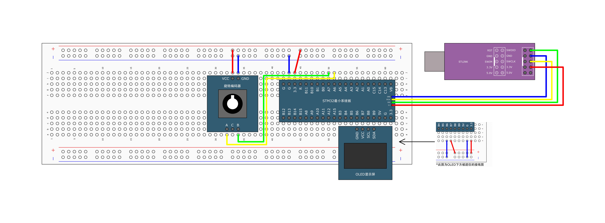

### 程序源码

main.c

```c
#include "stm32f10x.h" // Device header
#include "Delay.h"
#include "OLED.h"
#include "Timer.h"
#include "Encoder.h"

int16_t Speed = 0;

int main()
{
    OLED_Init();
	
    Encoder_Init();

    OLED_ShowString(1, 1, "Speed:");
    while (1) 
	{
		OLED_ShowSignedNum(1, 7, Encoder_Get(), 5);
		Delay_ms(100);
    }
}

void TIM2_IRQHandler(void)
{
	if (TIM_GetITStatus(TIM2, TIM_IT_Update) == SET)		//判断是否是TIM2的更新事件触发的中断
	{
		Speed = Encoder_Get();								//每隔固定时间段读取一次编码器计数增量值，即为速度值
		TIM_ClearITPendingBit(TIM2, TIM_IT_Update);			//清除TIM2更新事件的中断标志位
															//中断标志位必须清除
															//否则中断将连续不断地触发，导致主程序卡死
	}
}
```

Encoder.c

```c
#include "stm32f10x.h"                  // Device header
#include "Encoder.h"

void Encoder_Init(void)
{
	RCC_APB2PeriphClockCmd(RCC_APB2Periph_GPIOA, ENABLE);
	RCC_APB1PeriphClockCmd(RCC_APB1Periph_TIM3,ENABLE);
	
	GPIO_InitTypeDef GPIO_InitStruct;
	GPIO_InitStruct.GPIO_Mode = GPIO_Mode_IPU;
	GPIO_InitStruct.GPIO_Pin = GPIO_Pin_6 | GPIO_Pin_7;
	GPIO_InitStruct.GPIO_Speed = GPIO_Speed_50MHz;
	GPIO_Init(GPIOA, &GPIO_InitStruct);
	
	TIM_TimeBaseInitTypeDef TIM_TimeBaseInitStruct;
	TIM_TimeBaseInitStruct.TIM_ClockDivision = TIM_CKD_DIV1;
	TIM_TimeBaseInitStruct.TIM_CounterMode = TIM_CounterMode_Up;
	TIM_TimeBaseInitStruct.TIM_Period = 65536 - 1;
	TIM_TimeBaseInitStruct.TIM_Prescaler = 1 - 1;
	TIM_TimeBaseInitStruct.TIM_RepetitionCounter = 0;
	TIM_TimeBaseInit(TIM3, &TIM_TimeBaseInitStruct);
	
	TIM_ICInitTypeDef TIM_ICInitStruct;
	TIM_ICInitStruct.TIM_Channel = TIM_Channel_1;
	TIM_ICInitStruct.TIM_ICFilter = 0xF;
//	TIM_ICInitStruct.TIM_ICPolarity = TIM_ICPolarity_Rising;	//不反向
	TIM_ICInit(TIM3, &TIM_ICInitStruct);
	
	TIM_ICInitStruct.TIM_Channel = TIM_Channel_2;
	TIM_ICInitStruct.TIM_ICFilter = 0xF;
//	TIM_ICInitStruct.TIM_ICPolarity = TIM_ICPolarity_Rising;	//不反向
	TIM_ICInit(TIM3, &TIM_ICInitStruct);
	
	TIM_EncoderInterfaceConfig(TIM3, TIM_EncoderMode_TI12, TIM_ICPolarity_Rising, TIM_ICPolarity_Rising);

	TIM_Cmd(TIM3, ENABLE);	
}

int16_t Encoder_Get(void)
{
	int16_t tmp;
	tmp = TIM_GetCounter(TIM3);
	TIM_SetCounter(TIM3, 0);
	return tmp;
}
```

------

> `TIM_EncoderInterfaceConfig`：使用标准库函数 
>
> ​	选择TIM3模式
>
> ​	后连个参数配置选择的IC极性，选择两个相反的极性配置方向

<u>程序路径</u>


### 实物图


# ADC（Analog-Digital Converter）

## 概述

- ADC可以将引脚上连续变化的模拟电压转换为内存中存储的数字变量，建立模拟电路到数字电路的桥梁
- 12位逐次逼近型ADC，1us转换时间
- 输入电压范围：0 ~ 3.3V，转换结果范围：0 ~ 4095
- 18个输入通道，可测量16个外部和2个内部信号源
- 规则组和注入组两个转换单元
- 模拟看门狗自动监测输入电压范围
- ADC输入范围：V~REF-~ ≤ V~IN~ ≤ V~REF+~。
- STM32F103C8T6 ADC资源：ADC1、ADC2，10个外部输入通道

## 逐次逼近型ADC介绍


在该系列的MCU使用的<u>逐次逼近型ADC</u>

`EOC 转换结束位`

逐次比较型 ADC 原理是从高位到低位逐位比较，首先将缓冲寄存器各位清零；转换开始后，先将寄存器最高位置1，把值送入 D/A 转换器，经 D/A 转换后的模拟量送入比较器，称为 V~o~，与比较器的待转换的模拟量Vi比较，若 V~o~<V~i~ ，该位被保留，否则被清0。然后，再置寄存器次高位为1，将寄存器中新的数字量送 D/A 转换器，输出的  V~o~ 再与 V~i~ 比较，若 V~o~<V~i~ ，该位被保留，否则被清0。循环此过程，直到寄存器最低位，得到数字量的输出。

逐次逼近转换过程和用天平称物重非常相似。天平称重物过程是，从最重的砝码开始试放，与被称物体行进比较，若物体重于砝码，则该砝码保留，否则移去。再加上第二个次重砝码，由物体的重量是否大于砝码的重量决定第二个砝码是留下还是移去。照此一直加到最小一个砝码为止。将所有留下的砝码重量相加，就得此物体的重量。仿照这一思路，逐次比较型A/D转换器，就是将输入模拟信号与不同的参考电压作多次比较，使转换所得的数字量在数值上逐次逼近输入模拟量对应值。


当启动脉冲低电平到来后转换开始，在第一个 CP 作用下，数据寄存器将 D7～D0=10000000 送入 D/A 转换器，其输出电压 V~0~=5V ，V~A~ 与 V~0~ 比较， V~A~>V~0~ 存1;第二个 CP 到来时，寄存器输出 D7～D0=11000000 ， V~0~ 为7.5V， V~A~ 再与 7.5V 比较，因 V~A~<7.5V，所以 D6 存 0 ;输入第三个 CP 时，D7～D0=10100000，V~0~=6.25V ;V~A~ 再与 V~0~ 比较，……如此重复比较下去，经8个时钟周期，转换结束。由图中 V~0~的波形可见，在逐次比较过程中，与输出数字量对应的模拟电压 V~0~ 逐渐逼近 V~A~值，最后得到 A/D 转换器转换结果 D7～D0 为 10101111 。该数字量所对应的模拟电压为 6.8359375V ，与实际输入的模拟电压 6.84V 的相对误差仅为 0.06%。


## ADC基本结构


## ADC的基本原理

### 结构框图


### ADC引脚


一般情况下，**V~DD~是3.3V，V~SS~接地，相对应的，V~DDA~是3.3V，V~SSA~也接地，模拟输入信号不要超过V~DD~（3.3V）。**

### ADC通道和引脚对应关系

| **通道** |   **ADC1**   | **ADC2** | **ADC3** |
| :------: | :----------: | :------: | :------: |
|  通道0   |     PA0      |   PA0    |   PA0    |
|  通道1   |     PA1      |   PA1    |   PA1    |
|  通道2   |     PA2      |   PA2    |   PA2    |
|  通道3   |     PA3      |   PA3    |   PA3    |
|  通道4   |     PA4      |   PA4    |   PF6    |
|  通道5   |     PA5      |   PA5    |   PF7    |
|  通道6   |     PA6      |   PA6    |   PF8    |
|  通道7   |     PA7      |   PA7    |   PF9    |
|  通道8   |     PB0      |   PB0    |   PF10   |
|  通道9   |     PB1      |   PB1    |          |
|  通道10  |     PC0      |   PC0    |   PC0    |
|  通道11  |     PC1      |   PC1    |   PC1    |
|  通道12  |     PC2      |   PC2    |   PC2    |
|  通道13  |     PC3      |   PC3    |   PC3    |
|  通道14  |     PC4      |   PC4    |          |
|  通道15  |     PC5      |   PC5    |          |
|  通道16  |  温度传感器  |          |          |
|  通道17  | 内部参考电压 |          |          |

在该系列的 MCU 中是没有 ADC3

#### 规则通道

规则通道：顾名思意，规则通道就是很规矩的意思，**<u>我们平时一般使用的就是这个通道，</u>**或者应该说我们用到的都是这个通道，没有什么特别要注意的可讲。

**最多可以安排16个通道。**规则通道和它的转换顺序在ADC_SQRx寄存器中选择，规则组转换的总数应写入ADC_SQR1寄存器的L[3:0]中；

#### 注入通道

注入，可以理解为插入，插队的意思，是一种不安分的通道。它是一种在规则通道转换的时候强行插入要转换的一种。如果在规则通道转换过程中，有注入通道插队，那么就要先转换完注入通道，等注入通道转换完成后，再回到规则通道的转换流程。**<u>这点跟中断程序很像</u>**，都是不安分的主。所以，注入通道只有在规则通道存在时才会出现。

**最多可以安排4个通道。**注入组和它的转换顺序在ADC_JSQR寄存器中选择。注入组里转化的总数应写入ADC_JSQR寄存器的L[1:0]中。

## ADC转换方式

STM32的ADC的各通道可以组成规则通道组或注入通道组，但是在转换方式还可以有**单次转换、连续转换、扫描转换模式**。

### 单次转换模式

**单次转换模式下，ADC只执行一次转换。**


### 连续转换模式

**在连续转换模式中，当前面ADC转换一结束马上就启动另一次转换。**


### 扫描模式

**此模式用来扫描一组模拟通道。**

**在每个组的每个通道上执行单次转换。在每个转换结束时，同一组的下一个通道被自动转换。如果设置了CONT位，转换不会在选择组的最后一个通道上停止，而是再次从选择组的第一个通道继续转换。**

这里需要注意的是：**如果在使用扫描模式的情况下使用中断，会在最后一个通道转换完毕后才会产生中断。而连续转换，是在每次转换后，都会产生中断。**

**扫描模式**

在扫描模式下，ADC会按照预先设定的顺序依次对所有已配置的通道进行采样。每个通道的采样结果都会存储在相应的寄存器中。扫描模式的特点是：

- 可以同时采集多个通道的数据
- 采样顺序固定，不可更改
- 适用于需要同时采集多个通道数据且对采样顺序有要求的场景

**非扫描模式**

在非扫描模式下，ADC只会对单个指定的通道进行采样。采样完成后，ADC会自动进入空闲状态，等待下一次触发。非扫描模式的特点是：

- 可以灵活选择要采样的通道
- 采样效率较高
- 适用于需要对单个通道进行高频采样的场景

| 特性     | 扫描模式                                   | 非扫描模式                 |
| -------- | ------------------------------------------ | -------------------------- |
| 采样通道 | 多个                                       | 单个                       |
| 采样顺序 | 固定                                       | 可灵活选择                 |
| 采样效率 | 较低                                       | 较高                       |
| 适用场景 | 需要同时采集多个通道数据且对采样顺序有要求 | 需要对单个通道进行高频采样 |

### 模拟看门狗

ADC中断的产生方式除了规则组转换完成、注入组转换完成之外，还有模拟看门狗事件。

如果**被ADC转换的模拟电压低于低阀值或高于高阀值，AWD模拟看门狗状态位被设置。**

需要注意的是：阀值独立于由 ADC_CR2 寄存器上的 ALIGN 位选择的数据对齐模式。**比较是在对齐之前完成的。**也就是说，在数据保存到数据寄存器之前，就已经完成了比较


------

## 单次模式 连续模式 扫描模式 非扫描模式 图

•**单次转换，非扫描模式**


•**连续转换，非扫描模式**


•**单次转换，扫描模式**


•**连续转换，扫描模式**


## 数据对齐

### 数据右对齐


### 数据左对齐


## 中断

规则和注入组转换结束时能产生中断，当模拟看门狗状态位被设置时也能产生中断。它们都有 独立的中断使能位。


## 转换时间

AD转换的步骤：**采样，保持，量化，编码**

STM32 ADC的总转换时间为：

TCONV = 采样时间 + 12.5个ADC周期

例如：当ADCCLK=14MHz，采样时间为1.5个ADC周期

TCONV = 1.5 + 12.5 = 14个ADC周期 = 1μs

## 案例1 单次AD转换

### 接线图


### 程序源码

main.c

```c
#include "stm32f10x.h"                  // Device header
#include "Delay.h"
#include "OLED.h"
#include "AD.h"

uint16_t AD_Value;
float Voltage;

int main()
{
	OLED_Init();
	
	AD_Init();
	
	OLED_ShowString(1, 1, "ADValue");
	OLED_ShowString(2, 1, "Voltage:0.00V");
	
	while(1)
	{
		AD_Value = AD_GetValue();
		Voltage = (float)AD_Value / 4095 * 3.3;
		
		OLED_ShowNum(1, 9, AD_Value, 4);
		OLED_ShowNum(2, 9, Voltage, 1);
		OLED_ShowNum(2, 11, (uint16_t)(Voltage * 100) % 100, 2);
		
		Delay_ms(100);
	}
}
```

AD.c

```c
#include "stm32f10x.h"                  // Device header

void AD_Init(void)
{
	RCC_APB2PeriphClockCmd(RCC_APB2Periph_ADC1, ENABLE);
	RCC_APB2PeriphClockCmd(RCC_APB2Periph_GPIOA, ENABLE);	
	RCC_ADCCLKConfig(RCC_PCLK2_Div6);
	
	//GPIO串口初始化
	GPIO_InitTypeDef GPIO_InitStruct;
	GPIO_InitStruct.GPIO_Mode = GPIO_Mode_AIN; // 模拟输入 ADC专属模式
	GPIO_InitStruct.GPIO_Pin = GPIO_Pin_0;
	GPIO_InitStruct.GPIO_Speed = GPIO_Speed_50MHz;
	GPIO_Init(GPIOA, &GPIO_InitStruct);
	
	// 选择规则组的输入通道
	// 如果需要配多个菜单，需要多次调用该函数，修改第二和第三个参数
	ADC_RegularChannelConfig(ADC1, ADC_Channel_0, 1, ADC_SampleTime_55Cycles5);
//	ADC_RegularChannelConfig(ADC1, ADC_Channel_1, 2, ADC_SampleTime_55Cycles5);
//	ADC_RegularChannelConfig(ADC1, ADC_Channel_2, 3, ADC_SampleTime_55Cycles5);

	ADC_InitTypeDef ADC_InitStruct;
	ADC_InitStruct.ADC_ContinuousConvMode = DISABLE;// 连续模式
	ADC_InitStruct.ADC_DataAlign = ADC_DataAlign_Right;//数据对齐
	ADC_InitStruct.ADC_ExternalTrigConv = ADC_ExternalTrigConv_None;//配置外部触发源 选择None软件触发
	ADC_InitStruct.ADC_Mode = ADC_Mode_Independent; // 配置ADC选择在单ADC还是双ADC模式， 选择独立模式
	ADC_InitStruct.ADC_NbrOfChannel = 1;//通道数目，指定在扫描模式下 总共会用到几个通道
	ADC_InitStruct.ADC_ScanConvMode = DISABLE;// 扫描模式配置 ENABLE 或是 DISABLE
	ADC_Init(ADC1, &ADC_InitStruct);
	
	ADC_Cmd(ADC1, ENABLE);
	 
	// 校准（可选）
	// 复位校准
	ADC_ResetCalibration(ADC1);
	// 判断复位校准的状态
	// 如果复位校准完成，硬件会自动将复位校准寄存器的值从1改为0，函数返回值为0
	// 如果函数返回值为1，说明复位校准还没有完成
	// while空循环等待复位校准完成
	while(ADC_GetResetCalibrationStatus(ADC1) == SET);
	// 开启校准  硬件将自动完成校准不需要额外配置
	ADC_StartCalibration(ADC1);
	// 判断校准状态，与复位校准的函数使用方式类似
	while(ADC_GetCalibrationStatus(ADC1) == SET);
}

void AD_Init(void)
{
	// 使用软件触发模式 调用函数后ADC开始转换
	ADC_SoftwareStartConvCmd(ADC1, ENABLE);
	// 用于判断AD转换是否完成
	// 第二个参数EOC用于获取EOC（规则或注入组）通道的状态
	// 在读取数据寄存器后会自动为0
	while(ADC_GetFlagStatus(ADC1, ADC_FLAG_EOC) == RESET);
	return ADC_GetConversionValue(ADC1);
}
```

> `ADC_InitStruct.ADC_ContinuousConvMode = DISABLE;// 连续模式` 当设置为 `ENABLE`  是为连续模式，使用软件触发后，会自动进行下次AD转换，`ADC_SoftwareStartConvCmd(ADC1, ENABLE);` 放在 `void AD_Init(void)` 函数的最后一行，并且修改为
>
> ```c
> void AD_Init(void)
> {
> 	return ADC_GetConversionValue(ADC1);
> }
> ```

<u>程序路径</u>


### 实物图


### 案例2 多次AD转换

### 接线图


### 程序源码

main.c

```c
#include "stm32f10x.h"                  // Device header
#include "Delay.h"
#include "OLED.h"
#include "AD.h"

uint16_t AD[4] = {0};

int main()
{
	OLED_Init();
	
	AD_Init();
	
	OLED_ShowString(1, 1, "AD0:");
	OLED_ShowString(2, 1, "AD1:");
	OLED_ShowString(3, 1, "AD2:");
	OLED_ShowString(4, 1, "AD3:");
	
	while(1)
	{
		for(int i = 0; i<4; i++)
		{
			AD[i] = AD_GetValue(0x00+i);
		}
		for(int i = 0; i<4; i++)
		{
			OLED_ShowNum(i+1, 5, AD[i], 4);
		}
		Delay_ms(100);
	}
}
```

AD.c

```c
#include "stm32f10x.h"                  // Device header

void AD_Init(void)
{
	RCC_APB2PeriphClockCmd(RCC_APB2Periph_ADC1, ENABLE);
	RCC_APB2PeriphClockCmd(RCC_APB2Periph_GPIOA, ENABLE);	
	RCC_ADCCLKConfig(RCC_PCLK2_Div6);
	
	//GPIO串口初始化
	GPIO_InitTypeDef GPIO_InitStruct;
	GPIO_InitStruct.GPIO_Mode = GPIO_Mode_AIN; // 模拟输入 ADC专属模式
	GPIO_InitStruct.GPIO_Pin = GPIO_Pin_0 | GPIO_Pin_1 | GPIO_Pin_2 | GPIO_Pin_3;
	GPIO_InitStruct.GPIO_Speed = GPIO_Speed_50MHz;
	GPIO_Init(GPIOA, &GPIO_InitStruct);
	

	ADC_InitTypeDef ADC_InitStruct;
	ADC_InitStruct.ADC_ContinuousConvMode = DISABLE;// 连续模式
	ADC_InitStruct.ADC_DataAlign = ADC_DataAlign_Right;//数据对齐
	ADC_InitStruct.ADC_ExternalTrigConv = ADC_ExternalTrigConv_None;//配置外部触发源 选择None软件触发
	ADC_InitStruct.ADC_Mode = ADC_Mode_Independent; // 配置ADC选择在单ADC还是双ADC模式， 选择独立模式
	ADC_InitStruct.ADC_NbrOfChannel = 1;//通道数目，指定在扫描模式下 总共会用到几个通道
	ADC_InitStruct.ADC_ScanConvMode = DISABLE;// 扫描模式配置 ENABLE 或是 DISABLE
	ADC_Init(ADC1, &ADC_InitStruct);
	
	ADC_Cmd(ADC1, ENABLE);
	 
	// 校准（可选）
	// 复位校准
	ADC_ResetCalibration(ADC1);
	// 判断复位校准的状态
	// 如果复位校准完成，硬件会自动将复位校准寄存器的值从1改为0，函数返回值为0
	// 如果函数返回值为1，说明复位校准还没有完成
	// while空循环等待复位校准完成
	while(ADC_GetResetCalibrationStatus(ADC1) == SET);
	// 开启校准  硬件将自动完成校准不需要额外配置
	ADC_StartCalibration(ADC1);
	// 判断校准状态，与复位校准的函数使用方式类似
	while(ADC_GetCalibrationStatus(ADC1) == SET);
}

uint16_t AD_GetValue(uint8_t ADC_Channelx)
{
	ADC_RegularChannelConfig(ADC1, ADC_Channelx, 1, ADC_SampleTime_55Cycles5);
	// 使用软件触发模式 调用函数后ADC开始转换
	ADC_SoftwareStartConvCmd(ADC1, ENABLE);
	while(ADC_GetFlagStatus(ADC1, ADC_FLAG_EOC) == RESET);
	return ADC_GetConversionValue(ADC1);
}
```

<u>程序路径</u>


### 实物图


## 代码总结

- 

- `GPIO_Init(GPIOA, &GPIO_InitStruct);` 对 GPIO 口进行配置，需要注意 GPIO_Mode 需要配置为 GPIO_Mode_AIN 模拟输入

- `ADC_Init(ADC1, &ADC_InitStruct);` 对指定的 ADC 模块进行指定配置配置，参数包含在 `ADC_InitStruct` 结构体中

- `ADC_Cmd(ADC1, ENABLE);` 开启 ADC

- ```c
  ADC_ResetCalibration(ADC1);
  // 判断复位校准的状态
  // 如果复位校准完成，硬件会自动将复位校准寄存器的值从1改为0，函数返回值为0
  // 如果函数返回值为1，说明复位校准还没有完成
  // while空循环等待复位校准完成
  while(ADC_GetResetCalibrationStatus(ADC1) == SET);
  // 开启校准  硬件将自动完成校准不需要额外配置
  ADC_StartCalibration(ADC1);
  // 判断校准状态，与复位校准的函数使用方式类似
  while(ADC_GetCalibrationStatus(ADC1) == SET);
  ```

  用于对ADC的校准

- `ADC_SoftwareStartConvCmd(ADC1, ENABLE);` 在配置为软件触发源时，调用此函数触发AD转换

# DMA （Direct Memory Access）

## 概述

- DMA可以提供外设和存储器或者存储器和存储器之间的高速数据传输，无须CPU干预，节省了CPU的资源
- 12个独立可配置的通道： DMA1（7个通道）， DMA2（5个通道）
- 每个通道都支持软件触发和特定的硬件触发
- STM32F103C8T6 DMA资源：DMA1（7个通道）
- 外设和存储器、存储器和外设之间的传输
- 主动单元拥有存储器的访问权，主动单元有内核(CPU)和DMA。

## 结构框图


### 功能描述

DMA控制器和Cortex™-M3核心共享系统数据总线，执行直接存储器数据传输。当CPU和DMA 同时访问相同的目标(RAM或外设)时，DMA请求会暂停CPU访问系统总线达若干个周期，总线 仲裁器执行循环调度，以保证CPU至少可以得到一半的系统总线(存储器或外设)带宽。

### Flash

Flash是ROM(只读存储器)的一种，如果通过总线直接访问的话，无论是CPU还是DMA，都是只读的，只能读取数据而不能写入。如果的DMA的目的地址填了Flash的地址，那么转运时就会出错。Flash也不是绝对不可写入，要配置接口控制器对Flash进行写入。

在程序中定义一个 `const` 变量(常量): `const int A=0x66`; 常量 `A` 就存储在 Flash 里面  变量地址以 `0x08` 开头。当我们的程序中出现一大批不需要修改的数据(查找表、字库数据等)时，就可以定义成常量，从而节省 SRAM 的空间。

### 仲裁器

DMA总线只有一条，所有的通道只能分时复用这个通道。仲裁器根据通道请求的**<u>优先级</u>**来启动外设/存储器的访问。类似中断的 `NVIC`

### AHB设备

DMA既是总线矩阵上的主动单元，读取各种寄存器，又是总线矩阵上的被动单元，Cortex™-M3核心通过AHB配置寄存器DMA

### DMA请求

用于硬件触发DMA的数据转运。

## DMA基本结构


### 地址是否自增

通常在涉及到内存到内存的传输时，需要设置地址自增，以防止传入的数据覆盖了原来的数据

而在外设到内存的传输时，不需要设置地址自增，可以保持该内存的地址存储的数值实时为最新的数值

### 传输计数器

DMA每转运一次，计数器就减1，减到零就不会进行数据转运了。

另外计数器减到0之后，之前自增的地址也会恢复到起始地址的位置。

故DMA传输完成一次(计数器减到零)，再次开启，数据会从之前的源地址和目的地址开始传递。

<u>**例如**</u>

​	传世 `uint16_t data[10]` 需要设置传输计数器为10，即需要传输10次，地址自增

再次开启的方法：

1. 重置传输计数器的值，重置前要失能DMA  z
2. 打开DMA自动重装器，即软件上开启循环模式。

### 自动重装器

自动重装器分为  **<u>循环模式</u>**  **<u>正常模式</u>**

传输计数器以递减的方式，当递减到0是，DMA传输被结束，如果设置自动重装器为循环模式，在传输计数器为0后自动回复原来的数值，继续计数

在M2M选择是软件触发时，自动重装器不能被设置为循环模式。如果设置了软件触发，就意味着DMA传输的启动完全由软件控制。此时，如果再设置自动重装器为循环模式，那么DMA传输就会一直进行，不受软件控制，这可能会导致系统资源浪费和数据错误等问题

### DMA传输方向

- 外设 -> SRAM
- SRAM -> 外设
- Flash -> SRAM

<u>**需要注意**</u>

​	因为 Flash 是只读的，无法修改，所以没有 **<u>SRAM -> Flash</u>** 的传输方向 

### DMA传输参数和条件

我们知道，数据传输，首先需要的是 

1. **<u>数据的源地址</u>** 
2. **<u>数据传输位置的目标地址</u>** 
3. **<u>传递数据多少的数据传输量</u>** 
4. **<u>进行多少次传输的传输模式</u>** 

当用户将参数设置好，主要涉及源地址、目标地址、传输数据量这三个，DMA控制器就会启动数据传输，当剩余传输数据量为0时 达到传输终点，结束DMA传输 ，当然，DMA 还有循环传输模式 当到达传输终点时会重新启动DMA传输。
　　
也就是说只要剩余传输数据量不是0，而且DMA是启动状态，那么就会发生数据传输。

**<u>开启DMA传输必须满足三个条件</u>**

- 传输计数器的值大于0
- 触发源有触发信号
- DMA使能

## DMA请求

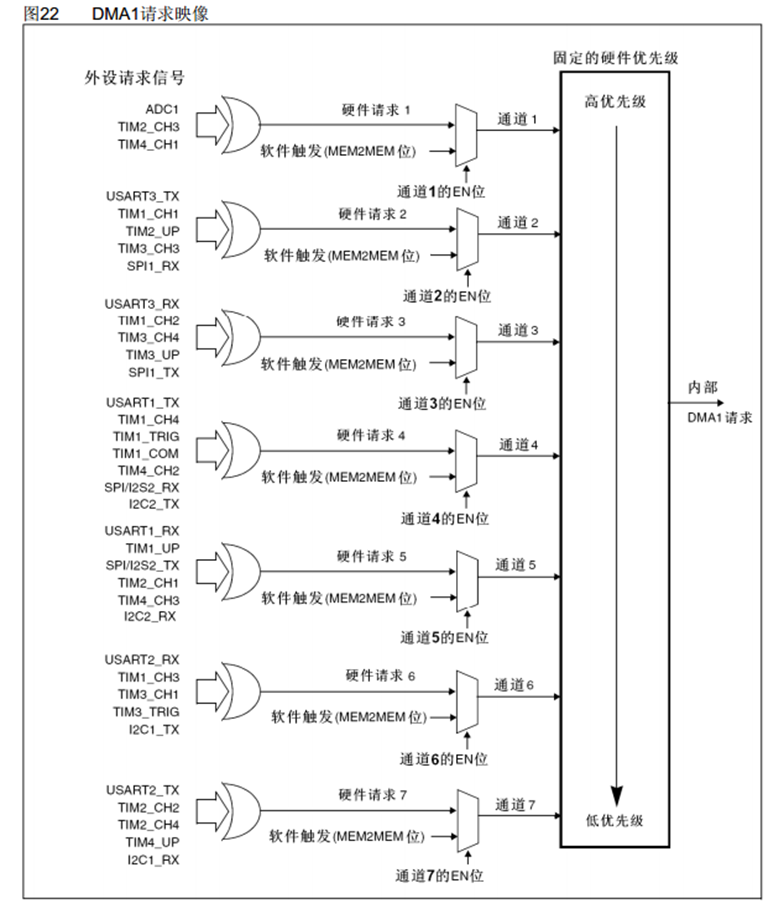

## 数据转运+DMA


## ADC扫描模式+DMA


## 案例1 DMA 数据转运

### 接线图


### 程序源码

```c
#include "stm32f10x.h"                  // Device header
#include "Delay.h"
#include "OLED.h"
#include "MyDMA.h"

uint8_t DataA[] = {0x01, 0x02, 0x03, 0x04};
uint8_t DataB[] = {0, 0, 0, 0};

int main()
{
	OLED_Init();
	MyDMA_Init(DataA, (uint32_t)DataB, sizeof(DataA)/sizeof(uint8_t));
	
	OLED_ShowString(1, 1, "DataA");
	OLED_ShowString(3, 1, "DataB");
	OLED_ShowHexNum(1, 8, (uint32_t)DataA, 8);
	OLED_ShowHexNum(3, 8, (uint32_t)DataB, 8);
	
	OLED_ShowHexNum(2, 1, DataA[0], 2);
	OLED_ShowHexNum(2, 4, DataA[1], 2);
	OLED_ShowHexNum(2, 7, DataA[2], 2);
	OLED_ShowHexNum(4, 10, DataA[3], 2);
	OLED_ShowHexNum(4, 1, DataB[0], 2);
	OLED_ShowHexNum(4, 4, DataB[1], 2);
	OLED_ShowHexNum(4, 7, DataB[2], 2);
	OLED_ShowHexNum(4, 10, DataB[3], 2);
	
	while(1)
	{
		DataA[0]++;
		DataA[1]++;
		DataA[2]++;
		DataA[3]++;
		
		OLED_ShowHexNum(2, 1, DataA[0], 2);
		OLED_ShowHexNum(2, 4, DataA[1], 2);
		OLED_ShowHexNum(2, 7, DataA[2], 2);
		OLED_ShowHexNum(4, 10, DataA[3], 2);
		OLED_ShowHexNum(4, 1, DataB[0], 2);
		OLED_ShowHexNum(4, 4, DataB[1], 2);
		OLED_ShowHexNum(4, 7, DataB[2], 2);
		OLED_ShowHexNum(4, 10, DataB[3], 2);
		
		Delay_ms(1000);
		
		MyDMA_Transfer();
		
		OLED_ShowHexNum(2, 1, DataA[0], 2);
		OLED_ShowHexNum(2, 4, DataA[1], 2);
		OLED_ShowHexNum(2, 7, DataA[2], 2);
		OLED_ShowHexNum(4, 10, DataA[3], 2);
		OLED_ShowHexNum(4, 1, DataB[0], 2);
		OLED_ShowHexNum(4, 4, DataB[1], 2);
		OLED_ShowHexNum(4, 7, DataB[2], 2);
		OLED_ShowHexNum(4, 10, DataB[3], 2);
	}
}
```

MyDMA.c

```c
#include "stm32f10x.h"                  // Device header

uint16_t MyDMA_Size;
void MyDMA_Init(uint8_t* AddrA, uint32_t AddrB, uint16_t size)
{
	RCC_AHBPeriphClockCmd(RCC_AHBPeriph_DMA1, ENABLE);
	
	DMA_InitTypeDef DMA_InitStruct;
	DMA_InitStruct.DMA_BufferSize = size;// 传输计数器的值
	DMA_InitStruct.DMA_DIR = DMA_DIR_PeripheralSRC;
	DMA_InitStruct.DMA_M2M = DMA_M2M_Enable;// 软件触发
	DMA_InitStruct.DMA_MemoryBaseAddr = AddrB;
	DMA_InitStruct.DMA_MemoryDataSize = DMA_PeripheralDataSize_Byte;
	DMA_InitStruct.DMA_MemoryInc = DMA_MemoryInc_Enable;
	DMA_InitStruct.DMA_Mode = DMA_Mode_Normal;// 不自动重装
	DMA_InitStruct.DMA_PeripheralBaseAddr = (uint32_t)AddrA;
	DMA_InitStruct.DMA_PeripheralDataSize = DMA_PeripheralDataSize_Byte;
	DMA_InitStruct.DMA_PeripheralInc = DMA_PeripheralInc_Enable;
	DMA_InitStruct.DMA_Priority = DMA_Priority_Medium;
	DMA_Init(DMA1_Channel1, &DMA_InitStruct);
	
	DMA_Cmd(DMA1_Channel1, DISABLE);
	
	MyDMA_Size = size;
}

void MyDMA_Transfer(void)
{
	DMA_Cmd(DMA1_Channel1, DISABLE);	
	DMA_SetCurrDataCounter(DMA1_Channel1, MyDMA_Size);
	DMA_Cmd(DMA1_Channel1, ENABLE);
	
	// 等待传输完成
	while(DMA_GetFlagStatus(DMA1_FLAG_TC1) == RESET);
	// 完成传输后清除标志位
	DMA_ClearFlag(DMA1_FLAG_TC1);
}
```

> 在 `MyDMA_Transfer` 函数中，需要再一次进行DMA传输，需要将<u>**传输计数器**</u>值从0变成Size大小，需要先关闭DMA，在进行<u>**传输计数器**</u>值的更改
>
> 在传输完成后， `DMA_GetFlagStatus`  函数的返回值为SET，跳出 while 循环，在最后进行清除标志位的操作

<u>程序路径</u>


## 案例2 DMA-AD多通道

### 接线图


### 程序源码

main.c

```c
#include "stm32f10x.h"                  // Device header
#include "Delay.h"
#include "OLED.h"
#include "AD.h"

int main()
{
	/*模块初始化*/
	OLED_Init();				//OLED初始化
	AD_Init();					//AD初始化
	
	/*显示静态字符串*/
	OLED_ShowString(1, 1, "AD0:");
	OLED_ShowString(2, 1, "AD1:");
	OLED_ShowString(3, 1, "AD2:");
	OLED_ShowString(4, 1, "AD3:");
	
	while (1)
	{
		OLED_ShowNum(1, 5, AD_Value[0], 4);		
		OLED_ShowNum(2, 5, AD_Value[1], 4);		
		OLED_ShowNum(3, 5, AD_Value[2], 4);		
		OLED_ShowNum(4, 5, AD_Value[3], 4);		
		
		Delay_ms(100);							//延时100ms，手动增加一些转换的间隔时间
	}
```

MyDMA.c

```c
#include "stm32f10x.h"                  // Device header

uint16_t AD_Value[4] = {0};

void AD_Init(void)
{
	RCC_APB2PeriphClockCmd(RCC_APB2Periph_ADC1, ENABLE);
	RCC_APB2PeriphClockCmd(RCC_APB2Periph_GPIOA, ENABLE);	
	RCC_AHBPeriphClockCmd(RCC_AHBPeriph_DMA1, ENABLE);
	RCC_ADCCLKConfig(RCC_PCLK2_Div6);
	
	//GPIO串口初始化
	GPIO_InitTypeDef GPIO_InitStruct;
	GPIO_InitStruct.GPIO_Mode = GPIO_Mode_AIN; // 模拟输入 ADC专属模式
	GPIO_InitStruct.GPIO_Pin = GPIO_Pin_0 | GPIO_Pin_1 | GPIO_Pin_2 | GPIO_Pin_3;
	GPIO_InitStruct.GPIO_Speed = GPIO_Speed_50MHz;
	GPIO_Init(GPIOA, &GPIO_InitStruct);
	
	// 规则组通道配置
	ADC_RegularChannelConfig(ADC1, ADC_Channel_0, 1, ADC_SampleTime_55Cycles5);
	ADC_RegularChannelConfig(ADC1, ADC_Channel_1, 2, ADC_SampleTime_55Cycles5);
	ADC_RegularChannelConfig(ADC1, ADC_Channel_2, 3, ADC_SampleTime_55Cycles5);
	ADC_RegularChannelConfig(ADC1, ADC_Channel_3, 4, ADC_SampleTime_55Cycles5);
	

	ADC_InitTypeDef ADC_InitStruct;
	ADC_InitStruct.ADC_ContinuousConvMode = ENABLE;// 连续模式
	ADC_InitStruct.ADC_DataAlign = ADC_DataAlign_Right;//数据对齐
	ADC_InitStruct.ADC_ExternalTrigConv = ADC_ExternalTrigConv_None;//配置外部触发源 选择None软件触发
	ADC_InitStruct.ADC_Mode = ADC_Mode_Independent; // 配置ADC选择在单ADC还是双ADC模式， 选择独立模式
	ADC_InitStruct.ADC_NbrOfChannel = 4;//通道数目，指定在扫描模式下 总共会用到几个通道
	ADC_InitStruct.ADC_ScanConvMode = ENABLE;// 扫描模式配置 ENABLE 或是 DISABLE
	ADC_Init(ADC1, &ADC_InitStruct);
	
	DMA_InitTypeDef DMA_InitStruct;
	DMA_InitStruct.DMA_BufferSize = 4;
	DMA_InitStruct.DMA_DIR = DMA_DIR_PeripheralSRC;
	DMA_InitStruct.DMA_M2M = DMA_M2M_Disable;
	DMA_InitStruct.DMA_MemoryBaseAddr = (uint32_t)AD_Value;
	DMA_InitStruct.DMA_MemoryDataSize = DMA_MemoryDataSize_HalfWord;
	DMA_InitStruct.DMA_MemoryInc = DMA_MemoryInc_Enable;
	DMA_InitStruct.DMA_Mode = DMA_Mode_Circular;
	DMA_InitStruct.DMA_PeripheralBaseAddr = (uint32_t)&ADC1->DR;
	DMA_InitStruct.DMA_PeripheralDataSize = DMA_PeripheralDataSize_HalfWord;
	DMA_InitStruct.DMA_PeripheralInc = DMA_PeripheralInc_Disable;
	DMA_InitStruct.DMA_Priority = DMA_Priority_Medium;
	DMA_Init(DMA1_Channel1, &DMA_InitStruct);
	DMA_Cmd(DMA1_Channel1, ENABLE);
	
	ADC_DMACmd(ADC1, ENABLE);// 启动ADC和DMA的通道
	ADC_Cmd(ADC1, ENABLE);
	 
	// 校准（可选）
	// 复位校准
	ADC_ResetCalibration(ADC1);
	// 判断复位校准的状态
	// 如果复位校准完成，硬件会自动将复位校准寄存器的值从1改为0，函数返回值为0
	// 如果函数返回值为1，说明复位校准还没有完成
	// while空循环等待复位校准完成
	while(ADC_GetResetCalibrationStatus(ADC1) == SET);
	// 开启校准  硬件将自动完成校准不需要额外配置
	ADC_StartCalibration(ADC1);
	// 判断校准状态，与复位校准的函数使用方式类似
	while(ADC_GetCalibrationStatus(ADC1) == SET);
	
	//软件触发
	ADC_SoftwareStartConvCmd(ADC1, ENABLE);
}
```

> 程序在 **<u>案例1</u>** 的基础上使能GPIO时钟和ADC时钟，配置GPIO口和ADC外设。
>
> `DMA_InitStruct.DMA_M2M = DMA_M2M_Disable;` 硬件出发，在完成一个ADC转化后，硬件会自动触发信号，DMA 自动会完成转运
>
> `DMA_InitStruct.DMA_DIR = DMA_DIR_PeripheralSRC;` 传输方向为外设到内存，所以外设为源地址
>
> `DMA_InitStruct.DMA_PeripheralBaseAddr = (uint32_t)&ADC1->DR;` ADC转换的数据存放在ADC的DR（Data Register）寄存器之中，所以外设的地址为 ADC->DR 地址
>
> `DMA_InitStruct.DMA_PeripheralInc = DMA_PeripheralInc_Disable;`   `DMA_InitStruct.DMA_MemoryInc = DMA_MemoryInc_Enable;`  在读取的外设地址始终为 ADC->DR 地址，配置外设内存不自增，内存地址配置为自增，每次读取的数据存放在数组中
>
> `ADC_InitStruct.ADC_ContinuousConvMode = ENABLE;// 连续模式`  `ADC_InitStruct.ADC_NbrOfChannel = 4;//通道数目，指定在扫描模式下 总共会用到几个通道` `ADC_InitStruct.ADC_ScanConvMode = ENABLE;// 扫描模式配置 ENABLE 或是 DISABLE`  `DMA_InitStruct.DMA_Mode = DMA_Mode_Circular;` 保证不间断的传输数据，将ADC配置为连续扫描模式，同时，使能DMA的自动重装器，在传输计数器递减到0后，传输计数器的值重装为初始值，以此保证DMA连续工作

<u>程序路径</u>


### 实物图


## 代码总结

在配置DMA时

- `RCC_AHBPeriphClockCmd(RCC_AHBPeriph_DMA1, ENABLE);` 配置DMA时钟 DMA挂载在AHB高级高性能总线上
- `DMA_Init(DMA1_Channel1, &DMA_InitStruct);` 初始化DMA模块
- `DMA_Cmd` 使能或者失能DMA

<u>**注意**</u>

DMA正常过做必须要满足三个条件

1. `DMA_Cmd` 使能DMA
2. `DMA_InitStruct.DMA_BufferSize = size;// 传输计数器的值` Size的值必须大于0，即DMA的传输次数大于0
3. 触发源有触发信号

在更改Size的值时，需要注意必须先关闭 `DMA_Cmd(DMA1_Channel1, DISABLE);`后在调用`DMA_SetCurrDataCounter(DMA1_Channel1, MyDMA_Size);` 函数给需要更改的Size值

# 串口通信

## 通信接口

- 通信的目的：将一个设备的数据传送到另一个设备，扩展硬件系统
- 通信协议：制定通信的规则，通信双方按照协议规则进行数据收发

| **名称** | **引脚**             | **双工** | **时钟** | **电平** | **设备** |
| -------- | -------------------- | -------- | -------- | -------- | -------- |
| USART    | TX、RX               | 全双工   | 异步     | 单端     | 点对点   |
| I2C      | SCL、SDA             | 半双工   | 同步     | 单端     | 多设备   |
| SPI      | SCLK、MOSI、MISO、CS | 全双工   | 同步     | 单端     | 多设备   |
| CAN      | CAN_H、CAN_L         | 半双工   | 异步     | 差分     | 多设备   |
| USB      | DP、DM               | 半双工   | 异步     | 差分     | 点对点   |

## 电平标准

电平标准是数据1和数据0的表达方式，是传输线缆中人为规定的电压与数据的对应关系，串口常用的电平标准有如下三种：

- TTL电平：+3.3V或+5V表示1，0V表示0
- RS232电平：-3 ~ -15V表示1，+3 ~ +15V表示0
- RS485电平：两线压差+2 ~ +6V表示1，-2 ~ -6V表示0（差分信号）

## 串口参数及时序

- 波特率：串口通信的速率
- 起始位：标志一个数据帧的开始，固定为低电平
- 数据位：数据帧的有效载荷，1为高电平，0为低电平，低位先行
- 校验位：用于数据验证，根据数据位计算得来
- 停止位：用于数据帧间隔，固定为高电平


# USART 串口通信

## 概述

- USART（Universal Synchronous/Asynchronous Receiver/Transmitter）通用同步/异步收发器
- USART是STM32内部集成的硬件外设，可根据数据寄存器的一个字节数据自动生成数据帧时序，从TX引脚发送出去，也可自动接收RX引脚的数据帧时序，拼接为一个字节数据，存放在数据寄存器里
- 自带波特率发生器，最高达4.5Mbits/s
- 可配置数据位长度（8/9）、停止位长度（0.5/1/1.5/2）
- 可选校验位（无校验/奇校验/偶校验）
- 支持同步模式、硬件流控制、DMA、智能卡、IrDA、LIN
- STM32F103C8T6 USART资源： USART1、 USART2、 USART3

## USART框图


### 引脚

- TX：发送数据输出
- RX：接收数据串行输入
- SCLK（位于最右边）：发送器时钟输出，仅同步通信时使用
- nRTS：请求发送(Request To Send)
- nCTS：清除发送(Clear To Send)
- SW_RX：数据接收引脚，属于内部引脚。

### 数据寄存器

数据寄存器（USART_DR）只有低9位有效，实际上它包含一个发送数据寄存器USART_TDR和一个接收数据寄存器USART_RDR。TDR和RDR都是介于系统总线和移位寄存器之间。这里比较特别：**一个地址对应了两个物理内存**。

当进行发送操作时，往USART_DR写入数据会自动存储在 TDR内，然后把内容转移到发送移位寄存器，最后通过模块发送到TX引脚

当进行读取操作时，信息从RX引脚进入，通过模块后存入接受移位寄存器，然后把内容转移到RDR内，最后USART_DR提取RDR数据。

### 发送器控制和接收器控制

发送器控制：用于控制发送移位寄存器

接收器控制：用于控制接收移位寄存器

### 硬件数据流控制

用于避免数据发送太快来不及处理，避免出现数据丢失的现象

- nRTS：请求发送(Request To Send)，用于告诉别人当前能不能接收数据
- nCTS：清除发送(Clear To Send)，用于接收别人nRTS信号

nRTS接别人的CTS引脚，当我能接收的时候，该引脚为低电平，请求发送，对方通过TX引脚接我方的RX引脚发送信号，当我方对数据处理来不及时间，nRTS为高电平，告诉对方设备暂停数据发送。

当我方是发送数据方时，我方的nCTS引脚接入对方的RTS引脚，用于获取对方的发送请求信号


### 唤醒单元

用于实现多设备间点对点的发送。当我们对 `USART地址` 分配地址后，唤醒单元在接收到指定地址后，便被唤醒工作。

### 波特率发生器

**f~PCLK~~x~** 

- USART1 挂载在APB2上，所以就是**f~PCLK~~2~** ，一般为72MHz
- 其他的USART 挂载在APB1上，所以就是**f~PCLK~~1~** ，一般为36MHz

**/USARTDIV 分频器**

​	USARTDIV 分为整数部分和小数部分

**RE 和 TE**

​	时钟再进过16分频发送到发送器始终和接收器时钟。

​	如果TE为1，发送器有效，RE为一，接收器有效

## USART基本结构


**发送：**

​	在数据用数据寄存器发送到移位寄存器时，会置一个TXE标志位，判断该标志位可以知道是不是可以写下个数据

**接收：**

​	在数据用数据寄存器发送到移位寄存器时，会置一个RXNE标志位，判断该标志位可以知道是不是收到数据，同时这个标志位可以申请中断

## 波特率发生器

- 波特率指数据信号对载波的调制速率，它用单位时间内载波调制状态改变次数来表示，单位为波特。
  比特率指单位时间内传输的比特数，单位bit/s(bps)。
- 对于USART 波特率与比特率相等，以后不区分这两个概念。
  <u>**波特率越大，传输速率越快。**</u>USART 的发送器和接收器使用相同的波特率。计算公式如下

$$
\begin{equation} \frac{T_x}{R_x} =  \frac{f_{PLCK}}{(16 \cdot USARTDIV)} \end{equation}
$$

- 其中，f~PLCK~ 为 USART  时钟，**USARTDIV** 是一个存放在波特率寄存器(USART_BRR) 的一个无符号定点数。
- 其中DIV_Mantissa[11:0] 位定义USARTDIV 的整数部分，DIV_Fraction[3:0] 位定义USARTDIV 的小数部分。


波特率的常用值有2400、9600、19200、115200。

## 中断控制

USART 有多个中断请求事件，具体见表USART 中断请求。


## 案例1 串口发送

### 接线图

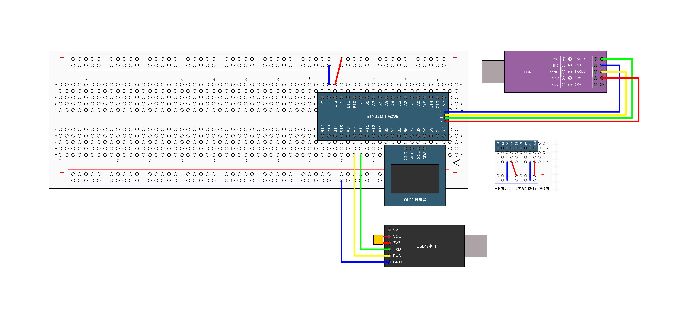

### 程序源码

main.c

```c
#include "stm32f10x.h"                  // Device header
#include "Delay.h"
#include "OLED.h"
#include "Serial.h"

int main()
{
	OLED_Init();
	
	Serial_Init();
	
	Serial_SendByte(0x41);
	
	Serial_SendString("\r\nHello World\r\n");
	
	printf("printf:Hello World %d\r\n",666);
	
	char String[100];
	sprintf(String, "sprintf:Hello World %d\r\n",666);
	printf(String);
	
	while(1); 
}
```

Serial.c

```c
#include "stm32f10x.h"                  // Device header
#include <stdio.h>
void Serial_Init(void)
{
	RCC_APB2PeriphClockCmd(RCC_APB2Periph_GPIOA, ENABLE);
	RCC_APB2PeriphClockCmd(RCC_APB2Periph_USART1, ENABLE);
	
	GPIO_InitTypeDef GPIO_InitStructure;
 	GPIO_InitStructure.GPIO_Mode = GPIO_Mode_AF_PP;
	GPIO_InitStructure.GPIO_Speed = GPIO_Speed_50MHz;
	GPIO_InitStructure.GPIO_Pin = GPIO_Pin_9;
 	GPIO_Init(GPIOA, &GPIO_InitStructure);
	
	USART_InitTypeDef USART_InitStruct;
	USART_InitStruct.USART_BaudRate = 9600;
	USART_InitStruct.USART_HardwareFlowControl = USART_HardwareFlowControl_None;// 不使用流控制
	USART_InitStruct.USART_Mode = USART_Mode_Tx;// 如果同时使用接受的发送 配置为 USART_Mode_Rx | USART_Mode_Tx
	USART_InitStruct.USART_StopBits = USART_StopBits_1;
	USART_InitStruct.USART_WordLength = USART_WordLength_8b;
	USART_InitStruct.USART_Parity = USART_Parity_No;
	USART_Init(USART1, &USART_InitStruct);
	
	USART_Cmd(USART1, ENABLE);
}

void Serial_SendByte(uint8_t Byte)
{
	USART_SendData(USART1, Byte);
	// 等待TDR寄存器将数据发送完成
	// TXE标志位为0，表示发送还没有完成
	// 标志位硬件自动清零，不需要手动清零
	while(USART_GetFlagStatus(USART1, USART_FLAG_TXE) == RESET);
}

void Serial_SendString(uint8_t *String)
{
	for(int i = 0; String[i] != '\0'; i++)
	{
		Serial_SendByte(String[i]);
	}
}

// 重定向 printf 函数
int fputc(int ch, FILE *f)
{
	Serial_SendByte(ch);
	return ch;
}
```

<u>程序路径</u>


### 实物图


## 串口通信时HEX和文本模式区别

 在串口通信中一般我们会用到串口助手之类的软件，而软件的接收和发送一般有两种模式选择。

1.HEX模式

 收到的是16进制的数，例如0x33,0x35等（一般不显示0x），可理解为下图的Hex行

2.文本模式

 收到的是ASCII码表上的字符，例如字符‘a’、‘B’等，可理解为下图中的Chr行


当单片机发送十六进制数0x33时，HEX模式下收到0x33，文本模式下收到字符‘ 3 ’

数据为16进制时，HEX模式下接收，不需要进行任何进制转换，直接收到0x33；文本模式下接收，则每次只收到一个字符‘3’

## 案例2 串口收发 HEX数据包

### 接线图


### 程序源码

main.c

```c
#include "stm32f10x.h"                  // Device header
#include "Delay.h"
#include "OLED.h"
#include "Serial.h"
#include "Key.h"

uint8_t RxData;
uint8_t KeyNum;

int main()
{
	OLED_Init();
	
	Key_Init();
	
	Serial_Init();
	
	OLED_ShowString(1, 1, "TxPacket");	
	OLED_ShowString(3, 1, "RxPacket");

	while(1)
	{
		KeyNum = Key_GetNum();
		if(KeyNum == 1)
		{
			Serial_TxPacket[0] ++;
			Serial_TxPacket[1] ++;
			Serial_TxPacket[2] ++;
			Serial_TxPacket[3] ++;
			
			Serial_SendPacket();
			
			OLED_ShowHexNum(2, 1, Serial_TxPacket[0], 2);
			OLED_ShowHexNum(2, 4, Serial_TxPacket[1], 2);
			OLED_ShowHexNum(2, 7, Serial_TxPacket[2], 2);
			OLED_ShowHexNum(2, 10, Serial_TxPacket[3], 2);
		}
		if(Serial_GetRxFlag() == 1)
		{
			OLED_ShowHexNum(4, 1, Serial_TxPacket[0], 2);
			OLED_ShowHexNum(4, 4, Serial_TxPacket[1], 2);
			OLED_ShowHexNum(4, 7, Serial_TxPacket[2], 2);
			OLED_ShowHexNum(4, 10, Serial_TxPacket[3], 2);
		}
	}
}
```

Serial.c

```c
#include "stm32f10x.h"                  // Device header
#include <stdio.h>

uint8_t Serial_TxPacket[4];	
uint16_t Serial_RxFlag;

void Serial_Init(void)
{
	RCC_APB2PeriphClockCmd(RCC_APB2Periph_GPIOA, ENABLE);
	RCC_APB2PeriphClockCmd(RCC_APB2Periph_USART1, ENABLE);
	
	GPIO_InitTypeDef GPIO_InitStructure;
 	GPIO_InitStructure.GPIO_Mode = GPIO_Mode_AF_PP;
	GPIO_InitStructure.GPIO_Speed = GPIO_Speed_50MHz;
	GPIO_InitStructure.GPIO_Pin = GPIO_Pin_9;
 	GPIO_Init(GPIOA, &GPIO_InitStructure);
	
	GPIO_InitStructure.GPIO_Mode = GPIO_Mode_IN_FLOATING;
	GPIO_InitStructure.GPIO_Pin = GPIO_Pin_10;
	GPIO_Init(GPIOA, &GPIO_InitStructure);
	
	USART_InitTypeDef USART_InitStruct;
	USART_InitStruct.USART_BaudRate = 9600;
	USART_InitStruct.USART_HardwareFlowControl = USART_HardwareFlowControl_None;// 不使用流控制
	USART_InitStruct.USART_Mode = USART_Mode_Tx | USART_Mode_Rx;// 如果同时使用接受的发送 配置为 USART_Mode_Rx | USART_Mode_Tx
	USART_InitStruct.USART_StopBits = USART_StopBits_1;
	USART_InitStruct.USART_WordLength = USART_WordLength_8b;
	USART_InitStruct.USART_Parity = USART_Parity_No;
	USART_Init(USART1, &USART_InitStruct);
	
	NVIC_PriorityGroupConfig(NVIC_PriorityGroup_2);
	NVIC_InitTypeDef NVIC_InitStruct;
	NVIC_InitStruct.NVIC_IRQChannel = USART1_IRQn;
	NVIC_InitStruct.NVIC_IRQChannelCmd = ENABLE;
	NVIC_InitStruct.NVIC_IRQChannelPreemptionPriority = 1;
	NVIC_InitStruct.NVIC_IRQChannelSubPriority = 1;
	NVIC_Init(&NVIC_InitStruct);
	USART_ITConfig(USART1, USART_IT_RXNE, ENABLE); // RXNE一旦被置1，触发中断
	
	USART_Cmd(USART1, ENABLE);
}

void Serial_SendByte(uint8_t Byte)
{
	USART_SendData(USART1, Byte);
	// 等待TDR寄存器将数据发送完成
	// TXE标志位为0，表示发送还没有完成
	// 标志位硬件自动清零，不需要手动清零
	while(USART_GetFlagStatus(USART1, USART_FLAG_TXE) == RESET);
}

void Serial_SendString(uint8_t *String)
{
	for(int i = 0; String[i] != '\0'; i++)
	{
		Serial_SendByte(String[i]);
	}
}

// 重定向 printf 函数
int fputc(int ch, FILE *f)
{
	Serial_SendByte(ch);
	return ch;
}

uint8_t Serial_GetRxFlag(void)
{
	if(Serial_RxFlag == SET)
	{
		Serial_RxFlag = 0;
		return 1;
	}else
		return 0;
}

void Serial_SendPacket(void)
{
	Serial_SendByte(0xFF);
	printf("%s",Serial_TxPacket);
	Serial_SendByte(0xFF);
}


// 使用状态机思想
void USART1_IRQHandler(void)
{
	static uint8_t RxState = 0;
	static uint8_t pSerial_TxPacket = 0;
	if(USART_GetFlagStatus(USART1, USART_IT_RXNE) == SET)
	{
		uint8_t tmp = USART_ReceiveData(USART1);
		if(RxState == 0)
		{
			if(tmp == 0xFF)
			{
				RxState++;
				pSerial_TxPacket = 0;
			}
		}else if(RxState == 1)
		{
			Serial_TxPacket[pSerial_TxPacket++] = tmp;
			if(pSerial_TxPacket == 4)
			{
				RxState = 2;
			}
		}else if(RxState == 2)
		{
			if(tmp == 0xFE)
			{
				RxState = 0;
				Serial_RxFlag = 1;
			}
		}
	}
}
```

<u>程序路径</u>


### 实物图


## 案例2 串口收发文本数据包

### 接线图


### 程序源码

main.c

```c
#include "stm32f10x.h"                  // Device header
#include "Delay.h"
#include "OLED.h"
#include "Serial.h"
#include "Key.h"
#include "LED.h"
#include <string.h>

uint8_t RxData;
uint8_t KeyNum;

int main()
{
	OLED_Init();
	
	LED_Init();
	
	Key_Init();
	
	Serial_Init();
	
	OLED_ShowString(1, 1, "TxPacket");	
	OLED_ShowString(3, 1, "RxPacket");

	while(1)
	{
		if(Serial_RxFlag == 1)
		{
			OLED_ShowString(4, 1, "                ");
			OLED_ShowString(4, 1, Serial_RxPacket);
			if(strcmp(Serial_RxPacket, "LED_ON") == 0)
			{
				GPIO_ResetBits(GPIOA, GPIO_Pin_1);
				printf("LED_ON_OK\r\n");
				
				OLED_ShowString(2, 1, "                ");
				OLED_ShowString(2, 1, "LED_ON_OK");
				Serial_RxFlag = 0;
			}else if(strcmp(Serial_RxPacket, "LED_OFF") == 0)
			{
				GPIO_SetBits(GPIOA, GPIO_Pin_1);
				printf("LED_OFF_OK\r\n");
				
				OLED_ShowString(2, 1, "                ");
				OLED_ShowString(2, 1, "LED_OFF_OK");
				Serial_RxFlag = 0;
			}else
			{
				printf("ERROE_COMMAND\r\n");
				
				OLED_ShowString(2, 1, "                ");
				OLED_ShowString(2, 1, "ERROE_COMMAND");
				Serial_RxFlag = 0;
			}
		}
	}
	
}
```

Serial.c

```c
#include "stm32f10x.h"                  // Device header
#include <stdio.h>

char Serial_RxPacket[100];
uint16_t Serial_RxFlag;

void Serial_Init(void)
{
	RCC_APB2PeriphClockCmd(RCC_APB2Periph_GPIOA, ENABLE);
	RCC_APB2PeriphClockCmd(RCC_APB2Periph_USART1, ENABLE);
	
	GPIO_InitTypeDef GPIO_InitStructure;
 	GPIO_InitStructure.GPIO_Mode = GPIO_Mode_AF_PP;
	GPIO_InitStructure.GPIO_Speed = GPIO_Speed_50MHz;
	GPIO_InitStructure.GPIO_Pin = GPIO_Pin_9;
 	GPIO_Init(GPIOA, &GPIO_InitStructure);
	
	GPIO_InitStructure.GPIO_Mode = GPIO_Mode_IN_FLOATING;
	GPIO_InitStructure.GPIO_Pin = GPIO_Pin_10;
	GPIO_Init(GPIOA, &GPIO_InitStructure);
	
	USART_InitTypeDef USART_InitStruct;
	USART_InitStruct.USART_BaudRate = 9600;
	USART_InitStruct.USART_HardwareFlowControl = USART_HardwareFlowControl_None;// 不使用流控制
	USART_InitStruct.USART_Mode = USART_Mode_Tx | USART_Mode_Rx;// 如果同时使用接受的发送 配置为 USART_Mode_Rx | USART_Mode_Tx
	USART_InitStruct.USART_StopBits = USART_StopBits_1;
	USART_InitStruct.USART_WordLength = USART_WordLength_8b;
	USART_InitStruct.USART_Parity = USART_Parity_No;
	USART_Init(USART1, &USART_InitStruct);
	
	NVIC_PriorityGroupConfig(NVIC_PriorityGroup_2);
	NVIC_InitTypeDef NVIC_InitStruct;
	NVIC_InitStruct.NVIC_IRQChannel = USART1_IRQn;
	NVIC_InitStruct.NVIC_IRQChannelCmd = ENABLE;
	NVIC_InitStruct.NVIC_IRQChannelPreemptionPriority = 1;
	NVIC_InitStruct.NVIC_IRQChannelSubPriority = 1;
	NVIC_Init(&NVIC_InitStruct);
	USART_ITConfig(USART1, USART_IT_RXNE, ENABLE); // RXNE一旦被置1，触发中断
	
	USART_Cmd(USART1, ENABLE);
}

void Serial_SendByte(uint8_t Byte)
{
	USART_SendData(USART1, Byte);
	// 等待TDR寄存器将数据发送完成
	// TXE标志位为0，表示发送还没有完成
	// 标志位硬件自动清零，不需要手动清零
	while(USART_GetFlagStatus(USART1, USART_FLAG_TXE) == RESET);
}

void Serial_SendString(uint8_t *String)
{
	for(int i = 0; String[i] != '\0'; i++)
	{
		Serial_SendByte(String[i]);
	}
}

// 重定向 printf 函数
int fputc(int ch, FILE *f)
{
	Serial_SendByte(ch);
	return ch;
}

void USART1_IRQHandler(void)
{
	static uint8_t RxState = 0;
	static uint8_t pRxPacket = 0;
	if(USART_GetFlagStatus(USART1, USART_IT_RXNE) == SET)
	{
		uint8_t tmp = USART_ReceiveData(USART1);
		if(RxState == 0 && Serial_RxFlag == 0)
		{
			if(tmp == '@')
			{
				RxState++;
				pRxPacket = 0;
			}
		}else if(RxState == 1)
		{
			if(tmp == '\r')
			{
				RxState = 2;
			}else
			{
				Serial_RxPacket[pRxPacket] = tmp;
				pRxPacket++;
			}
		}else if(RxState == 2)
		{
			if(tmp == '\n')
			{
				RxState = 0;
				Serial_RxFlag = 1;
				Serial_RxPacket[pRxPacket] = '\0';
			}
		}
	}
}
```

<u>程序路径</u>


### 实物图


## 代码总结

在配置USART串口通信时：

- 先进性 GPIO 和 USART 的时钟的使能
- 调用`GPIO_Init` 初始化用于接收和发送的GPIO口
- 调用 `USART_Init` 函数初始化 USART
- 最后调用 USART_Cmd 函数使能 USART
- 如果需要使用中断，调用`NVIC_Init` 初始化NVIC 


<u>**注意**</u>

- GPIO的Rx口需要配置为 `GPIO_Mode_IN_FLOATING` 模式，Tx口需要配置为 `GPIO_Mode_AF_PP` 模式
- 当 USART 接收到信息时，RXNE 标志位会被 `USART_ITConfig(USART1, USART_IT_RXNE, ENABLE);`   RXNE一旦被置1，触发中断

# I^2^C

## 概述

I^2^C 即Inter-Integrated Circuit(集成电路总线），这种总线类型是由飞利浦半导体公司设计出来的一种简单、双向、二线制、同步串行总线。它是一种多向控制总线，也就是说多个芯片可以连接到同一总线结构下，同时每个芯片都可以作为实时数据传输的控制源。这种方式简化了信号传输总线接口。

那么也就是说，只要收发双方同时接入SDA（双向数据线）、SCL（同步时钟线）便可以进行通信。

- 所有I2C设备的SCL连在一起，SDA连在一起
- 设备的SCL和SDA均要配置成<u>**开漏输出模式**</u>
- SCL和SDA各添加一个上拉电阻，阻值一般为4.7KΩ左右


## I^2^C 的电路特征

1. 它是一个支持设备的总线。“总线”指多个设备共用的信号线。在一个 I^2^C 通讯总线中，可连接多个 I^2^C 通讯设备，支持多个通讯主机及多个通讯从机。
2. 一个 I^2^C 总线只使用两条总线线路，一条双向串行数据线 (SDA) ，一条串行时钟线 (SCL)。数据线即用来表示数据，时钟线用于数据收发同步。
3. 每个连接到总线的设备都有一个独立的地址，主机可以利用这个地址进行不同设备之间的访问。
4. 总线通过上拉电阻接到电源。当 I^2^C 设备空闲时，会输出高阻态，而当所有设备都空闲，都输出高阻态时，由上拉电阻把总线拉成高电平。
5. 多个主机同时使用总线时，为了防止数据冲突，会利用仲裁方式决定由哪个设备占用总线。
6. 具有三种传输模式：标准模式传输速率为 100kbit/s ，快速模式为 400kbit/s ，高速模式下可达 3.4Mbit/s，但目前大多 I^2^C 设备尚不支持高速模式。

## I^2^C 需要用<u>开漏输出和上拉电阻</u>


I^2^C 协议支持多个主设备与多个从设备在一条总线上, 如果不用开漏输出, 而用推挽输出, 会出现主设备**<u>之间短路的情况</u>**. 至于为什么需要上拉电阻, 那是因为I^2^C通信需要输出高电平的能力.

为了实现多个主设备抢占总线时的仲裁。

I^2^C只有两根线(SCL和SDA), 怎么判断哪个主设备占用总线(当然是先来后到了). 假设主设备A需要启动I^2^C, 他需要在SCL高电平时, 将SDA由高电平转换为低电平作为启动信号. 主设备A在把SDA拉高后, 它需要再检查一下SDA的电平.

SDA是高电平, 说明主设备A可以占用总线, 然后主设备A将SDA拉低, 开始通信.
SDA是低电平, 说明有人已经捷足先登了, 主设备A不能占用总线, 结束通信.
为什么? 因为线与. 如果主设备A拉高SDA时, 已经有其他主设备将SDA拉低了. 由于 1 & 0 = 0 那么主设备A在检查SDA电平时, 会发现不是高电平, 而是低电平. 说明其他主设备抢占总线的时间比它早, 主设备A只能放弃占用总线. 如果是高电平, 则可以占用.

这就是开漏输出在I^2^C通信中的另一个作用.

因此, 模拟I^2^C一定要将GPIO端口设置为开漏输出并加上上拉电阻.(硬件I^2^C会自动配置为开漏输出)

## I^2^C的通信状态

**IIC的通信要注意以下6个知识点:**

1.空闲状态

2.开始信号

3.停止信号

4.应答信号

5.数据的有效性

6.数据传输

### 空闲状态

在IIC中规定，当SDA、SCL同时为高电平时，视为空闲状态。

注意，这个规定是通信设备通信前的判断条件。

### 开始信号 & 停止信号

在IIC中规定，当SCL为高电平，且SDA从高到低的跳变时，视为数据开始传输；

在IIC中规定，当SCL为高电平，且SDA从低到高的跳变时，视为数据停止传输；


###  数据传送 & 应答信号(ACK)

**数据传送：**

在I^2^C总线上传送的每一位数据都有一个时钟脉冲相对应（或同步控制），即在SCL串行时钟的配合下，在SDA上逐位地串行传送每一位数据。

在一般情况下，传输数据时，从数据的最高有效位开始发送。

**应答信号：**

在I^2^C中规定，发送方每发送1个字节（8位）后需要接收接收方发送的应答信号。

ACK为0时，视为有效应答；ACK为1时，视为无效响应。

总结：**<u>谁发了数据，谁就要接收一个应答信号</u>**。

## 案例1 软件模拟I^2^C通信

### 接线图

再用软件模拟I^2^C时，GPIO引脚是可以任意修改的


### 程序源码

main.c

```c
#include "stm32f10x.h"                  // Device header
#include "Delay.h"
#include "OLED.h"
#include "MPU6050.h"

uint8_t ID;								//定义用于存放ID号的变量
int16_t AX, AY, AZ, GX, GY, GZ;			//定义用于存放各个数据的变量

int main(void)
{
	/*模块初始化*/
	OLED_Init();		//OLED初始化
	MPU6050_Init();		//MPU6050初始化
	
	/*显示ID号*/
	OLED_ShowString(1, 1, "ID:");		//显示静态字符串
	ID = MPU6050_GetID();				//获取MPU6050的ID号
	OLED_ShowHexNum(1, 4, ID, 2);		//OLED显示ID号
	
	while (1)
	{
		MPU6050_GetData(&AX, &AY, &AZ, &GX, &GY, &GZ);		//获取MPU6050的数据
		OLED_ShowSignedNum(2, 1, AX, 5);					//OLED显示数据
		OLED_ShowSignedNum(3, 1, AY, 5);
		OLED_ShowSignedNum(4, 1, AZ, 5);
		OLED_ShowSignedNum(2, 8, GX, 5);
		OLED_ShowSignedNum(3, 8, GY, 5);
		OLED_ShowSignedNum(4, 8, GZ, 5);
	}
}
```

MyI2C.c

```c
#include "stm32f10x.h"
#include "Delay.h"

void MyI2C_W_SCL(uint8_t BitValue)
{
	GPIO_WriteBit(GPIOB, GPIO_Pin_10, (BitAction)BitValue);
	Delay_us(10);
}

void MyI2C_W_SDA(uint8_t BitValue)
{
	GPIO_WriteBit(GPIOB, GPIO_Pin_11, (BitAction)BitValue);
	Delay_us(10);
}

uint8_t MyI2C_R_SDA(void)
{
	uint8_t BitValue;
	BitValue = GPIO_ReadInputDataBit(GPIOB, GPIO_Pin_11);
	Delay_us(10);
	return BitValue;
}

void MyI2C_Init(void)
{
	RCC_APB2PeriphClockCmd(RCC_APB2Periph_GPIOB, ENABLE);
	
	GPIO_InitTypeDef GPIO_InitStruct;
	GPIO_InitStruct.GPIO_Mode = GPIO_Mode_Out_OD;
	GPIO_InitStruct.GPIO_Pin = GPIO_Pin_10 | GPIO_Pin_11;
	GPIO_InitStruct.GPIO_Speed = GPIO_Speed_50MHz;
	GPIO_Init(GPIOB, &GPIO_InitStruct);
	
	GPIO_SetBits(GPIOB, GPIO_Pin_10 | GPIO_Pin_11);
}

void MyI2C_Start(void)
{
	// 先释放SCL和SDA
	MyI2C_W_SCL(1);
	MyI2C_W_SDA(1);
	
	// 开始标志位 先是 SDA 拉低再 SCL 拉低
	MyI2C_W_SDA(0);
	MyI2C_W_SCL(0);
}

void MyI2C_Stop(void)
{
	MyI2C_W_SCL(0);
	MyI2C_W_SDA(0); 
	
	MyI2C_W_SCL(1);
	MyI2C_W_SDA(1);
}

void MyI2C_SendByte(uint8_t Byte)
{
	for(uint8_t i = 0; i < 8; i++)
	{
		MyI2C_W_SDA(Byte & (0x80 >> i));// 取出Byte的相应为
		MyI2C_W_SCL(1);// 拉高SCL读书SDA的值
		MyI2C_W_SCL(0);//准备下一次读写
	}
}

uint8_t MyI2C_ReceiveByte(void)
{

	uint8_t Byte = 0x00;
	// 进入主机读取模式
	// 主机先释放 SDA，将SDA拉上，这样子SDA的高低电平不受主机的SDA影响
	MyI2C_W_SDA(1);
	
	for(uint8_t i = 0 ; i < 8 ; i++)
	{
		// 在SCL高电平的时候，读取SDA的值
		MyI2C_W_SCL(1);
		
		// if 判断，读取的时候，如果当前是高电位，那么将Byte的当前为值高
		if(MyI2C_R_SDA() == 1)
		{
			Byte |= (0x80>>i);
		}
		// 拉低SCL的，从机更改SDA的值
		MyI2C_W_SCL(0);
	}
	return Byte;
}

void MyI2C_SendACK(uint8_t ACKBit)
{
	MyI2C_W_SDA(ACKBit);
	MyI2C_W_SCL(1);
	MyI2C_W_SCL(0);
}

uint8_t MyI2C_ReceiveACK(void)
{

	uint8_t AckBit;
	MyI2C_W_SDA(1);
	MyI2C_W_SCL(1);
		
	AckBit = MyI2C_R_SDA();
	
	MyI2C_W_SCL(0);
	return AckBit;
}
```

MPU6050.c

```c
#include "stm32f10x.h"                  // Device header
#include "MyI2C.h"
#include "MPU6050_Reg.h"

#define MPU6050_ADDRESS 0xD0

// Start IIC 
// 先是发送MPU6050的编号 再发送MPU6050的地址编号
// 最后发送Data数据
// 在每一次发送后都需要接收应答
// 在发送完后 Stop IIC
void MPU6050_WriteReg(uint8_t RegAddress, uint8_t Data)
{
	MyI2C_Start();
	MyI2C_SendByte(MPU6050_ADDRESS);
	MyI2C_ReceiveACK();
	MyI2C_SendByte(RegAddress);
	MyI2C_ReceiveACK();
	MyI2C_SendByte(Data);
	MyI2C_ReceiveACK();
	MyI2C_Stop();
}

// 在MPU6050中没有指定地址读的
// 先调用指定地址写的部分代码，将当前指针指向指定的位置
// 改为写的地址

// 在接收到数据后需要发送ACK应答
// 发送1表示读取完毕
// 如果需要连续读取多个字节 则发送 Ack 0
uint8_t MPU6050_ReadReg(uint8_t RegAddress)
{
	uint8_t Data;
	
	MyI2C_Start();
	MyI2C_SendByte(MPU6050_ADDRESS);
	MyI2C_ReceiveACK();
	MyI2C_SendByte(RegAddress);
	MyI2C_ReceiveACK();

	MyI2C_Start();
	MyI2C_SendByte(MPU6050_ADDRESS | 0x01);//0xD0是写地址 0xD1是都地址，需要或上0x01
	MyI2C_ReceiveACK();
	
	Data = MyI2C_ReceiveByte();
	
	MyI2C_SendACK(1);
	MyI2C_Stop();
	return Data;
}

void MPU6050_Init(void)
{
	MyI2C_Init();									//先初始化底层的I2C
	
	/*MPU6050寄存器初始化，需要对照MPU6050手册的寄存器描述配置，此处仅配置了部分重要的寄存器*/
	MPU6050_WriteReg(MPU6050_PWR_MGMT_1, 0x01);		//电源管理寄存器1，取消睡眠模式，选择时钟源为X轴陀螺仪
	MPU6050_WriteReg(MPU6050_PWR_MGMT_2, 0x00);		//电源管理寄存器2，保持默认值0，所有轴均不待机
	MPU6050_WriteReg(MPU6050_SMPLRT_DIV, 0x09);		//采样率分频寄存器，配置采样率
	MPU6050_WriteReg(MPU6050_CONFIG, 0x06);			//配置寄存器，配置DLPF
	MPU6050_WriteReg(MPU6050_GYRO_CONFIG, 0x18);	//陀螺仪配置寄存器，选择满量程为±2000°/s
	MPU6050_WriteReg(MPU6050_ACCEL_CONFIG, 0x18);	//加速度计配置寄存器，选择满量程为±16g
}

uint8_t MPU6050_GetID(void)
{
	return MPU6050_ReadReg(MPU6050_WHO_AM_I);
}

void MPU6050_GetData(int16_t *AccX, int16_t *AccY, int16_t *AccZ, 
						int16_t *GyroX, int16_t *GyroY, int16_t *GyroZ)
{
	uint8_t DataH, DataL;								//定义数据高8位和低8位的变量
	
	DataH = MPU6050_ReadReg(MPU6050_ACCEL_XOUT_H);		//读取加速度计X轴的高8位数据
	DataL = MPU6050_ReadReg(MPU6050_ACCEL_XOUT_L);		//读取加速度计X轴的低8位数据
	*AccX = (DataH << 8) | DataL;						//数据拼接，通过输出参数返回
	
	DataH = MPU6050_ReadReg(MPU6050_ACCEL_YOUT_H);		//读取加速度计Y轴的高8位数据
	DataL = MPU6050_ReadReg(MPU6050_ACCEL_YOUT_L);		//读取加速度计Y轴的低8位数据
	*AccY = (DataH << 8) | DataL;						//数据拼接，通过输出参数返回
	
	DataH = MPU6050_ReadReg(MPU6050_ACCEL_ZOUT_H);		//读取加速度计Z轴的高8位数据
	DataL = MPU6050_ReadReg(MPU6050_ACCEL_ZOUT_L);		//读取加速度计Z轴的低8位数据
	*AccZ = (DataH << 8) | DataL;						//数据拼接，通过输出参数返回
	
	DataH = MPU6050_ReadReg(MPU6050_GYRO_XOUT_H);		//读取陀螺仪X轴的高8位数据
	DataL = MPU6050_ReadReg(MPU6050_GYRO_XOUT_L);		//读取陀螺仪X轴的低8位数据
	*GyroX = (DataH << 8) | DataL;						//数据拼接，通过输出参数返回
	
	DataH = MPU6050_ReadReg(MPU6050_GYRO_YOUT_H);		//读取陀螺仪Y轴的高8位数据
	DataL = MPU6050_ReadReg(MPU6050_GYRO_YOUT_L);		//读取陀螺仪Y轴的低8位数据
	*GyroY = (DataH << 8) | DataL;						//数据拼接，通过输出参数返回
	
	DataH = MPU6050_ReadReg(MPU6050_GYRO_ZOUT_H);		//读取陀螺仪Z轴的高8位数据
	DataL = MPU6050_ReadReg(MPU6050_GYRO_ZOUT_L);		//读取陀螺仪Z轴的低8位数据
	*GyroZ = (DataH << 8) | DataL;						//数据拼接，通过输出参数返回
}
```

<u>程序路径</u>


### 实物图


## 软件模拟I^2^C总结

**<u>软件模拟 I^2^C</u>** 

- 先初始化 GPIO 口，配置为推挽输出模式
- 配置好函数 `MyI2C_W_SCL` 用于对 SCL 时钟线的操作   `MyI2C_W_SDA`  用于对SDA数据线的操作
- 在I^2^C中，开启I^2^C先调用 `MyI2C_Start`  当结束数据传输后调用 `MyI2C_Stop`  

- **<u>`MyI2C_W_SCL` 和 `MyI2C_W_SDA`</u>**

在需要调用 `GPIO_WriteBit` 函数对该引脚指定高低电平，之后使用延时函数。

- **<u>对SDA写操作</u>**

调用for循环，循环8次，先调用 `MyI2C_W_SDA` 函数写入指定的 0 或 1 ，之后调用 `MyI2C_W_SCL(1);`  拉高SCL，读取本次的SDA线上的值，接着 `MyI2C_W_SCL(1);`  拉低电位为下一次传输数据准备。

- **<u>对SDA读操作</u>**

当主机读去SDA线上的数据时，需要先让出SDA线的控制权，使用 `MyI2C_W_SDA(1);` 释放对SDA线的控制权，这样 SDA线上的高或低电平就由从机写入的决定（线与）。接着在 `MyI2C_W_SCL(1);` 拉高SCL线电位，让主机读数据。读完数据后`MyI2C_W_SCL(1);` ，让对方写数据。

- Ack

在每一次发送完一个字节数据就要调用 `MyI2C_ReceiveACK()` 函数接收对方发送来的Ack，Ack == 0 则结束发送

在每一次接收到一个字节数据要调用 `MyI2C_SendACK()` 函数给对方发送 Ack。       

## 硬件模拟I^2^C 外设介绍

- STM32内部集成了硬件I2C收发电路，可以由硬件自动执行时钟生成、起始终止条件生成、应答位收发、数据收发等功能，减轻CPU的负担
- 支持多主机模型
- 支持7位/10位地址模式
- 支持不同的通讯速度，标准速度(高达100 kHz)，快速(高达400 kHz)
- 支持DMA
- 兼容SMBus协议
- STM32F103C8T6 硬件I2C资源：I2C1、I2C2

## I^2^C 内部框图


## I^2^C基本结构


## 主模式下的通讯序列图


## 从模式下的通讯序列图


## 案例2 硬件I^2^C

### 接线图


### 程序源码

main.c

```c
#include "stm32f10x.h"                  // Device header
#include "Delay.h"
#include "OLED.h"
#include "MPU6050.h"

uint8_t ID;								//定义用于存放ID号的变量
int16_t AX, AY, AZ, GX, GY, GZ;			//定义用于存放各个数据的变量

int main(void)
{
	/*模块初始化*/
	OLED_Init();		//OLED初始化
	MPU6050_Init();		//MPU6050初始化
	
	/*显示ID号*/
	OLED_ShowString(1, 1, "ID:");		//显示静态字符串
	ID = MPU6050_GetID();				//获取MPU6050的ID号
	OLED_ShowHexNum(1, 4, ID, 2);		//OLED显示ID号
	
	while (1)
	{
		MPU6050_GetData(&AX, &AY, &AZ, &GX, &GY, &GZ);		//获取MPU6050的数据
		OLED_ShowSignedNum(2, 1, AX, 5);					//OLED显示数据
		OLED_ShowSignedNum(3, 1, AY, 5);
		OLED_ShowSignedNum(4, 1, AZ, 5);
		OLED_ShowSignedNum(2, 8, GX, 5);
		OLED_ShowSignedNum(3, 8, GY, 5);
		OLED_ShowSignedNum(4, 8, GZ, 5);
	}
}
```

MPU6050.c

```c
#include "stm32f10x.h"                  // Device header
#include "MPU6050_Reg.h"

#define MPU6050_ADDRESS 0xD0

// Start IIC 
// 先是发送MPU6050的编号 再发送MPU6050的地址编号
// 最后发送Data数据
// 在每一次发送后都需要接收应答
// 在发送完后 Stop IIC
void MPU6050_WriteReg(uint8_t RegAddress, uint8_t Data)
{	
	I2C_GenerateSTART(I2C2, ENABLE);
	// 等待相应的标志位确保执行完毕
	while(I2C_CheckEvent(I2C2, I2C_EVENT_MASTER_MODE_SELECT) != SUCCESS);
	// 自带接收应答
	I2C_Send7bitAddress(I2C2, MPU6050_ADDRESS, I2C_Direction_Transmitter);
	while(I2C_CheckEvent(I2C2, I2C_EVENT_MASTER_TRANSMITTER_MODE_SELECTED) != SUCCESS);
	
	I2C_SendData(I2C2, RegAddress);
	while(I2C_CheckEvent(I2C2, I2C_EVENT_MASTER_BYTE_TRANSMITTING) != SUCCESS);
	
	I2C_SendData(I2C2, Data);
	while(I2C_CheckEvent(I2C2, I2C_EVENT_MASTER_BYTE_TRANSMITTED) != SUCCESS);
	
	I2C_GenerateSTOP(I2C2, ENABLE);
}

// 在MPU6050中没有指定地址读的
// 先调用指定地址写的部分代码，将当前指针指向指定的位置
// 改为写的地址

// 在接收到数据后需要发送ACK应答
// 发送1表示读取完毕
// 如果需要连续读取多个字节 则发送 Ack 0
uint8_t MPU6050_ReadReg(uint8_t RegAddress)
{
	uint8_t Data;

	I2C_GenerateSTART(I2C2, ENABLE);
	// 等待相应的标志位确保执行完毕
	while(I2C_CheckEvent(I2C2, I2C_EVENT_MASTER_MODE_SELECT) != SUCCESS);
	// 自带接收应答
	I2C_Send7bitAddress(I2C2, MPU6050_ADDRESS, I2C_Direction_Transmitter);
	while(I2C_CheckEvent(I2C2, I2C_EVENT_MASTER_TRANSMITTER_MODE_SELECTED) != SUCCESS);
	
	I2C_SendData(I2C2, RegAddress);
	while(I2C_CheckEvent(I2C2, I2C_EVENT_MASTER_BYTE_TRANSMITTED) != SUCCESS);
	
	I2C_GenerateSTART(I2C2, ENABLE);
	while(I2C_CheckEvent(I2C2, I2C_EVENT_MASTER_MODE_SELECT) != SUCCESS);
	
	I2C_Send7bitAddress(I2C2, MPU6050_ADDRESS, I2C_Direction_Receiver);
	while(I2C_CheckEvent(I2C2, I2C_EVENT_MASTER_RECEIVER_MODE_SELECTED) != SUCCESS);
	/*在接收最后一个数据时需要提前给主机非应答，产生停止中断*/
	I2C_AcknowledgeConfig(I2C2, DISABLE);
	I2C_GenerateSTOP(I2C2, ENABLE);
	/*接收到数据*/
	while(I2C_CheckEvent(I2C2, I2C_EVENT_MASTER_BYTE_RECEIVED) != SUCCESS);
	Data = I2C_ReceiveData(I2C2);
	/*接收数据的过程结束，重新让ACK = ENABLE，默认状态状态下ACK就是ENABLE的*/
	I2C_AcknowledgeConfig(I2C2, ENABLE);
	
	return Data;
}

void MPU6050_Init(void)
{
	RCC_APB1PeriphClockCmd(RCC_APB1Periph_I2C2, ENABLE);
	RCC_APB2PeriphClockCmd(RCC_APB2Periph_GPIOB, ENABLE);
	
	GPIO_InitTypeDef GPIO_InitStruct;
	GPIO_InitStruct.GPIO_Mode = GPIO_Mode_AF_OD;
	GPIO_InitStruct.GPIO_Pin = GPIO_Pin_10 | GPIO_Pin_11;
	GPIO_InitStruct.GPIO_Speed = GPIO_Speed_50MHz;
	GPIO_Init(GPIOB, &GPIO_InitStruct);
	
	I2C_InitTypeDef I2C_InitStruct;
	I2C_InitStruct.I2C_Ack = I2C_Ack_Enable;
	I2C_InitStruct.I2C_AcknowledgedAddress = I2C_AcknowledgedAddress_7bit;
	I2C_InitStruct.I2C_ClockSpeed = 50000;
	I2C_InitStruct.I2C_DutyCycle = I2C_DutyCycle_2;
	I2C_InitStruct.I2C_Mode = I2C_Mode_I2C;
	I2C_InitStruct.I2C_OwnAddress1 = 0x00;
	I2C_Init(I2C2, &I2C_InitStruct);

	I2C_Cmd(I2C2, ENABLE);
	
	
	/*MPU6050寄存器初始化，需要对照MPU6050手册的寄存器描述配置，此处仅配置了部分重要的寄存器*/
	MPU6050_WriteReg(MPU6050_PWR_MGMT_1, 0x01);		//电源管理寄存器1，取消睡眠模式，选择时钟源为X轴陀螺仪
	MPU6050_WriteReg(MPU6050_PWR_MGMT_2, 0x00);		//电源管理寄存器2，保持默认值0，所有轴均不待机
	MPU6050_WriteReg(MPU6050_SMPLRT_DIV, 0x09);		//采样率分频寄存器，配置采样率
	MPU6050_WriteReg(MPU6050_CONFIG, 0x06);			//配置寄存器，配置DLPF
	MPU6050_WriteReg(MPU6050_GYRO_CONFIG, 0x18);	//陀螺仪配置寄存器，选择满量程为±2000°/s
	MPU6050_WriteReg(MPU6050_ACCEL_CONFIG, 0x18);	//加速度计配置寄存器，选择满量程为±16g

}

uint8_t MPU6050_GetID(void)
{
	return MPU6050_ReadReg(MPU6050_WHO_AM_I);
}

void MPU6050_GetData(int16_t *AccX, int16_t *AccY, int16_t *AccZ, 
						int16_t *GyroX, int16_t *GyroY, int16_t *GyroZ)
{
	uint8_t DataH, DataL;								//定义数据高8位和低8位的变量
	
	DataH = MPU6050_ReadReg(MPU6050_ACCEL_XOUT_H);		//读取加速度计X轴的高8位数据
	DataL = MPU6050_ReadReg(MPU6050_ACCEL_XOUT_L);		//读取加速度计X轴的低8位数据
	*AccX = (DataH << 8) | DataL;						//数据拼接，通过输出参数返回
	
	DataH = MPU6050_ReadReg(MPU6050_ACCEL_YOUT_H);		//读取加速度计Y轴的高8位数据
	DataL = MPU6050_ReadReg(MPU6050_ACCEL_YOUT_L);		//读取加速度计Y轴的低8位数据
	*AccY = (DataH << 8) | DataL;						//数据拼接，通过输出参数返回
	
	DataH = MPU6050_ReadReg(MPU6050_ACCEL_ZOUT_H);		//读取加速度计Z轴的高8位数据
	DataL = MPU6050_ReadReg(MPU6050_ACCEL_ZOUT_L);		//读取加速度计Z轴的低8位数据
	*AccZ = (DataH << 8) | DataL;						//数据拼接，通过输出参数返回
	
	DataH = MPU6050_ReadReg(MPU6050_GYRO_XOUT_H);		//读取陀螺仪X轴的高8位数据
	DataL = MPU6050_ReadReg(MPU6050_GYRO_XOUT_L);		//读取陀螺仪X轴的低8位数据
	*GyroX = (DataH << 8) | DataL;						//数据拼接，通过输出参数返回
	
	DataH = MPU6050_ReadReg(MPU6050_GYRO_YOUT_H);		//读取陀螺仪Y轴的高8位数据
	DataL = MPU6050_ReadReg(MPU6050_GYRO_YOUT_L);		//读取陀螺仪Y轴的低8位数据
	*GyroY = (DataH << 8) | DataL;						//数据拼接，通过输出参数返回
	
	DataH = MPU6050_ReadReg(MPU6050_GYRO_ZOUT_H);		//读取陀螺仪Z轴的高8位数据
	DataL = MPU6050_ReadReg(MPU6050_GYRO_ZOUT_L);		//读取陀螺仪Z轴的低8位数据
	*GyroZ = (DataH << 8) | DataL;						//数据拼接，通过输出参数返回
}
```

> 在I^2^C协议中，对于不同的通信速率，规定了不同的占空比范围。例如，在标准模式（100kbps）下，占空比应为2:1到5:1之间；在快速模式（400kbps）下，占空比应为1:2到2:1之间。
>
> 在I^2^C中，GPIO_Mode 为开漏输出，引脚的高低电平无法实现及1及0的切换，GPIO从0切换到1的过程是会缓慢上升,为了确保在CLK线高电平的时候能准确读取到SDA的数据，需要对I^2^C设置占空比
>
> SCL信号高电平脉冲宽度过短，可能会导致总线上数据传输出现错误；如果占空比设置过高，SCL信号高电平脉冲宽度过长，则会降低总线通信速率。

> [!TIP]
>
> 当STM32工作在主机模式下，可以**不用对** `I2C_InitStruct.I2C_OwnAddress1` `I2C_InitStruct.I2C_Ack` `I2C_InitStruct.I2C_AcknowledgedAddress` 进行配置

<u>程序路径</u>


### 实物图


# SPI 通信

## SPI概述

- SPI（Serial Peripheral Interface）是由Motorola公司开发的一种通用数据总线
- 四根通信线：SCK（Serial Clock）、MOSI（Master Output Slave Input）、MISO（Master Input Slave Output）、SS（Slave Select）
- 同步，全双工
- 支持总线挂载多设备（一主多从）


## SPI硬件电路

- 所有SPI设备的SCK、MOSI、MISO分别连在一起
- 主机另外引出多条SS控制线，分别接到各从机的SS引脚
- 输出引脚配置为推挽输出，输入引脚配置为浮空或上拉输入


## 移位示意图


## SPI时序基本单元

SS （CS） 片选信号

- 起始条件：SS从高电平切换到低电平
- 终止条件：SS从低电平切换到高电平

## SPI的四种模式

在芯片的资料上，有两个非常特殊的寄存器配置位，分别是 CPOL （Clock POlarity）和 CPHA （Clock PHAse）。

```文本
CPOL配置SPI总线的极性
CPHA配置SPI总线的相位

极性，会直接影响SPI总线空闲时的时钟信号是高电平还是低电平。
CPOL = 1：表示空闲时是高电平
CPOL = 0：表示空闲时是低电平

一个时钟周期会有2个跳变沿。而相位，直接决定SPI总线从那个跳变沿开始采样数据。
CPHA = 0：表示从第一个跳变沿开始采样
CPHA = 1：表示从第二个跳变沿开始采样
```


CPOL 和 CPHA 的不同组合，形成了SPI总线的不同模式。

|  mode  | CPOL | CPHA |
| :----: | :--: | :--: |
| mode 0 |  0   |  0   |
| mode 1 |  0   |  1   |
| mode 2 |  1   |  0   |
| mode 3 |  1   |  1   |

## 模式0 (CPOL=0; CPHA=0)

```文本
CPOL = 0：空闲时是低电平，第1个跳变沿是上升沿，第2个跳变沿是下降沿
CPHA = 0：数据在第1个跳变沿（上升沿）采样
```


## 模式1 (CPOL=0; CPHA=1)

```文本
CPOL = 0：空闲时是低电平，第1个跳变沿是上升沿，第2个跳变沿是下降沿
CPHA = 1：数据在第2个跳变沿（下降沿）采样
```


## 模式2 (CPOL=1; CPHA=0)

```文本
CPOL = 1：空闲时是高电平，第1个跳变沿是下降沿，第2个跳变沿是上升沿
CPHA = 0：数据在第1个跳变沿（下降沿）采样
```


## 模式3 (CPOL=1; CPHA=1)

```文本
CPOL = 1：空闲时是高电平，第1个跳变沿是下降沿，第2个跳变沿是上升沿
CPHA = 1：数据在第2个跳变沿（上升沿）采样
```


## 案例 1  软件SPI读写W5Q64

### W5Q64硬件介绍

- W25Qxx系列是一种低成本、小型化、使用简单的非易失性存储器，常应用于数据存储、字库存储、固件程序存储等场景
- 存储介质：Nor Flash（闪存）
- 时钟频率：80MHz / 160MHz (Dual SPI) / 320MHz (Quad SPI)
- 存储容量（24位地址）：

 W25Q40：  4Mbit / 512KByte

 W25Q80：  8Mbit / 1MByte

 W25Q16：  16Mbit / 2MByte

 W25Q32：  32Mbit / 4MByte

 W25Q64：  64Mbit / 8MByte

 W25Q128： 128Mbit / 16MByte

 W25Q256： 256Mbit / 32MByte

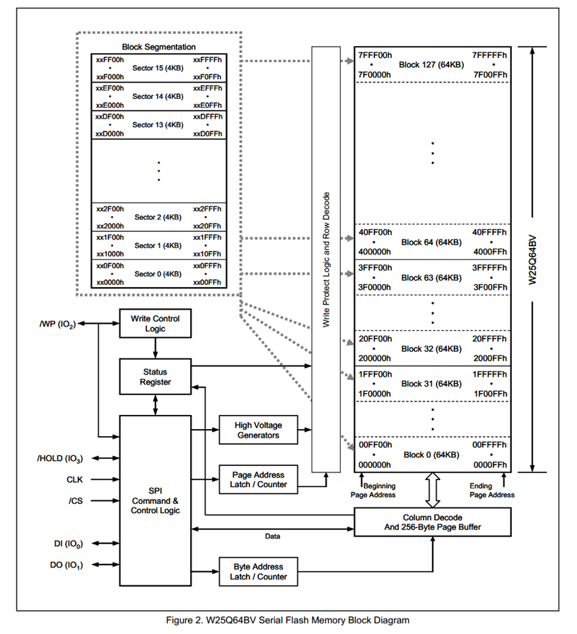

W26Q64 芯片存储单位分为 ：

| 存储单位 | 大小    | 擦除/写入单位 | 说明                                           |
| -------- | ------- | ------------- | ---------------------------------------------- |
| 页       | 256字节 | 页            | 最小存储单位，可以单独进行读写操作。           |
| 扇区     | 4KB     | 扇区          | 最小擦除单位，必须以扇区为单位进行擦除操作。   |
| 块       | 128KB   | 块            | 可选擦除单位，可以以块为单位进行擦除操作。     |
| 芯片     | 64MB    | 芯片          | 芯片的总存储容量，可以对整个芯片进行擦除操作。 |

> [!IMPORTANT]
>
> 在W5Q64芯片中，写入的最小单位是页，如果在页尾写入数据，继续写入的话，数据回到页头。但是读数据没有这种限制，在页尾读出数据，下次读取数据会来到下一页的页头，而不是本页的页头。
>
> 在每次对页写入数据的说话，需要进行的操作
>
> 1. 写入使能
> 2. 由于每个数据只能由1改写成0，不能有0改写分成1，所以必须要进行擦除，而且擦除的最小单位是扇
> 3. 写入操作结束后，写入的数据暂时存储在缓存区中，将数据从缓存区放如存储区时，芯片进入忙状态，不响应新的读写操作
>
> 读取数据的操作没有这么繁琐
>
> - 直接调用读取时序，无需使能，无需额外操作，没有页的限制，
> - 读取操作结束后不会进入忙状态，但不能在忙状态时读取

### 接线图


### 程序源码

main.c

```c
#include "stm32f10x.h"                  // Device header
#include "Delay.h"
#include "OLED.h"
#include "W25Q64.h"

uint8_t MID;							//定义用于存放MID号的变量
uint16_t DID;							//定义用于存放DID号的变量

uint8_t ArrayWrite[] = {0x01, 0x02, 0x03, 0x04};	//定义要写入数据的测试数组
uint8_t ArrayRead[4];								//定义要读取数据的测试数组

int main(void)
{
	/*模块初始化*/
	OLED_Init();						//OLED初始化
	W25Q64_Init();						//W25Q64初始化
	
	/*显示静态字符串*/
	OLED_ShowString(1, 1, "MID:   DID:");
	OLED_ShowString(2, 1, "W:");
	OLED_ShowString(3, 1, "R:");
	
	/*显示ID号*/
	W25Q64_ReadID(&MID, &DID);			//获取W25Q64的ID号
	OLED_ShowHexNum(1, 5, MID, 2);		//显示MID
	OLED_ShowHexNum(1, 12, DID, 4);		//显示DID
	
	/*W25Q64功能函数测试*/
	W25Q64_SectorErase(0x000000);					//扇区擦除
	W25Q64_PageProgram(0x000000, ArrayWrite, 4);	//将写入数据的测试数组写入到W25Q64中
	
	W25Q64_ReadData(0x000000, ArrayRead, 4);		//读取刚写入的测试数据到读取数据的测试数组中
	
	/*显示数据*/
	OLED_ShowHexNum(2, 3, ArrayWrite[0], 2);		//显示写入数据的测试数组
	OLED_ShowHexNum(2, 6, ArrayWrite[1], 2);
	OLED_ShowHexNum(2, 9, ArrayWrite[2], 2);
	OLED_ShowHexNum(2, 12, ArrayWrite[3], 2);
	
	OLED_ShowHexNum(3, 3, ArrayRead[0], 2);			//显示读取数据的测试数组
	OLED_ShowHexNum(3, 6, ArrayRead[1], 2);
	OLED_ShowHexNum(3, 9, ArrayRead[2], 2);
	OLED_ShowHexNum(3, 12, ArrayRead[3], 2);
	
	while (1);
}
```

MySPI.c

```c
#include "stm32f10x.h"                  // Device header

void MySPI_W_SS(uint8_t BitValue)
{
	GPIO_WriteBit(GPIOA, GPIO_Pin_4, (BitAction)BitValue);
}

void MySPI_W_SCK(uint8_t BitValue)
{
	GPIO_WriteBit(GPIOA, GPIO_Pin_5, (BitAction)BitValue);
}

void MySPI_W_MOSI(uint8_t BitValue)
{
	GPIO_WriteBit(GPIOA, GPIO_Pin_7, (BitAction)BitValue);
}

uint8_t MySPI_R_MISO(void)
{
	return GPIO_ReadInputDataBit(GPIOA, GPIO_Pin_6);
}

void MySPI_Init(void)
{
	RCC_APB2PeriphClockCmd(RCC_APB2Periph_GPIOA, ENABLE);
	GPIO_InitTypeDef GPIO_InitTypeStruct;
	GPIO_InitTypeStruct.GPIO_Mode = GPIO_Mode_IPU;
	GPIO_InitTypeStruct.GPIO_Pin = GPIO_Pin_6;
	GPIO_InitTypeStruct.GPIO_Speed = GPIO_Speed_50MHz;
	GPIO_Init(GPIOA, &GPIO_InitTypeStruct);
	
	GPIO_InitTypeStruct.GPIO_Mode = GPIO_Mode_Out_PP;
	GPIO_InitTypeStruct.GPIO_Pin = GPIO_Pin_4 | GPIO_Pin_5 | GPIO_Pin_7;
	GPIO_InitTypeStruct.GPIO_Speed = GPIO_Speed_50MHz;
	GPIO_Init(GPIOA, &GPIO_InitTypeStruct);
	
	MySPI_W_SS(1);
	MySPI_W_SCK(0);
}

void MySPI_Start(void)
{
	MySPI_W_SS(0);
}

void MySPI_Stop(void)
{
	MySPI_W_SS(1);
}

uint8_t MySPI_SwapByte(uint8_t ByteSend)
{
	for(uint8_t i = 0; i < 8; i++)
	{
		MySPI_W_MOSI(ByteSend & 0x80);
		ByteSend = ByteSend << 1;
		MySPI_W_SCK(1);
		if(MySPI_R_MISO() == 1){ByteSend |= 0x01;}
		MySPI_W_SCK(0);
	}
	return ByteSend;
}
```

W25Q64.c

```c
#include "stm32f10x.h"                  // Device header
#include "MySPI.h"
#include "W25Q64_Ins.h"

void W25Q64_Init(void)
{
	MySPI_Init();
}

void W25Q64_ReadID(uint8_t * MID, uint16_t *DID)
{
	// 开启SPI设备
	MySPI_Start();
	// 获取设备的ID，需要先发送指令，然后设备会通过发送一个数据
	MySPI_SwapByte(W25Q64_JEDEC_ID);
	// 接收数据，不需要发送指定的数据，默认设置为0xFF
	*MID = MySPI_SwapByte(W25Q64_DUMMY_BYTE);
	*DID = MySPI_SwapByte(W25Q64_DUMMY_BYTE);
	*DID = *DID << 8;
	*DID = *DID | MySPI_SwapByte(W25Q64_DUMMY_BYTE);
	// 停止
	MySPI_Stop();
}

void W25Q64_WriteEnable(void)
{
	MySPI_Start();
	MySPI_SwapByte(W25Q64_WRITE_ENABLE);
	MySPI_Stop();
}

void W25Q64_WaitBusy(void)
{
	MySPI_Start();
	MySPI_SwapByte(W25Q64_READ_STATUS_REGISTER_1);
	while((MySPI_SwapByte(W25Q64_DUMMY_BYTE) & 0x01) == 0x01);
	MySPI_Stop();
}

void W25Q64_PageProgram(uint32_t Address, uint8_t *DataArray, uint16_t Count)
{
	W25Q64_WriteEnable();
	MySPI_Start();
	MySPI_SwapByte(W25Q64_PAGE_PROGRAM);
	// 每一次传输8位，超出8位的部分会被踢出
	MySPI_SwapByte(Address >> 16);
	MySPI_SwapByte(Address >> 8);
	MySPI_SwapByte(Address);
	
	for(uint16_t i = 0; i < Count ; i++)
	{
		MySPI_SwapByte(DataArray[i]);
	}
	MySPI_Stop();
	
	// 在芯片将缓存数据写入硬盘时，芯片处于Busy状态，Busy状态下芯片无法进行写数据和读数据的操作
	W25Q64_WaitBusy();
}

void W25Q64_SectorErase(uint32_t Address)
{
	W25Q64_WriteEnable();
	
	MySPI_Start();
	MySPI_SwapByte(W25Q64_SECTOR_ERASE_4KB);
	MySPI_SwapByte(Address >> 16);
	MySPI_SwapByte(Address >> 8);
	MySPI_SwapByte(Address);
	MySPI_Stop();
	
	W25Q64_WaitBusy();	
}

// 在该芯片中，读取数据可以没有页的限制，在读取完本地址的内存后，自动内存加一读取下一个内存
// 而在写数据受到页的限制，写入数据的说话写道页尾，下次写入数据回跳到页头位置写入数据
void W25Q64_ReadData(uint32_t Address, uint8_t *DataArray, uint32_t Count)
{
	MySPI_Start();
	MySPI_SwapByte(W25Q64_READ_DATA);
	MySPI_SwapByte(Address >> 16);
	MySPI_SwapByte(Address >> 8);
	MySPI_SwapByte(Address);
	for(uint32_t i = 0; i < Count; i++)
	{
		DataArray[i] = MySPI_SwapByte(W25Q64_DUMMY_BYTE);
	}
	MySPI_Stop();
}
```

> *在`W25Q64_PageProgram`调用`W25Q64_WaitBusy()`，因为在对芯片写数据时，数据先存储到芯片的缓存中，再从缓存存储到芯片内存中。写完数据后，等待数据从缓存转换到芯片存储中*
>
> 在编写代码的时候，因为SPI通信的频率很高，所以不需要在GPIO口加入延迟

<u>程序路径</u>


### 实物图


## STM32 SPI外设

- STM32内部集成了硬件SPI收发电路，可以由硬件自动执行时钟生成、数据收发等功能，减轻CPU的负担
- 可配置8位/16位数据帧、高位先行/低位先行
- 时钟频率： fPCLK / (2, 4, 8, 16, 32, 64, 128, 256)
- 支持多主机模型、主或从操作
- 可精简为半双工/单工通信
- 支持DMA
- 兼容I2S协议
- 
- STM32F103C8T6 硬件SPI资源：SPI1、SPI2 

## SPI框图


> [!IMPORTANT]
>
> - 发送数据部分和接收数据部分共用一个移位寄存器 发送方数据的时候，当检测到移位寄存器没有数据在移位的时候，发送缓冲区（TDR）立刻将数据放入移位寄存器中，标志位TXE（发送缓冲区空1），当TXE标志位为1是，下一个数据就可以放入发送缓冲区（TDR）中。移位寄存器发送一位就会接收到一个位，当接收到8位刚好为1个字节，放入接收缓冲区（RDR），标志位RXNE（接收缓冲区非空1）。通过发送和接收的配合，可以做到无延迟。
> - LSBFIRST 控制器，用于控制地位先行还是高位先行。
> - 波特率发送器 用于分频


## SPI基本结构


## 案例2 硬件SPI读写W5Q64

main.c

```c
#include "stm32f10x.h"                  // Device header
#include "Delay.h"
#include "OLED.h"
#include "W25Q64.h"

uint8_t MID;							//定义用于存放MID号的变量
uint16_t DID;							//定义用于存放DID号的变量

uint8_t ArrayWrite[] = {0x01, 0x02, 0x03, 0x04};	//定义要写入数据的测试数组
uint8_t ArrayRead[4];								//定义要读取数据的测试数组

int main(void)
{
	/*模块初始化*/
	OLED_Init();						//OLED初始化
	W25Q64_Init();						//W25Q64初始化
	
	/*显示静态字符串*/
	OLED_ShowString(1, 1, "MID:   DID:");
	OLED_ShowString(2, 1, "W:");
	OLED_ShowString(3, 1, "R:");
	
	/*显示ID号*/
	W25Q64_ReadID(&MID, &DID);			//获取W25Q64的ID号
	OLED_ShowHexNum(1, 5, MID, 2);		//显示MID
	OLED_ShowHexNum(1, 12, DID, 4);		//显示DID
	
	/*W25Q64功能函数测试*/
	W25Q64_SectorErase(0x000000);					//扇区擦除
	W25Q64_PageProgram(0x000000, ArrayWrite, 4);	//将写入数据的测试数组写入到W25Q64中
	
	W25Q64_ReadData(0x000000, ArrayRead, 4);		//读取刚写入的测试数据到读取数据的测试数组中
	
	/*显示数据*/
	OLED_ShowHexNum(2, 3, ArrayWrite[0], 2);		//显示写入数据的测试数组
	OLED_ShowHexNum(2, 6, ArrayWrite[1], 2);
	OLED_ShowHexNum(2, 9, ArrayWrite[2], 2);
	OLED_ShowHexNum(2, 12, ArrayWrite[3], 2);
	
	OLED_ShowHexNum(3, 3, ArrayRead[0], 2);			//显示读取数据的测试数组
	OLED_ShowHexNum(3, 6, ArrayRead[1], 2);
	OLED_ShowHexNum(3, 9, ArrayRead[2], 2);
	OLED_ShowHexNum(3, 12, ArrayRead[3], 2);
	
	while (1);
}
```

MySPI.c

```c
#include "stm32f10x.h"                  // Device header

void MySPI_W_SS(uint8_t BitValue)
{
	GPIO_WriteBit(GPIOA, GPIO_Pin_4, (BitAction)BitValue);
}


void MySPI_Init(void)
{
	RCC_APB2PeriphClockCmd(RCC_APB2Periph_GPIOA, ENABLE);
	RCC_APB2PeriphClockCmd(RCC_APB2Periph_SPI1, ENABLE);
	
	GPIO_InitTypeDef GPIO_InitTypeStruct;
	GPIO_InitTypeStruct.GPIO_Mode = GPIO_Mode_Out_PP;
	GPIO_InitTypeStruct.GPIO_Pin = GPIO_Pin_4;
	GPIO_InitTypeStruct.GPIO_Speed = GPIO_Speed_50MHz;
	GPIO_Init(GPIOA, &GPIO_InitTypeStruct);
	
	GPIO_InitTypeStruct.GPIO_Mode = GPIO_Mode_AF_PP;
	GPIO_InitTypeStruct.GPIO_Pin = GPIO_Pin_5 | GPIO_Pin_7;
	GPIO_InitTypeStruct.GPIO_Speed = GPIO_Speed_50MHz;
	GPIO_Init(GPIOA, &GPIO_InitTypeStruct);
	
	GPIO_InitTypeStruct.GPIO_Mode = GPIO_Mode_IPU;
	GPIO_InitTypeStruct.GPIO_Pin = GPIO_Pin_6;
	GPIO_InitTypeStruct.GPIO_Speed = GPIO_Speed_50MHz;
	GPIO_Init(GPIOA, &GPIO_InitTypeStruct);
	
	SPI_InitTypeDef SPI_InitStructure;
	SPI_InitStructure.SPI_BaudRatePrescaler = SPI_BaudRatePrescaler_128;
	SPI_InitStructure.SPI_CPHA = SPI_CPHA_1Edge;
	SPI_InitStructure.SPI_CPOL = SPI_CPOL_Low;
	SPI_InitStructure.SPI_CRCPolynomial = 7;
	SPI_InitStructure.SPI_DataSize = SPI_DataSize_8b;
	SPI_InitStructure.SPI_Direction = SPI_Direction_2Lines_FullDuplex;
	SPI_InitStructure.SPI_FirstBit = SPI_FirstBit_MSB;// 高危先行
	SPI_InitStructure.SPI_Mode = SPI_Mode_Master;
	SPI_InitStructure.SPI_NSS = SPI_NSS_Soft;
	SPI_Init(SPI1, &SPI_InitStructure);
	
	SPI_Cmd(SPI1, ENABLE);
	
	MySPI_W_SS(1);
}

void MySPI_Start(void)
{
	MySPI_W_SS(0);
}

void MySPI_Stop(void)
{
	MySPI_W_SS(1);
}

uint8_t MySPI_SwapByte(uint8_t ByteSend)
{
	// 必须先发送在接收

	// 如果发送寄存器中有东西（TXE！=1），等待数据从发送寄存器发送出去
	while(SPI_I2S_GetFlagStatus(SPI1, SPI_I2S_FLAG_TXE) != SET);
	
	SPI_I2S_SendData(SPI1, ByteSend);
	// 等待接收寄存器接收到数据
	while(SPI_I2S_GetFlagStatus(SPI1, SPI_I2S_FLAG_RXNE) != SET);
	// 返回数据
	return SPI_I2S_ReceiveData(SPI1);
}
```

W25Q64.c

```c
#include "stm32f10x.h"                  // Device header
#include "MySPI.h"
#include "W25Q64_Ins.h"

void W25Q64_Init(void)
{
	MySPI_Init();
}

void W25Q64_ReadID(uint8_t * MID, uint16_t *DID)
{
	// 开启SPI设备
	MySPI_Start();
	// 获取设备的ID，需要先发送指令，然后设备会通过发送一个数据
	MySPI_SwapByte(W25Q64_JEDEC_ID);
	// 接收数据，不需要发送指定的数据，默认设置为0xFF
	*MID = MySPI_SwapByte(W25Q64_DUMMY_BYTE);
	*DID = MySPI_SwapByte(W25Q64_DUMMY_BYTE);
	*DID = *DID << 8;
	*DID = *DID | MySPI_SwapByte(W25Q64_DUMMY_BYTE);
	// 停止
	MySPI_Stop();
}

void W25Q64_WriteEnable(void)
{
	MySPI_Start();
	MySPI_SwapByte(W25Q64_WRITE_ENABLE);
	MySPI_Stop();
}

void W25Q64_WaitBusy(void)
{
	MySPI_Start();
	MySPI_SwapByte(W25Q64_READ_STATUS_REGISTER_1);
	while((MySPI_SwapByte(W25Q64_DUMMY_BYTE) & 0x01) == 0x01);
	MySPI_Stop();
}

void W25Q64_PageProgram(uint32_t Address, uint8_t *DataArray, uint16_t Count)
{
	W25Q64_WriteEnable();
	MySPI_Start();
	MySPI_SwapByte(W25Q64_PAGE_PROGRAM);
	// 每一次传输8位，超出8位的部分会被踢出
	MySPI_SwapByte(Address >> 16);
	MySPI_SwapByte(Address >> 8);
	MySPI_SwapByte(Address);
	
	for(uint16_t i = 0; i < Count ; i++)
	{
		MySPI_SwapByte(DataArray[i]);
	}
	MySPI_Stop();
	
	// 在芯片将缓存数据写入硬盘时，芯片处于Busy状态，Busy状态下芯片无法进行写数据和读数据的操作
	W25Q64_WaitBusy();
}

void W25Q64_SectorErase(uint32_t Address)
{
	W25Q64_WriteEnable();
	MySPI_Start();
	MySPI_SwapByte(W25Q64_SECTOR_ERASE_4KB);
	MySPI_SwapByte(Address >> 16);
	MySPI_SwapByte(Address >> 8);
	MySPI_SwapByte(Address);
	MySPI_Stop();
	
	W25Q64_WaitBusy();
}

// 在该芯片中，读取数据可以没有页的限制，在读取完本地址的内存后，自动内存加一读取下一个内存
// 而在写数据受到页的限制，写入数据的说话写道页尾，下次写入数据回跳到页头位置写入数据
void W25Q64_ReadData(uint32_t Address, uint8_t *DataArray, uint32_t Count)
{
	MySPI_Start();
	MySPI_SwapByte(W25Q64_READ_DATA);
	MySPI_SwapByte(Address >> 16);
	MySPI_SwapByte(Address >> 8);
	MySPI_SwapByte(Address);
	for(uint32_t i = 0; i < Count; i++)
	{
		DataArray[i] = MySPI_SwapByte(W25Q64_DUMMY_BYTE);
	}
	MySPI_Stop();
}
```

<u>程序路径</u>


## 实物图


# BKP备份寄存器

## BKP简介

- BKP（Backup Registers）备份寄存器

- BKP可用于存储用户应用程序数据。当VDD（2.0 ~ 3.6V）电源被切断，他们仍然由VBAT（1.8 ~ 3.6V）维持供电。当系统在待机模式下被唤醒，或系统复位或电源复位时，他们也不会被复位

- TAMPER引脚产生的侵入事件将所有备份寄存器内容清除

- RTC引脚输出RTC校准时钟、RTC闹钟脉冲或者秒脉冲

- 存储RTC时钟校准寄存器

- 用户数据存储容量：

  ​	20字节（中容量和小容量）/ 84字节（大容量和互联型）

## BKP基本结构


BKP和RTC相关电路都位于后被区域（图中橙色部分），当VDD主电源掉电后，后背区域的供电切换到VBAT供电，当VDD上电是，后被区域的供电转换到VDD。

**<u>TAMPER</u>**

侵入检测，当TAMPER产生上升沿或者下降沿时，清除BKP的所有数据，保证安全。

**<u>时钟输出</u>**

把RTC的相关时钟从PC13引脚输出出去，供外部使用。

## 案例 读写备份寄存器

### 接线图


### 程序源码

```c
#include "stm32f10x.h"                  // Device header
#include "Delay.h"
#include "OLED.h"
#include "Key.h"

uint16_t ArrayWrite[] = {0x1234, 0x5678};
uint16_t ArrayRead[2] = {0};
int main()
{
	OLED_Init();
	
	Key_Init();
	
	OLED_ShowString(1, 1, "W:");
	OLED_ShowString(2, 1, "R:");
	
	//开启时钟
	RCC_APB1PeriphClockCmd(RCC_APB1Periph_PWR, ENABLE);
	RCC_APB1PeriphClockCmd(RCC_APB1Periph_BKP, ENABLE);
	
	PWR_BackupAccessCmd(ENABLE);
	
	//BKP_DeInit();
	
	while(1)
	{
		if(Key_GetNum() == 1)
		{
			ArrayWrite[0]++;
			ArrayWrite[1]++;
			
			BKP_WriteBackupRegister(BKP_DR1, *ArrayWrite);
			BKP_WriteBackupRegister(BKP_DR2, *(ArrayWrite+1));
			
			OLED_ShowHexNum(1, 3, ArrayWrite[0], 4);
			OLED_ShowHexNum(1, 8, ArrayWrite[1], 4);
		}
		
	ArrayRead[0] = BKP_ReadBackupRegister(BKP_DR1);
	ArrayRead[1] = BKP_ReadBackupRegister(BKP_DR2);
	
	OLED_ShowHexNum(2, 3, ArrayRead[0], 4);
	OLED_ShowHexNum(2, 8, ArrayRead[1], 4);
	}
}
```

<u>程序路径</u>


### 实物图


## 代码总结

在对BKP操作的时候，需要

- `RCC_APB1PeriphClockCmd(RCC_APB1Periph_PWR, ENABLE);`
- `RCC_APB1PeriphClockCmd(RCC_APB1Periph_BKP, ENABLE);` 开启两个时钟
- 调用 `PWR_BackupAccessCmd(ENABLE);` 函数。之后就可以对BKP写入操作了

**<u>注意</u>**

​	对BKP里面的数据进行清除操作，可以调用 `BKP_DeInit();`  函数，BKP里面的函数就会便初始值0

# RTC （Really Time Clock）

- RTC（Real Time Clock）实时时钟
- RTC是一个独立的定时器，可为系统提供时钟和日历的功能
- RTC和时钟配置系统处于后备区域，系统复位时数据不清零，VDD（2.0 ~ 3.6V）断电后可借助VBAT（1.8 ~ 3.6V）供电继续走时
- 32位的可编程计数器，可对应Unix时间戳的秒计数器
- 20位的可编程预分频器，可适配不同频率的输入时钟
- 可选择三种RTC时钟源：

>  HSE时钟除以128（通常为8MHz/128）
>
>  LSE振荡器时钟（通常为32.768KHz）
>
>  LSI振荡器时钟（40KHz）

## RTC框图


**<u>RTC预分频器</u>**

包含 RTC_PRL 和 RTC_DIV ，类似与定时器里面的ARR自动重装值和CNT计数值。RTC_DIV 的值是一个递减的。

**<u>32可编程计时器</u>**

RTC_CNT 可以把这个计数器看作Unix秒计数器。

**<u>工作介绍</u>**

目标产生1Hz的时钟信号，也就是每一秒RTC_CNT值加一。RTCCLK 输入脉冲信号，时钟频率位32.768kHz，设置RTC_PRL和RTC_DIV 初始值分别为32767和0，当一个脉冲进来时，DIV值减一触发信号，RTC_CNT加一，DIV的值变为RTC_PRL的值，也就是32767。RTC_DIV 每计数32768次，CNT加一，产生1Hz的信号。

**<u>RTC_ALR</u>**

也是32位的寄存器，与RTC_CNT等宽。当（RTC_CNT == RTC_ALR）的数值时，会产生 RTC_Alarm信号，通往中断，接下来程序执行中断函数。同时RTC_Alarm信号也通往图中右下角部分，用于退出待机模式。例如嵌入产品工作在环境恶劣地方，需要每天12点采集数据，可以设置RTC_ALR的值，当到达每天12的后，退出待机模式采集数据，结束采集，继续进入待机模式（需要调用相应的API）。需要注意的是，这个闹钟是一个定值，需要在每次闹钟响后，在程序中更改。RTC_ALR的数值，位下一次触发闹钟做准备。

**<u>中断部分</u>**

图示右边，由三部分的中断：

1. RTC_Second 秒中断，开启这个中断，每秒进入中断
2. RTC_Overflow 溢出中断，当RTC_CNT的32位计满移除，触发中断。当设置了这个中断，在2106年会触发一次这中断
3. RTC_Alarm 闹钟中断

其中，SECF OWF ALRF （F结尾）是中断标志位，SECIE OWIE ALRIE （IE结尾）是中断使能，通往NVIC中断控制器。

**<u>退出待机模式</u>**

图示下面部分，退出待机模式可以有RTC_Alarm 和 WKUP Pin触发。

## RTC基本结构


一般选择 LSE（32.768kHz） 作为RTCCLK时钟信号

## 案例 实时时钟

### 接线图

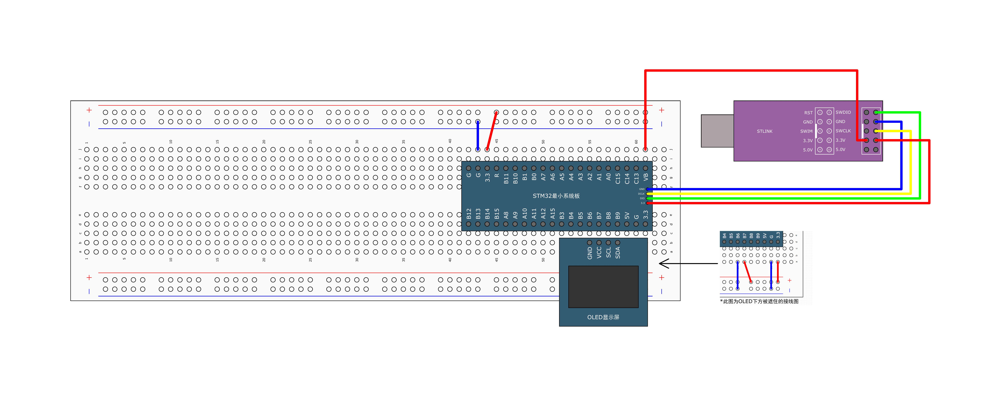

### 程序源码

main.c

```c
#include "stm32f10x.h"                  // Device header
#include "Delay.h"
#include "OLED.h"
#include "MyRTC.h"

int main(void)
{
	/*模块初始化*/
	OLED_Init();		//OLED初始化
	MyRTC_Init();		//RTC初始化
	
	/*显示静态字符串*/
	OLED_ShowString(1, 1, "Date:XXXX-XX-XX");
	OLED_ShowString(2, 1, "Time:XX:XX:XX");
	OLED_ShowString(3, 1, "CNT :");
	OLED_ShowString(4, 1, "DIV :");
	
	while (1)
	{
		MyRTC_ReadTime();							//RTC读取时间，最新的时间存储到MyRTC_Time数组中
		
		OLED_ShowNum(1, 6, MyRTC_Time[0], 4);		//显示MyRTC_Time数组中的时间值，年
		OLED_ShowNum(1, 11, MyRTC_Time[1], 2);		//月
		OLED_ShowNum(1, 14, MyRTC_Time[2], 2);		//日
		OLED_ShowNum(2, 6, MyRTC_Time[3], 2);		//时
		OLED_ShowNum(2, 9, MyRTC_Time[4], 2);		//分
		OLED_ShowNum(2, 12, MyRTC_Time[5], 2);		//秒
		
		OLED_ShowNum(3, 6, RTC_GetCounter(), 10);	//显示32位的秒计数器
		OLED_ShowNum(4, 6, RTC_GetDivider(), 10);	//显示余数寄存器
	}
}
```

MyRTC.c

```c
#include "stm32f10x.h"                  // Device header
#include <time.h>
#include "MyRTC.h"

uint16_t MyRTC_Time[] = {2024, 6, 21, 23, 59, 55};

void MyRTC_Init(void)
{
	// 启用备份和电源（BKP）外设时钟，这对于访问RTC寄存器是必需的。
	RCC_APB1PeriphClockCmd(RCC_APB1Periph_BKP, ENABLE);
	RCC_APB1PeriphClockCmd(RCC_APB1Periph_PWR, ENABLE);

	// 启用对备份数据寄存器的访问，包括RTC寄存器。
	PWR_BackupAccessCmd(ENABLE);
	
	// 启用低速外部（LSE）晶振。
	RCC_LSEConfig(RCC_LSE_ON);
	
	// 等待LSE时钟稳定并可用。
	while(RCC_GetFlagStatus(RCC_FLAG_LSERDY) == RESET);
	
	// 选择RTC时钟源为LSE。
	RCC_RTCCLKConfig(RCC_RTCCLKSource_LSE);
	// 开启RTC时钟。
	RCC_RTCCLKCmd(ENABLE);

	// 检查备份寄存器是否已设置。
	if(BKP_ReadBackupRegister(BKP_DR1) != 0x1234)
	{
		// 等待RTC寄存器同步完成。
		RTC_WaitForSynchro();
		// 等待上一个写操作完成。
		RTC_WaitForLastTask();
		
		// 设置RTC预分频器值。
		RTC_SetPrescaler(32768 - 1);
		RTC_WaitForLastTask();

		// 设置初始时间。
		MyRTC_SetTime();
		RTC_WaitForLastTask();

		// 向备份寄存器写入标志值。
		BKP_WriteBackupRegister(BKP_DR1, 0x1234);
	}
	else
	{
		// 等待RTC寄存器同步完成。
		RTC_WaitForSynchro();
		// 等待上一个写操作完成。
		RTC_WaitForLastTask();
	}
}

void MyRTC_SetTime(void)
{
	time_t time_cnt;
	struct tm time_date;
	
	time_date.tm_year = MyRTC_Time[0] - 1900;
	time_date.tm_mon = MyRTC_Time[1] - 1;
	time_date.tm_mday = MyRTC_Time[2];
	time_date.tm_min = MyRTC_Time[3];
	time_date.tm_sec = MyRTC_Time[4];
	
	time_cnt = mktime(&time_date) - 8 * 3600;
	
	RTC_SetCounter(time_cnt);
	// 写操作的时候等待操作完成
	RTC_WaitForLastTask();
}

void MyRTC_ReadTime(void)
{
	time_t time_cnt;
	struct tm time_date;
	
	time_cnt = RTC_GetCounter() + 8 * 3600;
	
	time_date = *localtime(&time_cnt);
	
	MyRTC_Time[0] = time_date.tm_year + 1900 ;
	MyRTC_Time[1] = time_date.tm_mon + 1;
	MyRTC_Time[2] = time_date.tm_mday ;
	MyRTC_Time[3] = time_date.tm_min ;
	MyRTC_Time[4] = time_date.tm_sec ;
}
```

<u>程序路径</u>


### 实物图


## 代码总结

在对RTC寄存器进行访问操作前，必须先对时钟使能，包括对RCC_APB1Periph_BKP RCC_APB1Periph_PWR 必须对访问备份寄存器使能。

- `RCC_APB1PeriphClockCmd(RCC_APB1Periph_BKP, ENABLE);`
  
- `RCC_APB1PeriphClockCmd(RCC_APB1Periph_PWR, ENABLE);`
- `PWR_BackupAccessCmd(ENABLE);`

因为APB1总线时钟频率和PLCCLK时钟频率不一样，必须调用`RTC_WaitForSynchro();` 等待时钟同步，在完成写入操作后，必须调用 `RTC_WaitForLastTask();` 等待写入的完成。

- `while(RCC_GetFlagStatus(RCC_FLAG_LSERDY) == RESET);` 等待时钟稳定
- `RCC_RTCCLKConfig(RCC_RTCCLKSource_LSE);`  选择RTC时钟源为LSE。
- `RCC_RTCCLKCmd(ENABLE);`  开启RTC时钟。 


# PWR 电源控制

## PWR简介

- PWR（Power Control）电源控制
- PWR负责管理STM32内部的电源供电部分，可以实现可编程电压监测器和低功耗模式的功能
- 可编程电压监测器（PVD）可以监控VDD电源电压，当VDD下降到PVD阀值以下或上升到PVD阀值之上时，PVD会触发中断，用于执行紧急关闭任务
- 低功耗模式包括睡眠模式（Sleep）、停机模式（Stop）和待机模式（Standby），可在系统空闲时，降低STM32的功耗，延长设备使用时间

## 电源框图

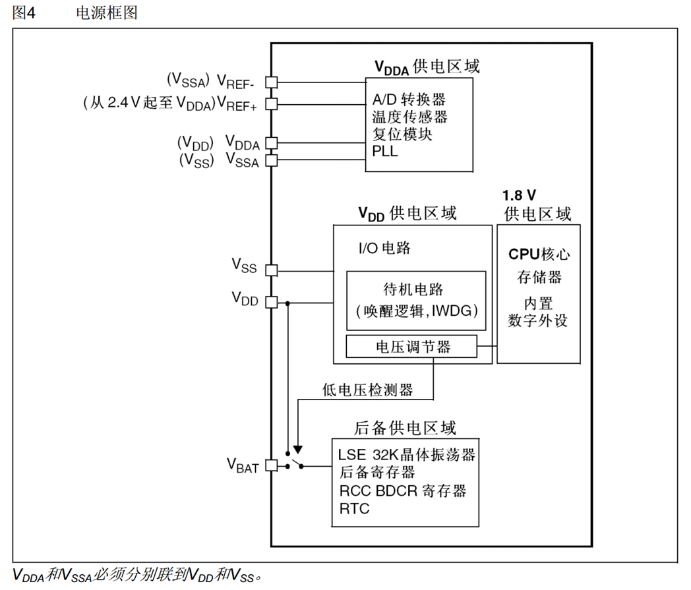

电源控制可以分为三个部分 V~DDA~ V~DD~和1.8V供电区  后备供电区域

<u>**V~DDA~**</u>

其中，A/D转换器，温度传感器，复位模块，PLL锁相环等部分在V~DDA~供电部分，启动A/D转换器有两个额外的参考电压引脚，V~REF+~和V~REF-~，在引脚多的STM32芯片中，有单独的引脚，但是在引脚少的芯片中，如C8T6中，在内部分别接到V~DD~和V~SS~

**<u>V~DD~和1.8V供电区</u>**

V~DD~供电区有I/O电路，待机电路和电压调节器，通过电压调节器将3.3V的电压降压到1.8V供后面的1.8V供电区域，包含CPU核心，存储器和内置数字外设。STM32芯片内部大部分关键电路都以1.8V低电压运行，当这些外设需要和外界交流时，才通过I/O电路转换到3.3V。

**<u>后备供电区域</u>**

LSE 晶体振荡器，RCC BDCR寄存器 RTC在该供电区。低电压检测器与V~DD~相连，V~DD~有电时，由V~DD~供电，V~DD~没电时，由V~BAT~供电

## 低功耗模式


**<u>关闭时钟</u>**

所有涉及运算和时序的操作都会暂停，但是寄存器和存储器里面保存的数据还可以维持，不会消失。

**<u>关闭电源</u>**

电路直接断电，电路的操作和数据都会直接丢失。所以关闭电源，比关闭时钟更加省电。

<u>**电压调节器**</u>

电压调节器相当于1.8V电源的开关。当电压调节器关，就代表直接把1.8V区域断电。

复位后调节器总是使能的。根据应用方式它以3种不同的模式工作。

- 运转模式:调节器以正常功耗模式提供1.8V电源(内核，内存和外设)。
- 停止模式:调节器以低功耗模式提供1.8V电源，以保存寄存器和SRAM的内容。
- 待机模式:调节器停止供电。除了备用电路和备份域外，寄存器和SRAM的内容全部丢失。

**<u>PDDS 和 LDPS</u>**

- PDDS = 0; 进入停机模式 PDDS = 1; 进入待机模式。
- LDPS = 0;  电压调节器开启 LDPS = 1; 电压调节器进入低功耗 

## 模式选择


- 在调用WFI 或者 WFE API前，需要先配置其他的寄存器。
- 执行完WFI/WFE指令后，STM32进入睡眠模式，程序暂停运行，唤醒后程序从暂停的地方继续运行
- SLEEPONEXIT位决定STM32执行完WFI或WFE后，是立刻进入睡眠，还是等STM32从最低优先级的中断处理程序中退出时进入睡眠
- 在睡眠模式下，所有的I/O引脚都保持它们在运行模式时的状态
- WFI指令进入睡眠模式，可被任意一个NVIC响应的中断唤醒
- WFE指令进入睡眠模式，可被唤醒事件唤醒

## 案例 1修改系统芯片频率

修改 system_stm32f10x.c 文件中的宏定义实现修改系统频率


main.c

```c
#include "stm32f10x.h"                  // Device header
#include "Delay.h"
#include "OLED.h"
int main()
{
	OLED_Init();
	
	OLED_ShowString(1 ,1, "SYSCLK:");
	
	OLED_ShowNum(1, 8, SystemCoreClock, 8);	
	
	while(1)
	{
		OLED_ShowString(2, 1, "Running:");
		Delay_ms(500);
		OLED_ShowString(2, 1, "        ");
		Delay_ms(500);
	}
}
```

在main.c程序中，调用 `SystemCoreClock` 全局标量查看 当前时钟频率。

## 案例2 睡眠模式+串口发送+接收

```c
#include "stm32f10x.h"                  // Device header
#include "Delay.h"
#include "OLED.h"
#include "Serial.h"

uint8_t RxData;			//定义用于接收串口数据的变量

int main(void)
{
	OLED_Init();		//OLED初始化
	OLED_ShowString(1, 1, "RxData:");	//显示静态字符串
	
	Serial_Init();		//串口初始化
	
	while (1)
	{
		if (Serial_GetRxFlag() == 1)			//检查串口接收数据的标志位
		{
			RxData = Serial_GetRxData();		//获取串口接收的数据
			Serial_SendByte(RxData);			//串口将收到的数据回传回去，用于测试
			OLED_ShowHexNum(1, 8, RxData, 2);	//显示串口接收的数据
		}
		
		OLED_ShowString(2, 1, "Running");		//OLED闪烁Running，指示当前主循环正在运行
		Delay_ms(100);
		OLED_ShowString(2, 1, "       ");
		Delay_ms(100);
		
		__WFI();								//执行WFI指令，CPU睡眠，并等待中断唤醒
	}
}
```

调用 `__WFI();` 直接进入睡眠模式

## 案例3 停止模式+对称式红外传感器计次

```c
#include "stm32f10x.h" // Device header
#include "Delay.h"
#include "OLED.h"
#include "CountSensor.h"
int main()
{
    OLED_Init();

    OLED_Clear();

    CountSensor_Init();
	
	RCC_APB1PeriphClockCmd(RCC_APB1Periph_PWR, ENABLE);

    while (1) 
	{
        OLED_ShowNum(1, 1, CountNum(),3);
		
		OLED_ShowString(2, 1, "Running");
		Delay_ms(100);
		OLED_ShowString(2, 1, "       ");
		Delay_ms(100);
		
		PWR_EnterSTOPMode(PWR_Regulator_ON, PWR_STOPEntry_WFI);
    }
}
```

> 需要开启PWR的时钟，不然写入和读取寄存是无效的操作
>
> 在调用 `PWR_EnterSTOPMode(PWR_Regulator_ON, PWR_STOPEntry_WFI);` 后，程序会进入停止模式，当被中断函数唤醒时，程序先执行中断函数部分，然后返回main函数，继续执行while循环的部分。

## 案例4 待机模式+实时时钟

```c
#include "stm32f10x.h"                  // Device header
#include "Delay.h"
#include "OLED.h"
#include "MyRTC.h"

int main(void)
{
	/*模块初始化*/
	OLED_Init();		//OLED初始化
	MyRTC_Init();		//RTC初始化
	
	RCC_APB1PeriphClockCmd(RCC_APB1Periph_PWR, ENABLE);
	
	/*显示静态字符串*/
	OLED_ShowString(1, 1, "CNT :");
	OLED_ShowString(2, 1, "ALR :");
	OLED_ShowString(3, 1, "ALRF:");
	/*使能WKUP引脚*/
	PWR_WakeUpPinCmd(ENABLE);						//使能位于PA0的WKUP引脚，WKUP引脚上升沿唤醒待机模式
	
	/*设定闹钟*/
	uint32_t Alarm = RTC_GetCounter() + 10;			//闹钟为唤醒后当前时间的后10s
	RTC_SetAlarm(Alarm);							//写入闹钟值到RTC的ALR寄存器
	OLED_ShowNum(2, 6, Alarm, 10);					//显示闹钟值
	
	while (1)
	{
		OLED_ShowNum(1, 6, RTC_GetCounter(), 10);	//显示32位的秒计数器
		OLED_ShowNum(3, 6, RTC_GetFlagStatus(RTC_FLAG_ALR), 1);		//显示闹钟标志位
		
		OLED_ShowString(4, 1, "Running");			//OLED闪烁Running，指示当前主循环正在运行
		Delay_ms(100);
		OLED_ShowString(4, 1, "       ");
		Delay_ms(100);
		
		OLED_ShowString(4, 9, "STANDBY");			//OLED闪烁STANDBY，指示即将进入待机模式
		Delay_ms(1000);
		OLED_ShowString(4, 9, "       ");
		Delay_ms(100);
		
		OLED_Clear();								//OLED清屏，模拟关闭外部所有的耗电设备，以达到极度省电
		
		PWR_EnterSTANDBYMode();						//STM32进入停止模式，并等待指定的唤醒事件（WKUP上升沿或RTC闹钟）
		/*待机模式唤醒后，程序会重头开始运行*/
	}
}
```

# WDG看门狗 （独立看门狗IWDG & 窗口看门狗WWDG）

## 看门狗简介

- WDG（Watchdog）看门狗
- 看门狗可以监控程序的运行状态，当程序因为设计漏洞、硬件故障、电磁干扰等原因，出现卡死或跑飞现象时，看门狗能及时复位程序，避免程序陷入长时间的罢工状态，保证系统的可靠性和安全性
- 看门狗本质上是一个定时器，当指定时间范围内，程序没有执行喂狗（重置计数器）操作时，看门狗硬件电路就自动产生复位信号
- STM32内置两个看门狗

 	独立看门狗（IWDG）：独立工作，对时间精度要求较低
 	
 	窗口看门狗（WWDG）：要求看门狗在精确计时窗口起作用

|            | **IWDG****独立看门狗**       | **WWDG****窗口看门狗**              |
| ---------- | ---------------------------- | ----------------------------------- |
| 复位       | 计数器减到0后                | 计数器T[5:0]减到0后、过早重装计数器 |
| 中断       | 无                           | 早期唤醒中断                        |
| 时钟源     | LSI（40KHz）                 | PCLK1（36MHz）                      |
| 预分频系数 | 4、8、32、64、128、256       | 1、2、4、8                          |
| 计数器     | 12位                         | 6位（有效计数）                     |
| 超时时间   | 0.1ms~26214.4ms              | 113us~58.25ms                       |
| 喂狗方式   | 写入键寄存器，重装固定值RLR  | 直接写入计数器，写多少重装多少      |
| 防误操作   | 键寄存器和写保护             | 无                                  |
| 用途       | 独立工作，对时间精度要求较低 | 要求看门狗在精确计时窗口起作用      |

##  IWDG功能框图


**<u>独立看门狗时钟</u>**

独立看门狗的时钟由独立的RC振荡器LSI提供，即使主时钟发生故障它仍然有效，非常独立。LSI的频率一般在30~60KHZ之间， 根据温度和工作场合会有一定的漂移，我们一般取40KHZ，所以独立看门狗的定时时间并不一定非常精确，只适用于对时间精度要求比较低的场合。

**<u>计数器时钟</u>**

递减计数器的时钟由LSI经过一个8位的预分频器得到，我们可以操作预分频器寄存器IWDG_PR来设置分频因子， 分频因子可以是：[4,8,16,32,64,128,256,256]，计数器时钟CK_CNT= 40/ 4*2^PRV，一个计数器时钟计数器就减一。

**<u>计数器</u>**

独立看门狗的计数器是一个12位的递减计数器，最大值为0XFFF，当计数器减到0时，会产生一个复位信号:IWDG_RESET， 让程序重新启动运行，如果在计数器减到0之前刷新了计数器的值的话，就不会产生复位信号，重新刷新计数器值的这个动作我们俗称喂狗。

**<u>重装载寄存器</u>**

重装载寄存器是一个12位的寄存器，里面装着要刷新到计数器的值，这个值的大小决定着独立看门狗的溢出时间。

键寄存器IWDG_KR可以说是独立看门狗的一个控制寄存器，主要有三种控制方式，往这个寄存器写入下面三个不同的值有不同的效果。

| **写入键寄存器的值** | **作用**                               |
| -------------------- | -------------------------------------- |
| 0xCCCC               | 启用独立看门狗                         |
| 0xAAAA               | IWDG_RLR中的值重新加载到计数器（喂狗） |
| 0x5555               | 解除IWDG_PR和IWDG_RLR的写保护          |
| 0x5555之外的其他值   | 启用IWDG_PR和IWDG_RLR的写保护          |

键寄存器本质上是控制寄存器，用于控制硬件电路的工作

在可能存在干扰的情况下，一般通过在整个键寄存器写入特定值来代替控制寄存器写入一位的功能，**<u>以降低硬件电路受到干扰的概率</u>**

## WWDG功能框图


**<u>窗口看门狗时钟</u>**

窗口看门狗时钟来自PCLK1，PCLK1最大是36M，由RCC时钟控制器开启。

**<u>计数器时钟</u>**

计数器时钟由CK计时器时钟经过预分频器分频得到，分频系数由配置寄存器CFR的位8:7 WDGTB[1:0]配置，可以是[0,1,2,3]， 其中CK计时器时钟=PCLK1/4096，除以4096是手册规定的，没有为什么。所以计数器的时钟CNT_CK=PCLK1/4096/(2^WDGTB)， 这就可以算出计数器减一个数的时间T= 1/CNT_CK = Tpclk1 * 4096 * (2^WDGTB)。

**<u>计数器</u>**

窗口看门狗的计数器是一个递减计数器，共有7位，其值存在控制寄存器CR的位6:0，即T[6:0]，当7个位全部为1时是0X7F， 这个是最大值，当递减到T6位变成0时，即从0X40变为0X3F时候，会产生看门狗复位。这个值0X40是看门狗能够递减到的最小值， **<u>所以计数器的值只能是：0X40~0X7F之间，实际上真正用来计数的是T[5:0]。</u>**当递减计数器递减到0X40的时候，还不会马上产生复位， 如果使能了提前唤醒中断：CFR位9EWI置1，则产生提前唤醒中断，如果真进入了这个中断的话，就说明程序肯定是出问题了， 那么在中断服务程序里面我们就需要做最重要的工作，比如保存重要数据，或者报警等，这个中断我们也叫它死前中断

**<u>窗口值</u>**

我们知道窗口看门狗必须在计数器的值在一个范围内才可以喂狗，其中下窗口的值是固定的0X40，上窗口的值可以改变， 具体的由配置寄存器CFR的位6:0 W[6:0]设置。其值必须大于0X40，如果小于或者等于0X40就是失去了窗口的价值，而且也不能大于计数器的值， 所以必须得小于0X7F。那窗口值具体要设置成多大？这个得根据我们需要监控的程序的运行时间来决定。如果我们要监控的程序段A运行的时间为Ta， 当执行完这段程序之后就要进行喂狗，如果在窗口时间内没有喂狗的话，那程序就肯定是出问题了。一般计数器的值TR设置成最大0X7F，窗口值为WR， 计数器减一个数的时间为T，那么时间：(TR-WR)*T应该稍微小于Ta即可，这样就能做到刚执行完程序段A之后喂狗，起到监控的作用，这样也就可以算出WR的值是多少。


## IWDG超时时间计算

$$
\begin{align*}
T_{IWDG} &= T_{LSI} \times PR\times (RL + 1) 
\end{align*}
$$

$$
T_{LSI} = \frac{1}{F_{LSI}}
$$


## WWDG超时时间

$$
T_{WWDG}= T_{PCLK1}\times4096\times 2^{WDGTB} \times (T[5:0] + 1)
$$

$$
T_{WWDG}:WWDG超时时间
$$

$$
T_{PCLK1}:ABP1以ms为单位的时钟间隔
$$

| WDGTB | 最小超时时间 | 最大超时时间 |
| :---: | :----------: | :----------: |
|   0   |    113μs     |    7.28ms    |
|   1   |    227μs     |   14.56ms    |
|   2   |    455με     |   29.12ms    |
|   3   |    910μς     |   58.25ms    |

## 案例1 独立看门狗

### 接线图


### 程序源码

```c
#include "stm32f10x.h"                  // Device header
#include "Delay.h"
#include "OLED.h"
#include "Key.h"

int main()
{
	OLED_Init();
	
	Key_Init();
	
	OLED_ShowString(1, 1, "IWDG TEST");
	
	if(RCC_GetFlagStatus(RCC_FLAG_IWDGRST) == SET)
	{
		OLED_ShowString(2, 1, "IWDG RESET");
		Delay_ms(500);
		OLED_ShowString(2, 1, "          ");
		Delay_ms(100);
		
		RCC_ClearFlag();
	}else
	{
		OLED_ShowString(2, 1, "RESET");
		Delay_ms(500);
		OLED_ShowString(2, 1, "     ");
		Delay_ms(100);
		
		RCC_ClearFlag();
	}
	
	IWDG_WriteAccessCmd(IWDG_WriteAccess_Enable);  //解除看门狗的写保护
	IWDG_SetPrescaler(IWDG_Prescaler_16);		   //写入预分频系数
	IWDG_SetReload(2499);						   //写入重装值
	
	IWDG_ReloadCounter(); //喂狗
	IWDG_Enable(); //使能看门狗
	while(1)
	{
		while(Key_GetNum() == 1);
		
		IWDG_ReloadCounter();
		OLED_ShowString(2, 1, "FEED");
		
		OLED_ShowString(2, 1, "    ");
	}	
}
```

## 案例2 窗口看门狗

### 接线图


### 程序源码

```c
#include "stm32f10x.h"                  // Device header
#include "Delay.h"
#include "OLED.h"
#include "Key.h"

int main()
{
	OLED_Init();
	
	Key_Init();
	
	OLED_ShowString(1, 1, "IWDG TEST");
	
	if(RCC_GetFlagStatus(RCC_FLAG_WWDGRST) == SET)
	{
		OLED_ShowString(2, 1, "WWDG RESET");
		Delay_ms(500);
		OLED_ShowString(2, 1, "          ");
		Delay_ms(100);
		
		RCC_ClearFlag();
	}else
	{
		OLED_ShowString(2, 1, "RESET");
		Delay_ms(500);
		OLED_ShowString(2, 1, "     ");
		Delay_ms(100);
		
		RCC_ClearFlag();
	}
	RCC_APB1PeriphClockCmd(RCC_APB1Periph_WWDG, ENABLE);
	
	// 在窗口看门狗中，没有重装寄存器，所以在使能和喂狗的操作中，都是直接对寄存写进值
	WWDG_SetPrescaler(WWDG_Prescaler_8);
	WWDG_SetWindowValue(21 | 0x40);
	WWDG_Enable(0x40 | 54);
	
	while(1)
	{
		Key_GetNum();
		
		
		OLED_ShowString(2, 1, "FEED");
		Delay_ms(20);
		OLED_ShowString(2, 1, "    ");
		Delay_ms(20);
		WWDG_SetCounter(54 | 0x40);
	}	
}
```

# STM32内部Flash

## Flash简介

- STM32F1系列的FLASH包含程序存储器、系统存储器和选项字节三个部分，通过闪存存储器接口（外设）可以对程序存储器和选项字节进行擦除和编程
- 读写FLASH的用途：
-  利用程序存储器的剩余空间来保存掉电不丢失的用户数据
-  通过在程序中编程（IAP），实现程序的自我更新
- 在线编程（In-Circuit Programming – ICP）用于更新程序存储器的全部内容，它通过JTAG、SWD协议或系统加载程序（Bootloader）下载程序
- 在程序中编程（In-Application Programming – IAP）可以使用微控制器支持的任一种通信接口下载程序

## 闪存模块组织

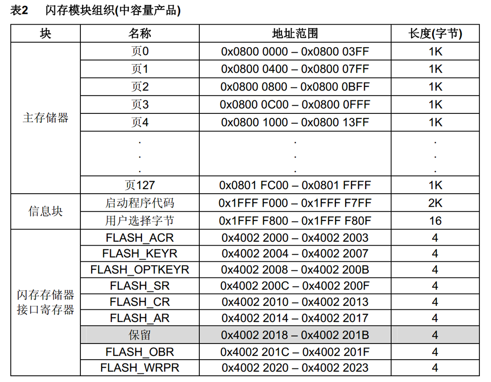

## FLASH基本结构


## FLASH解锁

**<u>FPEC共有三个键值：</u>**

​	RDPRT键 = 0x000000A5

​	KEY1 = 0x45670123

​	 KEY2 = 0xCDEF89AB

**<u>解锁：</u>**

​	 复位后，FPEC被保护，不能写入FLASH_CR

​	 在FLASH_KEYR先写入KEY1，再写入KEY2，解锁

​	 错误的操作序列会在下次复位前锁死FPEC和FLASH_CR

**<u>加锁：</u>**

​	 设置FLASH_CR中的LOCK位锁住FPEC和FLASH_CR

## 使用指针访问存储器

**<u>使用指针读指定地址下的存储器：</u>**

```
 uint16_t Data = *((__IO uint16_t *)(0x08000000));
```

**<u>使用指针写指定地址下的存储器：</u>**

```
*((__IO uint16_t *)(0x08000000)) = 0x1234;
#define  __IO  volatile
```

## 程序存储器编程

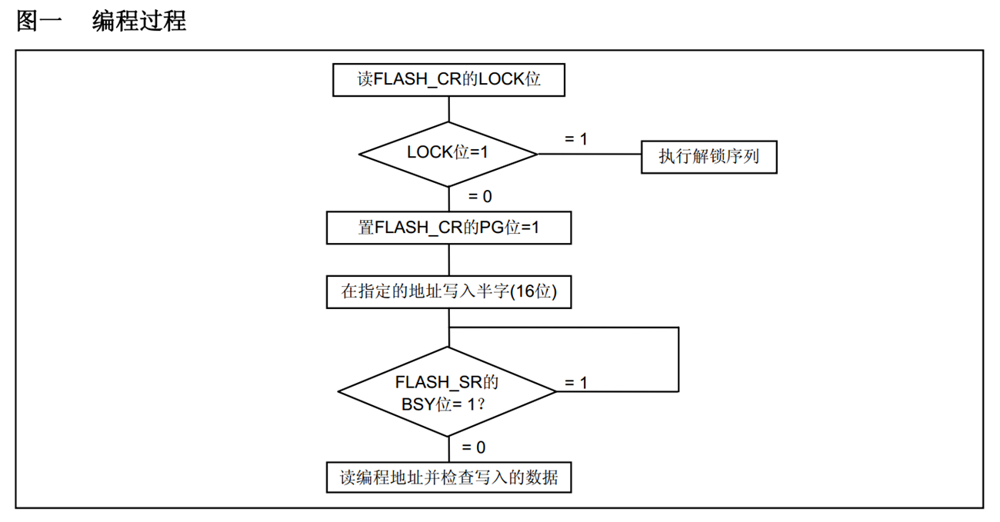

## 程序存储器页擦除


## 程序存储器全擦除


## 选项字节


- RDP：写入RDPRT键（0x000000A5）后解除读保护
- USER：配置硬件看门狗和进入停机/待机模式是否产生复位
- Data0/1：用户可自定义使用
- WRP0/1/2/3：配置写保护，每一个位对应保护4个存储页（中容量）

### 选项字节编程

- 检查FLASH_SR的BSY位，以确认没有其他正在进行的编程操作
- 解锁FLASH_CR的OPTWRE位
- 设置FLASH_CR的OPTPG位为1
- 写入要编程的半字到指定的地址
- 等待BSY位变为0
- 读出写入的地址并验证数据

### 选项字节擦除

- 检查FLASH_SR的BSY位，以确认没有其他正在进行的闪存操作
- 解锁FLASH_CR的OPTWRE位
- 设置FLASH_CR的OPTER位为1
- 设置FLASH_CR的STRT位为1
- 等待BSY位变为0
- 读出被擦除的选择字节并做验证

## 器件电子签名

- 电子签名存放在闪存存储器模块的系统存储区域，包含的芯片识别信息在出厂时编写，不可更改，使用指针读指定地址下的存储器可获取电子签名

**<u>闪存容量寄存器：</u>**

 基地址：0x1FFF F7E0

 大小：16位

**<u>产品唯一身份标识寄存器：</u>**

 基地址： 0x1FFF F7E8

 大小：96位

## 案例1 读写内部Flash

### 接线图


### 程序源码

main.c

```c
#include "stm32f10x.h"                  // Device header
#include "Delay.h"
#include "OLED.h"
#include "Key.h"
#include "Store.h"

uint8_t KeyNum;

int main()
{
	OLED_Init();
	
	Key_Init();
	
	Store_Init();
	
	OLED_ShowString(1, 1, "Flag:");
	OLED_ShowString(2, 1, "Data:");
	
	while(1)
	{
		KeyNum = Key_GetNum();
		if(KeyNum == 1)
		{
			Store_Data[1] += 1;
			Store_Data[2] += 2;
			Store_Data[3] += 3;
			Store_Data[4] += 4;
			Store_Save();
		}
		if(KeyNum == 2)
		{
			Store_Clear();
		}
		OLED_ShowHexNum(1, 6, Store_Data[0], 4);
		OLED_ShowHexNum(3, 1, Store_Data[1], 4);
		OLED_ShowHexNum(3, 6, Store_Data[2], 4);
		OLED_ShowHexNum(4, 1, Store_Data[3], 4);
		OLED_ShowHexNum(4, 6, Store_Data[4], 4);
	}
}
```

MyFlash.c

```c
#include "stm32f10x.h"                  // Device header

uint32_t MyFlash_ReadWord(uint32_t Address)
{
	return (*(__IO uint32_t*)(Address));
}

uint16_t MyFlash_ReadHalfWord(uint32_t Address)
{
	return (*(__IO uint16_t*)(Address));
}


uint8_t MyFlash_ReadByte(uint32_t Address)
{
	return (*(__IO uint8_t*)(Address));
}

void MyFlash_EraseAllPages(void)
{
	FLASH_Unlock();
	FLASH_EraseAllPages();
	FLASH_Lock();
}

void MyFlash_ErasePage(uint32_t PageAddress)
{
	FLASH_Unlock();
	FLASH_ErasePage(PageAddress);
	FLASH_Lock();
}

void MyFlash_ProgramWord(uint32_t Address, uint32_t Data)
{
	FLASH_Unlock();
	FLASH_ProgramWord(Address, Data);
	FLASH_Lock();
}

void MyFlash_ProgramHalfWord(uint32_t Address, uint32_t Data)
{
	FLASH_Unlock();
	FLASH_ProgramHalfWord(Address, Data);
	FLASH_Lock();
}
```

Store.c

```c
#include "stm32f10x.h"                  // Device header
#include "MyFlash.h"

uint16_t Store_Data[512] = {0};

void Store_Init(void)
{
	if(MyFlash_ReadHalfWord(0x0800FC00) != 0xA5A5)
	{
		MyFlash_ErasePage(0x0800FC00);
		MyFlash_ProgramHalfWord(0x0800FC00,0x5A5A);
		
		for(uint16_t i = 1; i <= 512; i++)
		{
			MyFlash_ProgramHalfWord(0x0800FC00 + i * 2, 0x0000);
		}
	}
	for(uint16_t i = 0; i <= 512; i++)
	{
		Store_Data[i] = MyFlash_ReadHalfWord(0x0800FC00 + i * 2);
	}	
}

void Store_Save(void)
{
	MyFlash_ErasePage(0x0800FC00);
	for(uint16_t i = 0; i <= 512; i++)
	{
		MyFlash_ProgramHalfWord(0x0800FC00 + i * 2, Store_Data[i]);
	}
}

void Store_Clear(void)
{
	for(uint16_t i = 1; i <= 512; i++)
	{
		Store_Data[i] = 0x0000;
	}
	Store_Save();
}
```

<u>程序路径</u>


### 实物图


和通过软件查看的数值对比一致


## 案例2 读取芯片ID

### 接线图


### 程序源码

main.c

```c
#include "stm32f10x.h"                  // Device header
#include "Delay.h"
#include "OLED.h"
int main()
{
	OLED_Init();
	
	OLED_ShowString(1, 1, "F_SIZEP:");
	OLED_ShowHexNum(1, 9, *((__IO uint16_t *)(0x1FFFF7E0)), 4);
	
	OLED_ShowString(2, 1, "U_ID:");
	OLED_ShowHexNum(2, 6, *((__IO uint16_t *)(0x1FFFF7E8)), 4);
	OLED_ShowHexNum(2, 11, *((__IO uint16_t *)(0x1FFFF7E8 + 0x02)), 4);
	OLED_ShowHexNum(3, 1, *((__IO uint32_t *)(0x1FFFF7E8 + 0x04)), 8);
	OLED_ShowHexNum(4, 1, *((__IO uint32_t *)(0x1FFFF7E8 + 0x08)), 8);
	
	while(1); 
}
```

### 实物图


和通过软件查看的数值对比一致


